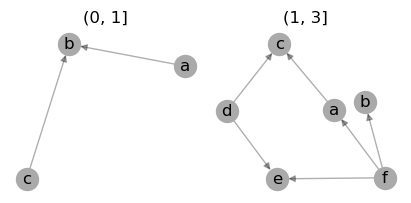
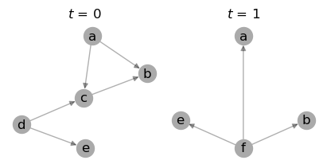
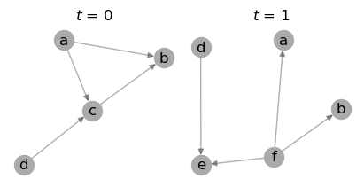
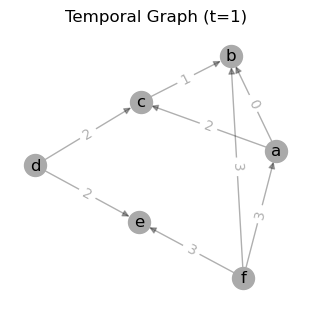
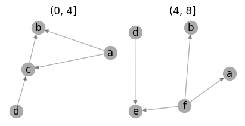
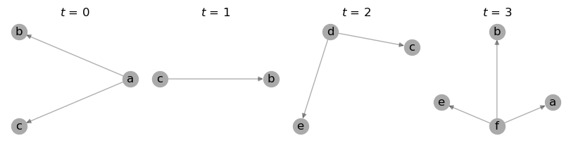

.. include:: notebook.rst

################
Basic operations
################

The examples below cover the package's basic functionalities, including how to build a temporal
graph, slice it into snapshots, save and load the resulting objects to disk, and other class methods.

Build temporal graph
====================

The main class of the package is the
:class:`~networkx_temporal.TemporalGraph`
object, which extends `NetworkX graphs
<https://networkx.org/documentation/stable/reference/classes/index.html>`__
to handle temporal data.
Let's start by creating a simple directed graph using ``time`` as attribute key:

.. code-block:: python

   >>> import networkx_temporal as tx
   >>>
   >>> TG = tx.TemporalDiGraph()  # TG = tx.temporal_graph(directed=True, multigraph=False)
   >>>
   >>> TG.add_edge("a", "b", time=0)
   >>> TG.add_edge("c", "b", time=1)
   >>> TG.add_edge("d", "c", time=2)
   >>> TG.add_edge("d", "e", time=2)
   >>> TG.add_edge("a", "c", time=2)
   >>> TG.add_edge("f", "e", time=3)
   >>> TG.add_edge("f", "a", time=3)
   >>> TG.add_edge("f", "b", time=3)
   >>>
   >>> print(TG)

   TemporalDiGraph (t=1) with 6 nodes and 8 edges

Note that the resulting graph object reports a single time step ``t=1``, as it has not yet been
`sliced <#slice-temporal-graph>`__.

.. note::

   Multigraphs are particularly useful to represent temporal graphs, as it allows to store multiple
   interactions between the same nodes at different time steps within a single graph object. This
   behavior can be set by passing ``multigraph=True`` when creating the :class:`~networkx_temporal.TemporalGraph` object.

Slice temporal graph
====================

Let's use the :func:`~networkx_temporal.TemporalGraph.slice` method to split the temporal graph we
created into a number of snapshots:

.. code-block:: python

   >>> TG = TG.slice(attr="time")
   >>> print(TG)

   TemporalDiGraph (t=4) with 12 nodes and 8 edges

Inspecting the resulting object's properties can be achieved using some familiar methods:

.. code-block:: python

   >>> print(f"t = {len(TG)} time steps\n"
   >>>       f"V = {TG.order()} nodes ({TG.temporal_order()} unique, {TG.total_order()} total)\n"
   >>>       f"E = {TG.size()} edges ({TG.temporal_size()} unique, {TG.total_size()} total)")

   t = 4 time steps
   V = [2, 2, 4, 4] nodes (6 unique, 12 total)
   E = [1, 1, 3, 3] edges (8 unique, 8 total)

We may also visualize the resulting snapshots using the :func:`~networkx_temporal.draw` function:

.. code-block:: python

   >>> tx.draw(TG, layout="kamada_kawai", figsize=(8, 2))

.. image:: ../../figure/fig-0.png

Note that :func:`~networkx_temporal.TemporalGraph.slice` by default returns a snapshot for each
unique attribute value passed to it.

.. hint::

   Setting ``names=True`` will use the :attr:`~networkx_temporal.TemporalGraph.names` property as
   subplot titles, instead of their indices. By default, :func:`~networkx_temporal.TemporalGraph.slice`
   returns the interval of the resulting temporal snapshots as their names.

Number of snapshots
--------------------

A new object can be created with a specific number of snapshots by setting the
``bins`` parameter:

.. code-block:: python

   >>> TG = TG.slice(attr="time", bins=2)
   >>> tx.draw(TG, layout="kamada_kawai", figsize=(4, 2), names=True)

.. note::

   In some cases, :func:`~networkx_temporal.TemporalGraph.slice` may still not be able to split the
   graph into the number of snapshots specified by ``bins`` (e.g., due to insufficient data), in
   which case the maximum possible number is returned instead. See `Quantile-based cut
   <#quantile-based-cut>`__ and `Rank-based cut <#rank-based-cut>`__ examples below for alternatives.

Quantile-based cut
------------------

By default, created bins are composed of non-overlapping edges and might have uneven order and/or
size. To try and balance them using quantiles, pass ``qcut=True`` (see `pandas.qcut
<https://pandas.pydata.org/pandas-docs/stable/reference/api/pandas.qcut.html>`__ for details):

.. code-block:: python

   >>> TG = TG.slice(attr="time", bins=2, qcut=True)
   >>> tx.draw(TG, layout="kamada_kawai", figsize=(4, 2), names=True)

Though not perfectly balanced due to node :math:`a` originally appearing multiple times (in
:math:`t=\{0,2,3\}`), the resulting snapshots have more comparable order and size, with edges still
sorted by their ``attr``.

This method is particularly useful when node interactions are not evenly distributed across time.
Note that results are highly data-dependent and are expected to vary in a case-by-case basis.

Rank-based cut
--------------

Forcing a number of bins can be achieved by setting ``rank_first=True``, which sorts edges, nodes,
or one of its attributes by their order of appearance in the data (see `pandas.Series.rank
<https://pandas.pydata.org/pandas-docs/stable/reference/api/pandas.Series.rank.html>`__ for details):

.. code-block:: python

   >>> TG = TG.slice(bins=2, rank_first=True)
   >>> tx.draw(TG, layout="kamada_kawai", figsize=(4, 2), names=True)

Notice how each snapshot title now refer to edge intervals: :math:`e_0` to :math:`e_3`
:math:`(0, 4]` and :math:`e_4` to :math:`e_7` :math:`(4, 8]`. In this case, the graph was split
by sorting the edges by the order in which they were added to the graph.

Although the resulting number of nodes per snapshot may vary, this method is useful to obtain an
arbitrarily defined number of subgraphs, especially when its temporal values are not known.

-----

Import static graphs
====================

Static graph objects may also carry temporal information as node- and edge-level attributes:

.. code-block:: python

   >>> G = nx.DiGraph()
   >>>
   >>> G.add_nodes_from([
   >>>     ("a", {"time": 0}),
   >>>     ("b", {"time": 0}),
   >>>     ("c", {"time": 1}),
   >>>     ("d", {"time": 2}),
   >>>     ("e", {"time": 3}),
   >>>     ("f", {"time": 3}),
   >>> ])
   >>>
   >>> G.add_edges_from([
   >>>     ("a", "b", {"time": 0}),
   >>>     ("c", "b", {"time": 1}),
   >>>     ("d", "c", {"time": 2}),
   >>>     ("d", "e", {"time": 2}),
   >>>     ("a", "c", {"time": 2}),
   >>>     ("f", "e", {"time": 3}),
   >>>     ("f", "a", {"time": 3}),
   >>>     ("f", "b", {"time": 3}),
   >>> ])
   >>>
   >>> print(G)

   DiGraph with 6 nodes and 8 edges

We may convert a static graph to a :class:`~networkx_temporal.TemporalGraph` object
using the :func:`~networkx_temporal.from_static` function:

.. code-block:: python

   >>> TG = tx.from_static(G)
   >>> print(TG)

   TemporalDiGraph (t=1) with 6 nodes and 8 edges

As expected, the resulting object has the same number of nodes and edges as the original graph.
Drawing it with edge labels allows to visualize the edge-level temporal information in a single plot:

.. code-block:: python

   >>> tx.draw(TG, layout="kamada_kawai", edge_labels="time", suptitle="Temporal Graph (t=1)")

However, note that in the example above, both the nodes and edges are attributed with a ``time`` key.
Let's see how this affects the resulting temporal graph when slicing it into snapshots next.

.. seealso::

   The :func:`~networkx_temporal.from_snapshots` function to import a list of static graphs as
   temporal graph snapshots.

Edge-level time attribute
-------------------------

Converting a static graph considering edge-level temporal data in to a temporal graph object:

.. code-block:: python

   >>> TG_ = TG.slice(attr="time")
   >>> tx.draw(TG_, layout="kamada_kawai", figsize=(8, 2))

The resulting temporal graph has the same number of edges as the original graph, but a higher number
of nodes. This is expected, as the same nodes appear in more than one snapshot.

.. note::

   By default, :func:`~networkx_temporal.TemporalGraph.slice` considers ``attr`` as an edge-level
   attribute, which is usually the case for temporal data. This behavior can be changed by setting
   ``level='node'``, as seen below.

Node-level time attribute
-------------------------

Converting a static graph considering node-level temporal data to a temporal graph object:

.. code-block:: python

   >>> TG_ = TG.slice(attr="time", level="node")
   >>> tx.draw(TG_, layout="kamada_kawai", figsize=(8, 2))

Note that now, even though the edge :math:`(a, c)` contains the attribute ``time=2``, considering
node-level attributes resulted in it being placed at the snapshot :math:`t=0` instead, as node
:math:`a` is set to ``time=0``:

.. code-block:: python

   >>> G.nodes(data="time")["a"]

   0

.. note::

    When ``level='node'``, the source node's temporal attribute is used by default to determine the
    time step of an edge. This behavior can be changed by setting ``node_level='target'`` instead.

-----

Save and load data
==================

Temporal graphs may be read from or written to a file using the following functions:

.. code-block:: python

   >>> tx.write_graph(TG, "temporal-graph.graphml.zip")
   >>> TG = tx.read_graph("temporal-graph.graphml.zip")

Supported formats will be automatically detected based on the file extension.
For details on both, please refer to their respective documentations:
:func:`~networkx_temporal.read_graph` and :func:`~networkx_temporal.write_graph`.

.. seealso::

   The `read and write documentation
   <https://networkx.org/documentation/stable/reference/readwrite/index.html>`__
   from NetworkX for a list of supported graph formats.

-----

Other inherited methods
=======================

The methods available from a `NetworkX graph
<https://networkx.org/documentation/stable/reference/classes/graph.html#networkx.Graph>`__
can be called directly from a :class:`~networkx_temporal.TemporalGraph` object as well.
For example, the familiar methods below transform its edges into directed or undirected:

.. code-block:: python

   >>> TG.to_undirected()

   <networkx_temporal.graph.graph.TemporalGraph at 0x7f13dcde4dd0>

.. code-block:: python

   >>> TG.to_directed()

   <networkx_temporal.graph.digraph.TemporalDiGraph at 0x7f13dcdccdd0>

Note that both methods return new objects when called, so the original graph remains unchanged.

.. seealso::

   - The `Appendix → Index <../genindex.html>`__  page for a list of the implemented classes, methods,
     and functions.

   - The `NetworkX documentation
     <https://networkx.org/documentation/stable/reference/classes/graph.html#networkx.Graph>`__
     for a list of inherited methods found in a :class:`~networkx_temporal.TemporalGraph`.