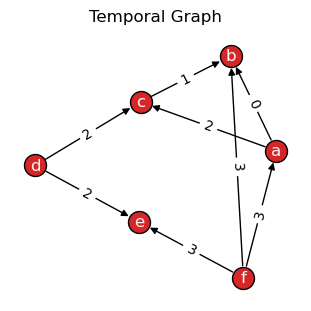
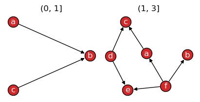
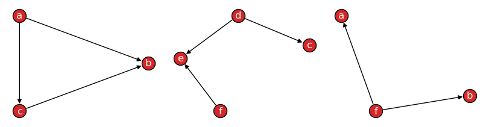
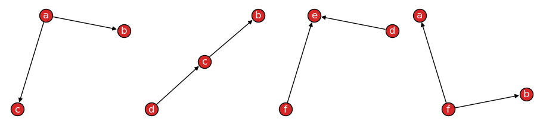
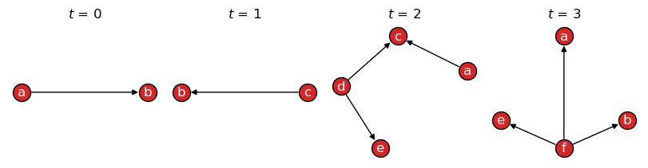
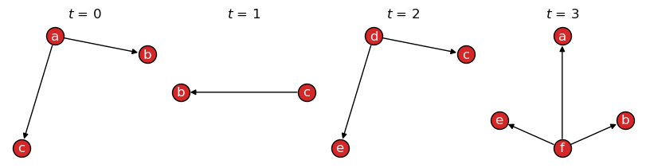
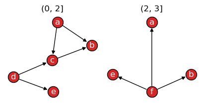
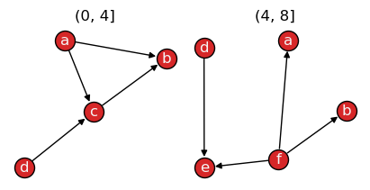
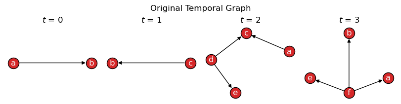
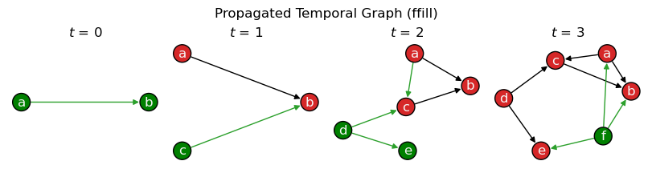

.. seealso::

    All examples in this guide are also available as an interactive
    `Jupyter notebook
    <https://github.com/nelsonaloysio/networkx-temporal/blob/main/notebook/networkx-temporal-01-basics.ipynb>`__
    (`open on Colab
    <https://colab.research.google.com/github/nelsonaloysio/networkx-temporal/blob/main/notebook/networkx-temporal-01-basics.ipynb>`__).

################
Basic operations
################

The examples below cover the package's basic functionalities, including how to build a temporal
graph, slice it into snapshots, save and load graph objects to disk, and other inherited methods.

Build temporal graph
====================

This package implements new
:class:`~networkx_temporal.classes.TemporalGraph`
classes, which extend `NetworkX graphs
<https://networkx.org/documentation/stable/reference/classes/index.html>`__
to handle temporal (dynamic) data.
Let's start by creating a simple directed graph using ``time`` as attribute key:

.. code-block:: python

   >>> import networkx_temporal as tx
   >>>
   >>> TG = tx.temporal_graph(directed=True)  # tx.TemporalMultiDiGraph()
   >>>
   >>> TG.add_edge("a", "b", time=0)
   >>> TG.add_edge("c", "b", time=1)
   >>> TG.add_edge("d", "c", time=2)
   >>> TG.add_edge("d", "e", time=2)
   >>> TG.add_edge("a", "c", time=2)
   >>> TG.add_edge("f", "e", time=3)
   >>> TG.add_edge("f", "a", time=3)
   >>> TG.add_edge("f", "b", time=3)
   >>>
   >>> print(TG)

   TemporalMultiDiGraph (t=1) with 6 nodes and 8 edges

Note that the resulting graph object reports a single time step ``t=1``, as it has not yet been
`sliced <#slice-temporal-graph>`__.

.. hint::

   To allow multiple interactions between the same nodes over time, a
   :class:`~networkx_temporal.classes.TemporalMultiGraph` or
   :class:`~networkx_temporal.classes.TemporalMultiDiGraph` object is required. Otherwise, only a
   single edge is allowed among pairs.

Import static graphs
====================

Static graphs from NetworkX can be converted into temporal graphs with
:func:`~networkx_temporal.transform.from_static`:

.. code-block:: python

   >>> import networkx as nx
   >>>
   >>> G = nx.DiGraph()
   >>>
   >>> G.add_nodes_from([
   >>>     ("a", {"time": 0}),
   >>>     ("b", {"time": 0}),
   >>>     ("c", {"time": 1}),
   >>>     ("d", {"time": 2}),
   >>>     ("e", {"time": 3}),
   >>>     ("f", {"time": 3}),
   >>> ])
   >>>
   >>> G.add_edges_from([
   >>>     ("a", "b", {"time": 0}),
   >>>     ("c", "b", {"time": 1}),
   >>>     ("d", "c", {"time": 2}),
   >>>     ("d", "e", {"time": 2}),
   >>>     ("a", "c", {"time": 2}),
   >>>     ("f", "e", {"time": 3}),
   >>>     ("f", "a", {"time": 3}),
   >>>     ("f", "b", {"time": 3}),
   >>> ])
   >>>
   >>> TG = tx.from_static(G)
   >>> print(TG)

   TemporalDiGraph (t=1) with 6 nodes and 8 edges

In the example above, both nodes and edges contain a ``time`` attribute, and slicing the graph
using either node-level or edge-level data will yield different results.
Let's :func:`~networkx_temporal.drawing.draw` the static graph:

.. code-block:: python

   >>> tx.draw(TG, layout="kamada_kawai", edge_labels="time", suptitle="Temporal Graph")

|

Slice temporal graph
====================

Let's use the :func:`~networkx_temporal.classes.TemporalGraph.slice` method to split the temporal
graph into a number of snapshots:

.. code-block:: python

   >>> TG = TG.slice(attr="time")
   >>> print(TG)

   TemporalDiGraph (t=4) with 6 nodes and 8 edges

.. code-block:: python

   >>> for t, G in enumerate(TG):
   >>>     print(f"Snapshot t={t}: {G.order()} nodes, {G.size()} edges")

   Snapshot t=0: 2 nodes, 1 edges
   Snapshot t=1: 2 nodes, 1 edges
   Snapshot t=2: 4 nodes, 3 edges
   Snapshot t=3: 4 nodes, 3 edges

When sliced, :func:`~networkx_temporal.drawing.draw` will return a plot of each resulting snapshot
in the temporal graph:

.. code-block:: python

   >>> tx.draw(TG, layout="kamada_kawai", figsize=(8, 2))

.. image:: ../../assets/figure/notebook/networkx-temporal-01-basics_13_0.png
   :align: center

|

Define number of snapshots
--------------------------

By default, :func:`~networkx_temporal.classes.TemporalGraph.slice`
returns snapshots based on unique attribute values, here :math:`t \in \{0,1,2,3\}`,
which are stored in the :attr:`~networkx_temporal.classes.TemporalGraph.names` property
of :class:`~networkx_temporal.classes.TemporalGraph` objects for future access.

A new object can be created with a specific number of snapshots by setting the
``bins`` parameter:

.. code-block:: python

   >>> TG = TG.slice(attr="time", bins=2)
   >>> tx.draw(TG, layout="kamada_kawai", figsize=(4, 2), names=True)

|

In case :func:`~networkx_temporal.classes.TemporalGraph.slice` is not able to split the graph into
the specified number of ``bins``, for example, due to insufficient data (nodes/edges), the
maximum possible number of snapshots is returned instead.

Cut by snapshot order or size
-----------------------------

Passing ``axis=1`` to :func:`~networkx_temporal.classes.TemporalGraph.slice`
will bin snapshots based on their number of nodes or edges, as defined by the ``level``
argument, optionally considering temporal information available as their ``attr``, if set:

.. code-block:: python

   >>> TG = TG.slice(3, attr="time", axis=1)  # level="edge" (default)
   >>> tx.draw(TG, layout="kamada_kawai", figsize=(8, 2), names=False)

|

Or, to limit the maximum number of nodes allowed per snapshot, set ``axis=1`` and ``level='node'``:

.. code-block:: python

   >>> TG = TG.slice(3, axis=1, level="node")
   >>> tx.draw(TG, layout="kamada_kawai", figsize=(9, 2), names=False)

|

Node or edge attributes
-----------------------

By default, the :func:`~networkx_temporal.classes.TemporalGraph.slice` function
considers ``level="edge"`` attribute data:

.. code-block:: python

   >>> TG = TG.slice(attr="time")  # level="edge" (default)
   >>> tx.draw(TG, layout="kamada_kawai", figsize=(8, 2))

|

If ``level='node'`` is set, node-level attribute data is used to determine snapshots:

.. code-block:: python

   >>> TG_node = TG.slice(attr="time", level="node")
   >>> tx.draw(TG_node, layout="kamada_kawai", figsize=(8, 2))

|

Quantile-based cut
------------------

Setting ``qcut=True`` slices a graph into quantiles, creating snapshots with balanced order and/or
size (nodes/edges). This is useful when interactions are not evenly distributed across time.
For example:

.. code-block:: python

   >>> TG = TG.slice(attr="time", bins=2, qcut=True)
   >>> tx.draw(TG, layout="kamada_kawai", figsize=(4, 2), names=True)

|

The resulting snapshots have uneven time intervals: :math:`t=(0,2]` and :math:`t=(2,3]`, respectively.
Objects are sorted by their ``time`` attribute values and then split into two groups with approximately
the same order (nodes) or size (edges), depending on the level of the attribute passed to the function.

.. seealso::

   The `pandas.qcut documentation
   <https://pandas.pydata.org/pandas-docs/stable/reference/api/pandas.qcut.html>`__
   for more information on quantile-based discretization.

Rank-based cut
--------------

Setting ``rank_first=True`` slices a graph considering the order of appearance of edges (default),
nodes, or attributes, forcing each snapshot to have approximately the same number of elements:

.. code-block:: python

   >>> TG = TG.slice(bins=2, rank_first=True)
   >>> tx.draw(TG, layout="kamada_kawai", figsize=(4, 2), names=True)

|

As ``attr`` was not set, the graph was split considering the order in which edges were added
to the graph. Notice how each snapshot title now refer to edge intervals: :math:`e_0` to :math:`e_3`
:math:`(0, 4]` and :math:`e_4` to :math:`e_7` :math:`(4, 8]`.
This is useful to obtain an arbitrary number of subgraphs, independent of their temporal dynamics.

.. seealso::

   The `pandas.rank documentation
   <https://pandas.pydata.org/pandas-docs/stable/reference/api/pandas.Series.rank.html>`__
   for more information on ranking data.

Propagate snapshots
===================

Suppose connections should be instead treated as long-lasting, with future snapshots maintaining
past observed data. The :func:`~networkx_temporal.utils.propagate_snapshots` function allows to
merge previous snapshots forward or backward in time. New nodes and edges for each snapshot
are here highlighted in green:

.. code-block:: python

   >>> TG = tx.temporal_graph(directed=True)
   >>>
   >>> TG.add_edge("a", "b", time=0)
   >>> TG.add_edge("c", "b", time=1)
   >>> TG.add_edge("d", "c", time=2)
   >>> TG.add_edge("d", "e", time=2)
   >>> TG.add_edge("a", "c", time=2)
   >>> TG.add_edge("f", "e", time=3)
   >>> TG.add_edge("f", "a", time=3)
   >>> TG.add_edge("f", "b", time=3)
   >>>
   >>> TG = TG.slice(attr="time")
   >>>
   >>> tx.draw(TG, figsize=(8,2), layout="kamada_kawai", suptitle="Original Temporal Graph")

|

.. code-block:: python

   >>> TG_prop = tx.propagate_snapshots(TG, method="ffill")
   >>>
   >>> temporal_node_color = [
   >>>     ["green" if TG_prop.index_node(n)[0] == t else "tab:red"
   >>>      for n in G.nodes()] for t, G in enumerate(TG_prop)]
   >>>
   >>> temporal_edge_color = [
   >>>     ["tab:green" if TG_prop.index_edge((n1, n2))[0] == t else "black"
   >>>      for n1, n2 in G.edges()] for t, G in enumerate(TG_prop)]
   >>>
   >>> tx.draw(TG_prop, figsize=(8, 2), layout="kamada_kawai",
   >>>         temporal_node_color=temporal_node_color,
   >>>         temporal_edge_color=temporal_edge_color,
   >>>         suptitle="Propagated Temporal Graph (ffill)")

|

This allows to model scenarios where connections persist over time until removed, which may be
useful for the purposes of analyzing and simulating spreading processes, among other applications.

Save and load data
==================

Temporal graphs may be read from or written to a file using
:func:`~networkx_temporal.readwrite.read_graph` and :func:`~networkx_temporal.readwrite.write_graph`:

.. code-block:: python

   >>> tx.write_graph(TG, "temporal-graph.graphml.zip")
   >>> TG = tx.read_graph("temporal-graph.graphml.zip")

Supported formats are the same as those in NetworkX and depend on the version installed.

.. seealso::

   The `read and write documentation
   <https://networkx.org/documentation/stable/reference/io/index.html>`__
   from NetworkX for a list of supported graph formats.

Inherited methods
=================

Any methods available from a `NetworkX graph
<https://networkx.org/documentation/stable/reference/classes/graph.html#networkx.Graph>`__
can be called directly from a :class:`~networkx_temporal.classes.TemporalGraph` object.
For example, the familiar methods below transform edges in the graph into directed or undirected:

.. code-block:: python

   >>> TG.to_undirected()

   <networkx_temporal.classes.graph.TemporalGraph at 0x7f13dcde4dd0>

.. code-block:: python

   >>> TG.to_directed()

   <networkx_temporal.classes.digraph.TemporalDiGraph at 0x7f13dcdccdd0>

Note that both methods return new objects when called, so the original graph remains unchanged.

.. seealso::

   The `NetworkX documentation
   <https://networkx.org/documentation/stable/reference/classes/graph.html#methods>`__
   for a list of methods inherited by a :class:`~networkx_temporal.classes.TemporalGraph`
   object.

Utility functions
=================

Utility functions for temporal graphs are available in the
``~networkx_temporal.utils`` module.

.. code:: python

   >>> TG = tx.temporal_graph(multigraph=False)
   >>>
   >>> TG.add_node("a", group=0)
   >>> TG.add_node("b", group=1)
   >>> TG.add_node("c", group=1)
   >>> TG.add_node("d")
   >>>
   >>> TG.add_edge("a", "b", time=0)
   >>> TG.add_edge("b", "c", time=0)
   >>> TG.add_edge("a", "d", time=1)
   >>>
   >>> print(TG)

   TemporalGraph (t=1) with 4 nodes and 3 edges

Node and edge attributes
------------------------

Obtaining node and edge attributes across snapshots:

.. code:: python

   >>> tx.get_node_attributes(TG, "group")

   [{'a': 0, 'b': 1, 'c': 1, 'd': nan}]

.. code:: python

   >>> tx.get_edge_attributes(TG, "time")

   [{('a', 'b'): 0, ('a', 'd'): 1, ('b', 'c'): 0}]

Partition node and edge sets
----------------------------

Partition nodes and edges based on their attribute values per
snapshot:

.. code:: python

   >>> tx.partition_nodes(TG, "group", index=True, default="unknown")

   [{0: ['a'], 1: ['b', 'c'], 'unknown': ['d']}]

.. code:: python

   >>> tx.partition_nodes(TG, "group", index=False)

   [[['a'], ['c', 'b'], ['d']]]

   >>> tx.partition_edges(TG, "time")

   [{0: [('a', 'b'), ('b', 'c')], 1: [('a', 'd')]}]

Mapping node and edge attributes
--------------------------------

Mapping edge-level ``time`` to nodes, or node-level ``group`` to
edges:

.. code:: python

   >>> tx.map_edge_attr_to_nodes(TG, "time", unique=True)

   [{'a': [0, 1], 'b': [0, 0], 'c': [0], 'd': [1]}]

.. code:: python

   >>> tx.map_node_attr_to_edges(TG, "group", origin="source")

   [{('a', 'b'): 0, ('a', 'd'): 0, ('b', 'c'): 1}]

Similarity of node and edge sets
--------------------------------

Obtaining a Jaccard similarity matrix (intersection over union) of node sets over time:

.. code:: python

   >>> snapshots = TG.slice(attr="time")
   >>> tx.temporal_node_matrix(snapshots, method="jaccard")

   [[1.0, 0.25], [0.25, 1.0]]

.. seealso::

   The `Algorithms and metrics → Temporal evolution <../examples/metrics.html#temporal-evolution>`__
   examples with similarity matrices.