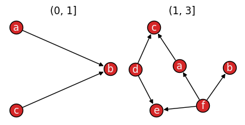

.. include:: ../include-examples.rst

################
Basic operations
################

The examples below cover the package's basic functionalities, including how to build a temporal
graph, slice it into snapshots, save and load graph objects to disk, and other inherited methods.

Build temporal graph
====================

This package implements new
:class:`~networkx_temporal.classes.TemporalGraph`
classes, which extend `NetworkX graphs
<https://networkx.org/documentation/stable/reference/classes/index.html>`__
to handle temporal (dynamic) data.
Let's start by creating a simple directed graph using ``time`` as attribute key:

.. code-block:: python

   >>> import networkx_temporal as tx
   >>>
   >>> TG = tx.TemporalDiGraph()  # TG = tx.temporal_graph(directed=True, multigraph=False)
   >>>
   >>> TG.add_edge("a", "b", time=0)
   >>> TG.add_edge("c", "b", time=1)
   >>> TG.add_edge("d", "c", time=2)
   >>> TG.add_edge("d", "e", time=2)
   >>> TG.add_edge("a", "c", time=2)
   >>> TG.add_edge("f", "e", time=3)
   >>> TG.add_edge("f", "a", time=3)
   >>> TG.add_edge("f", "b", time=3)
   >>>
   >>> print(TG)

   TemporalDiGraph (t=1) with 6 nodes and 8 edges

Note that the resulting graph object reports a single time step ``t=1``, as it has not yet been
`sliced <#slice-temporal-graph>`__.

.. attention::

   To allow multiple interactions between the same nodes over time, create a
   :class:`~networkx_temporal.classes.TemporalMultiGraph` or
   :class:`~networkx_temporal.classes.TemporalMultiDiGraph` object instead. Otherwise, only a single
   edge is allowed among pairs.

Slice temporal graph
====================

Let's use the :func:`~networkx_temporal.classes.TemporalGraph.slice` method to split the temporal graph we
created into a number of snapshots:

.. code-block:: python

   >>> TG = TG.slice(attr="time")
   >>> print(TG)

   TemporalDiGraph (t=4) with 6 nodes and 8 edges

Inspecting the resulting object's properties can be achieved using some familiar methods:

.. code-block:: python

   >>> print(f"t = {len(TG)} time steps\n"
   ...       f"V = {TG.order()} nodes "
   ...       f"({TG.order(copies=False)} unique, {TG.order(copies=True)} total)\n"
   ...       f"E = {TG.size()} edges "
   ...       f"({TG.size(copies=False)} unique, {TG.size(copies=True)} total)")

   t = 4 time steps
   V = [2, 2, 4, 4] nodes (6 unique, 12 total)
   E = [1, 1, 3, 3] edges (8 unique, 8 total)

We may also visualize the resulting snapshots using the :func:`~networkx_temporal.drawing.draw` function:

.. code-block:: python

   >>> tx.draw(TG, layout="kamada_kawai", figsize=(8, 2))

.. image:: ../../assets/figure/fig-0.png

Note that :func:`~networkx_temporal.classes.TemporalGraph.slice` by default returns a snapshot for each
unique attribute value passed to it.

.. hint::

   By default, :func:`~networkx_temporal.classes.TemporalGraph.slice` returns the interval of the resulting
   snapshots as their :attr:`~networkx_temporal.classes.TemporalGraph.names` property. Passing
   ``names=True`` to :func:`~networkx_temporal.drawing.draw` will use them instead of indices as
   subplot titles, as seen `below <#number-of-snapshots>`__.

Number of snapshots
--------------------

A new object can be created with a specific number of snapshots by setting the
``bins`` parameter:

.. code-block:: python

   >>> TG = TG.slice(attr="time", bins=2)
   >>> tx.draw(TG, layout="kamada_kawai", figsize=(4, 2), names=True)

Quantile-based cut
------------------

Setting ``qcut=True`` slices a graph into quantiles, creating snapshots with balanced order and/or
size. This is useful when interactions are not evenly distributed across time (see
`pandas.qcut <https://pandas.pydata.org/pandas-docs/stable/reference/api/pandas.qcut.html>`__
for details):

.. code-block:: python

   >>> TG = TG.slice(attr="time", bins=2, qcut=True)
   >>> tx.draw(TG, layout="kamada_kawai", figsize=(4, 2), names=True)

The resulting snapshots have a more similar number of nodes and edges, sorted by the selected
``attr`` values, though they are still uneven due to node :math:`a` interacting multiple times in
:math:`t=\{0,2,3\}`.
Note that the resulting split is highly data-dependent and expected to vary in a case-by-case basis.

Rank-based cut
--------------

Setting ``rank_first=True`` slices a graph considering the order of appearance of edges,
nodes, or attributes, depending on the parameters passed to the function (see `pandas.Series.rank
<https://pandas.pydata.org/pandas-docs/stable/reference/api/pandas.Series.rank.html>`__ for details):

.. code-block:: python

   >>> TG = TG.slice(bins=2, rank_first=True)
   >>> tx.draw(TG, layout="kamada_kawai", figsize=(4, 2), names=True)

As ``attr`` was not set, the graph was split considering the order in which edges were added
to the graph. Notice how each snapshot title now refer to edge intervals: :math:`e_0` to :math:`e_3`
:math:`(0, 4]` and :math:`e_4` to :math:`e_7` :math:`(4, 8]`.
This is useful to obtain an arbitrary number of subgraphs, independent of their temporal dynamics.

.. note::

   In cases, :func:`~networkx_temporal.classes.TemporalGraph.slice` is not able to split the
   graph into the number specified by ``bins`` (e.g., due to insufficient data),
   the maximum possible number of snapshots is returned instead.

Import static graphs
====================

Static graph objects may also carry temporal information as node- and edge-level attributes:

.. code-block:: python

   >>> G = nx.DiGraph()
   >>>
   >>> G.add_nodes_from([
   >>>     ("a", {"time": 0}),
   >>>     ("b", {"time": 0}),
   >>>     ("c", {"time": 1}),
   >>>     ("d", {"time": 2}),
   >>>     ("e", {"time": 3}),
   >>>     ("f", {"time": 3}),
   >>> ])
   >>>
   >>> G.add_edges_from([
   >>>     ("a", "b", {"time": 0}),
   >>>     ("c", "b", {"time": 1}),
   >>>     ("d", "c", {"time": 2}),
   >>>     ("d", "e", {"time": 2}),
   >>>     ("a", "c", {"time": 2}),
   >>>     ("f", "e", {"time": 3}),
   >>>     ("f", "a", {"time": 3}),
   >>>     ("f", "b", {"time": 3}),
   >>> ])
   >>>
   >>> print(G)

   DiGraph with 6 nodes and 8 edges

We may convert a static graph to a :class:`~networkx_temporal.classes.TemporalGraph` object
using the :func:`~networkx_temporal.transform.from_static` function:

.. code-block:: python

   >>> TG = tx.from_static(G)
   >>> print(TG)

   TemporalDiGraph (t=1) with 6 nodes and 8 edges

As expected, the resulting object has the same number of nodes and edges as the original graph.
Drawing it with edge labels allows to visualize the edge-level temporal information in a single plot:

.. code-block:: python

   >>> tx.draw(TG, layout="kamada_kawai", edge_labels="time", suptitle="Temporal Graph")

However, note that in the example above, both the nodes and edges are attributed with a ``time`` key.
Next, let's see how this affects the resulting temporal graph when slicing it into snapshots.

.. seealso::

   The :func:`~networkx_temporal.transform.from_snapshots` function to import a list of static graphs as
   temporal graph snapshots.

Edge-level time attribute
-------------------------

Converting a static graph considering edge-level temporal data in to a temporal graph object:

.. code-block:: python

   >>> TG = TG.slice(attr="time")  # level="edge"
   >>> tx.draw(TG, layout="kamada_kawai", figsize=(8, 2))

The resulting temporal graph has the same number of edges as the original graph, but a higher number
of nodes. This is expected, as the same nodes appear in more than one snapshot.

.. note::

   By default, :func:`~networkx_temporal.classes.TemporalGraph.slice` considers ``attr`` as an edge-level
   attribute, which is usually the case for temporal data. This behavior can be changed by setting
   ``level='node'``, as seen below.

Node-level time attribute
-------------------------

Converting a static graph considering node-level temporal data to a temporal graph object:

.. code-block:: python

   >>> TG = TG.slice(attr="time", level="node")
   >>> tx.draw(TG, layout="kamada_kawai", figsize=(8, 2))

.. image:: ../../assets/figure/fig-6.png

Note that now, even though the edge :math:`(a, c)` contains the attribute ``time=2``, the
performed node-level slice resulted in it being placed at the snapshot :math:`t=0` instead, as node
:math:`a` is set to ``time=0``:

.. code-block:: python

   >>> G.nodes(data="time")["a"]

   0

.. note::

    When ``level='node'``, the source node's ``attr`` value is used by default to determine the
    edge's interaction time. This behavior can be changed by setting ``level='target'`` instead.

Save and load data
==================

Temporal graphs may be read from or written to a file using
:func:`~networkx_temporal.readwrite.read_graph` and :func:`~networkx_temporal.readwrite.write_graph`:

.. code-block:: python

   >>> tx.write_graph(TG, "temporal-graph.graphml.zip")
   >>> TG = tx.read_graph("temporal-graph.graphml.zip")

Supported formats are the same as those in NetworkX and depend on the version installed.

.. seealso::

   See the `read and write documentation
   <https://networkx.org/documentation/stable/reference/io/index.html>`__
   from NetworkX for a list of supported graph formats.

Inherited methods
=================

Any methods available from a `NetworkX graph
<https://networkx.org/documentation/stable/reference/classes/graph.html#networkx.Graph>`__
can be called directly from a :class:`~networkx_temporal.classes.TemporalGraph` object.
For example, the familiar methods below transform edges in the graph into directed or undirected:

.. code-block:: python

   >>> TG.to_undirected()

   <networkx_temporal.classes.graph.TemporalGraph at 0x7f13dcde4dd0>

.. code-block:: python

   >>> TG.to_directed()

   <networkx_temporal.classes.digraph.TemporalDiGraph at 0x7f13dcdccdd0>

Note that both methods return new objects when called, so the original graph remains unchanged.

.. seealso::

   - The `Appendix → Index <../genindex.html>`__  page for a list of the implemented classes,
     methods, and functions.

   - The `NetworkX documentation
     <https://networkx.org/documentation/stable/reference/classes/graph.html#methods>`__
     for a list of methods inherited by a :class:`~networkx_temporal.classes.TemporalGraph`
     object.
