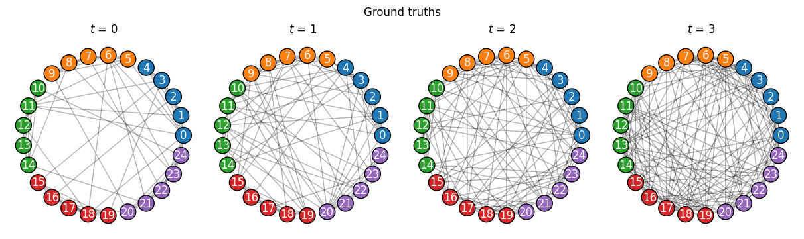
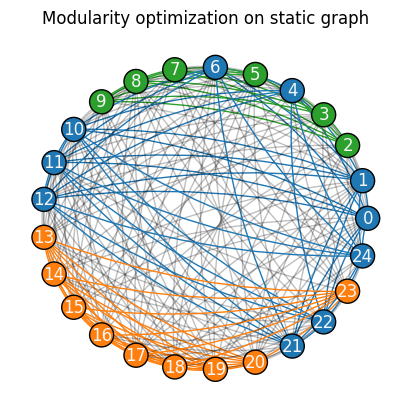
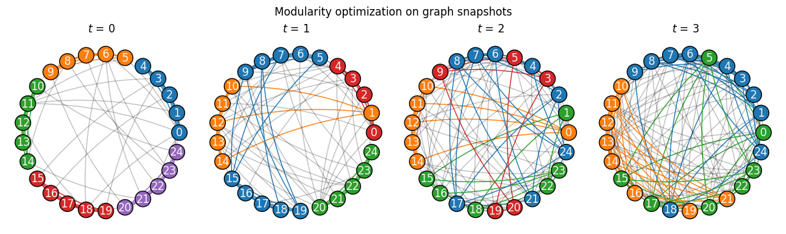
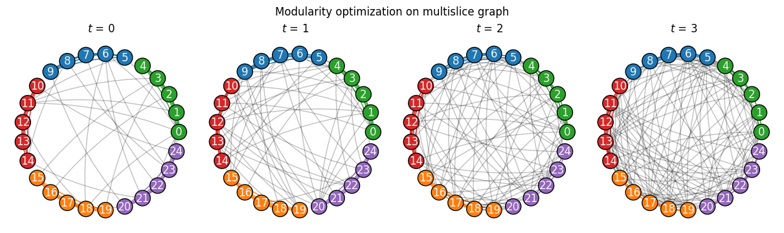

.. include:: ../include-examples.rst

###################
Community detection
###################

Community detection is a fundamental task in network analysis. This simple example demonstrates how
a network's temporal dynamics can overall benefit the detection of its mesoscale structures.

.. note::

   Contributions are welcome! If you would like to see a specific algorithm for temporal graphs
   implemented, please feel free to submit a pull request on the package's `GitHub repository
   <https://github.com/nelsonaloysio/networkx-temporal>`__.

Generate graph
==============

As a toy example, let's use the simplest `Stochastic Block Model
<https://networkx.org/documentation/stable/reference/generated/networkx.generators.community.stochastic_block_model.html>`__
to generate 4 graph snapshots, in which each of the 5 clusters of 5 nodes each continuously mix
over time (decreasing assortativity):

.. code-block:: python

   >>> nodes = 5       # Number of nodes in each cluster.
   >>> clusters = 5    # Number of clusters/communities.
   >>> snapshots = 4   # Temporal graphs to generate.
   >>>
   >>> p = .9          # High initial probability of within-community edges.
   >>> q = .1          # Low initial probability of inter-community edges.
   >>> rate = .125     # Change in within- and inter-community edges over time.
   >>>
   >>> TG = tx.from_snapshots([
   >>>     nx.stochastic_block_model(
   >>>         sizes=[nodes]*clusters,
   >>>         p=tx.generate_block_matrix(clusters, p=p-(t*rate), q=q+(t*rate)),
   >>>         seed=10
   >>>     )
   >>>     for t in range(snapshots)
   >>> ])
   >>>
   >>> print(TG)

.. seealso::

   The :func:`~networkx_temporal.generators.dynamic_stochastic_block_model`
   function for an SBM generator with node community transitions.

Let's plot the graphs, with colors representing communities and within-community edges:

.. code-block:: python

   >>> import matplotlib.pyplot as plt
   >>> colors = plt.cm.tab10.colors
   >>>
   >>> def get_edge_color(edges, node_color):
   >>>     edge_color = []
   >>>     for u, v in edges:
   >>>         if node_color[u] == node_color[v]:
   >>>             edge_color.append(node_color[u])  # Within-community edge.
   >>>         else:
   >>>             edge_color.append((0, 0, 0, .25))  # Inter-community edge.
   >>>     return edge_color

.. code-block:: python

   >>> # Node positions.
   >>> pos = nx.circular_layout(TG.to_static())
   >>>
   >>> # Node options for all graphs; colorize nodes by block/community.
   >>> node_color = [colors[x % len(colors)] for n, x in TG[0].nodes(data="block")]
   >>>
   >>> # Plot snapshots with community ground truths.
   >>> tx.draw(
   >>>     TG,
   >>>     pos=pos,
   >>>     figsize=(12, 3.5),
   >>>     node_size=300,
   >>>     node_color=node_color,
   >>>     edge_color=(0, 0, 0, .3),
   >>>     suptitle="Ground truths")

We see that all snapshots are generated with the same community structure, but varying degrees of
assortativity. Let's try to retrieve the ground truths using a simple community detection algorithm.

Modularity optimization
=======================

The `leidenalg <https://leidenalg.readthedocs.readwrite>`__ [1]_ package implements optimization algorithms
for community detection that may be applied on snapshot-based temporal graphs, allowing to better
capture their underlying structure.

.. attention ::

   Optimization algorithms may help with descriptive or exploratory tasks and post-hoc network
   analysis, but lack statistical rigor for inferential purposes. See `Peixoto (2021)
   <https://skewed.de/tiago/posts/descriptive-inferential/>`__ [2]_ for a discussion.

.. code-block:: python

   >>> import leidenalg as la

Optimizating static modularity
------------------------------

Let's start by considering the network as a single static graph, ignoring its temporal information.

We can observe that, depending on the initial node community assignments (e.g., with ``seed=0`` below),
`modularity <https://leidenalg.readthedocs.readwrite/en/stable/reference.html#modularityvertexpartition>`__
fails to retrieve the true communities (ground truths) in the network:

.. code-block:: python

   >>> membership = la.find_partition(
   >>>     TG.to_static("igraph"),
   >>>     la.ModularityVertexPartition,
   >>>     n_iterations=-1,
   >>>     seed=0,
   >>> )
   >>>
   >>> node_color = [colors[x % len(colors)] for x in membership]
   >>>
   >>> tx.draw(
   >>>     TG.to_static(),
   >>>     pos=pos,
   >>>     figsize=(4, 4),
   >>>     node_size=300,
   >>>     node_color=node_color,
   >>>     edge_color=get_edge_color(TG.to_static().edges(), node_color),
   >>>     connectionstyle="arc3,rad=0.1",
   >>>     suptitle="Modularity optimization on static graph")

Next, let's try considering the network's temporal information to see if we can improve the results.

Running the same algorithm separately on each of the generated snapshots retrieves the correct
clusters only on the first graph (:math:`t=0`). In addition, community indices (represented by their
colors) are not fixed over snapshots, which makes it harder to track their mesoscale dynamics:

.. code-block:: python

   >>> snapshot_membership = [
   >>>     la.find_partition(
   >>>         TG[t:t+1].to_static("igraph"),
   >>>         la.ModularityVertexPartition,
   >>>         n_iterations=-1,
   >>>         seed=0
   >>>     ).membership
   >>>     for t in range(len(TG))
   >>> ]
   >>>
   >>> temporal_node_color = [
   >>>     [colors[m] for m in snapshot_membership[t]]
   >>>     for t in range(len(TG))
   >>> ]
   >>>
   >>> tx.draw(
   >>>     TG,
   >>>     pos=pos,
   >>>     figsize=(12, 3.5),
   >>>     node_size=300,
   >>>     temporal_node_color=temporal_node_color,
   >>>     temporal_edge_color=[
   >>>         get_edge_color(G.edges(), temporal_node_color[t])
   >>>         for t, G in enumerate(TG)
   >>>     ],
   >>>     connectionstyle="arc3,rad=0.1",
   >>>     suptitle="Modularity optimization on graph snapshots")

This is partly due to modularity optimization expecting an assortative community structure, while
the network grew more disassortative over time. Not only the results of later snapshots are here
suboptimal, but the varying community indices increase the complexity of their temporal analysis.

Optimizing temporal (multislice) modularity
-------------------------------------------

Considering snapshots as layers (slices) of a multiplex graph, with `interslice edges coupling
temporal node copies <https://leidenalg.readthedocs.io/en/stable/multiplex.html#slices-to-layers>`__,
is one way of employing modularity optimization on dynamic graphs, which may help to better capture
their mesoscale structures [3]_. This example uses the same algorithm as before:

.. code-block:: python

   >>> multislice_membership, improvement = la.find_partition_temporal(
   >>>     TG.to_snapshots("igraph"),
   >>>     la.ModularityVertexPartition,
   >>>     interslice_weight=1.0,
   >>>     n_iterations=-1,
   >>>     seed=0,
   >>>     vertex_id_attr="_nx_name"
   >>> )
   >>>
   >>> temporal_node_color = [
   >>>     [colors[m] for m in multislice_membership[t]]
   >>>     for t in range(len(TG))
   >>> ]
   >>>
   >>> tx.draw(
   >>>     TG,
   >>>     pos=pos,
   >>>     figsize=(12, 3.5),
   >>>     node_size=300,
   >>>     temporal_node_color=temporal_node_color,
   >>>     temporal_edge_color=[
   >>>         get_edge_color(G.edges(), temporal_node_color[t])
   >>>         for t, G in enumerate(TG)
   >>>     ],
   >>>     connectionstyle="arc3,rad=0.1",
   >>>     suptitle="Modularity optimization on multislice graph")

Simply considering the network's temporal dimension allows modularity optimization to correctly
retrieve the ground truths in the network, while maintaining the community indices fixed over
time.

Evaluating community structures
===============================

We may now compute the modularity for different partitionings and optimization strategies:

.. code-block:: python

   >>> modularity = ("Static", "Snapshot", "Multislice")
   >>> partitions = (membership, snapshot_membership, multislice_membership)
   >>>
   >>> for m, partition in zip(modularity, partitions):
   >>>    Q = tx.modularity(TG, partition)
   >>>    mean = sum(Q) / len(Q)
   >>>    Q = [round(q, 3) for q in Q]
   >>>    print(f"{m}: Q = {Q} (mean: {mean:.3f})")

   Static: Q = [0.142, 0.132, 0.078, 0.018] (mean: 0.093)
   Snapshot: Q = [0.451, 0.268, 0.182, 0.132] (mean: 0.258)
   Multislice: Q = [0.451, 0.26, 0.089, 0.019] (mean: 0.205)

Snapshot-based optimization of modularity returned values of :math:`Q` that are higher than those
obtained by optimizing it on the static or multislice graphs, but they do not correspond to the
ground truths. This illustrates how modularity optimization may yield misleading results when the
assumptions of the quality function are not met by the network structure, as in this case.

The same observation applies to conductance [4]_, where lower values correspond to more tight-knit
communities, with fewer connections to the rest of the network compared to within themselves:

.. code-block:: python

   >>> for m, partition in zip(modularity, partitions):
   >>>    conductance = tx.conductance(TG, partition)
   >>>    mean = sum(conductance) / len(conductance)
   >>>    conductance = [round(c, 3) for c in conductance]
   >>>    print(f"{m}: C = {conductance} (mean: {mean:.3f})")

   Static: C = [0.517, 0.533, 0.587, 0.641] (mean: 0.569)
   Snapshot: C = [0.344, 0.493, 0.569, 0.536] (mean: 0.486)
   Multislice: C = [0.344, 0.532, 0.71, 0.78] (mean: 0.591)

We see how Leiden optimization on snapshots returned overall lower conductance values, which would
indicate better community structure, but this assumption is not met by the network structure.
Still, we may achieve better insight by computing a temporal version of modularity:

.. code-block:: python

   for m, partition in zip(modularity, partitions):
      Q_ms = tx.multislice_modularity(TG, partition, interslice_weight=1)
      print(f"{m}: multislice Q = {Q_ms:.3f}")

   Static: multislice Q = 0.075
   Snapshot: multislice Q = 0.027
   Multislice: multislice Q = 0.076

Multislice modularity better captures a quality measure of temporal community structures and
returns a single value that is more interpretable than computing the mean over snapshots. In this
particular example, although not significant, we also observe a higher value of modularity :math:`Q`.

This example showcases how employing time-aware quality functions for the evaluation of community
structure helps in the task of community detection, allowing a better description of the network
for exploratory analyses, although it should be used with care as a heuristic procedure.

-----

.. rubric:: References

.. [1] V. A. Traag, L. Waltman, N. J. van Eck (2019). ''From Louvain to Leiden: guaranteeing
   well-connected communities''. Scientific Reports, 9(1), 5233.

.. [2] Tiago. P. Peixoto (2023). ''Descriptive Vs. Inferential Community Detection in Networks:
   Pitfalls, Myths and Half-Truths''. Elements in the Structure and Dynamics of Complex Networks,
   Cambridge University Press.

.. [3] P. J. Mucha et al (2010). ''Community Structure in Time-Dependent,
   Multiscale, and Multiplex Networks''. Science, 328, 876--878.

.. [4] Kannan, R., Vempala, S., & Vetta, A. (2004). ''On clusterings: Good, bad and spectral''.
   Journal of the ACM (JACM), 51(3), 497-515.