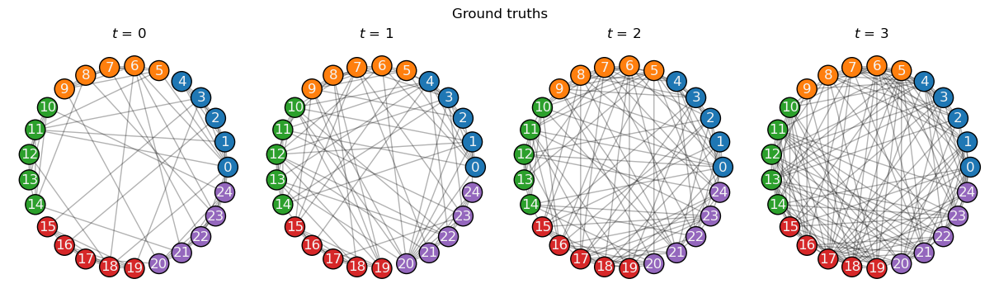
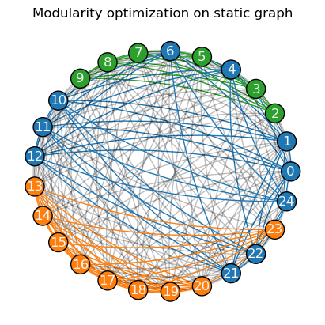
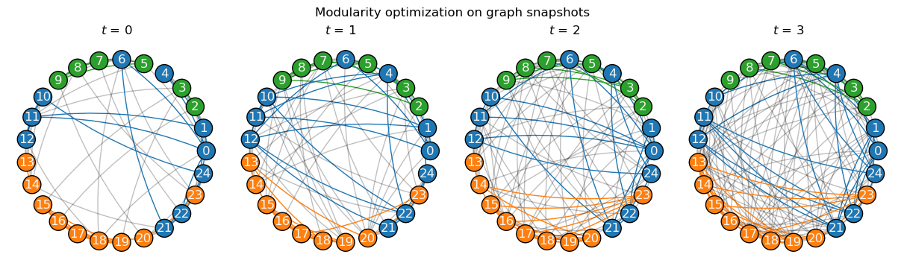
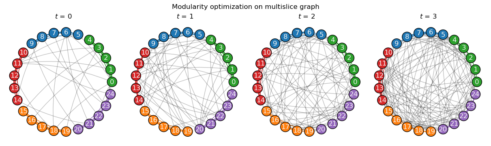
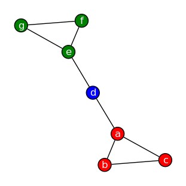

.. include:: ../include-template.rst

###################
Community detection
###################

   .. image:: https://colab.research.google.com/assets/colab-badge.svg
      :target: https://colab.research.google.com/github/nelsonaloysio/networkx-temporal/blob/main/notebook/networkx-temporal-04-community.ipynb
      :alt: Open on Colab
      :align: right

   Examples in this guide are also available as an interactive
   `Jupyter notebook
   <https://github.com/nelsonaloysio/networkx-temporal/blob/main/notebook/networkx-temporal-04-community.ipynb>`__.

Community detection is a fundamental task in network analysis. This simple example demonstrates how
a network's temporal dynamics can overall benefit the detection of its mesoscale structures.

Generate graph
==============

As a toy graph, let's use the simplest `Stochastic Block Model
<https://networkx.org/documentation/stable/reference/generated/networkx.generators.community.stochastic_block_model.html>`__
to generate 4 snapshots, in which each of the 5 clusters of 5
nodes each continuously mix over time (decreasing assortativity):

.. code-block:: python

   >>> import networkx as nx
   >>> import networkx_temporal as tx
   >>>
   >>> TG = tx.temporal_graph()
   >>>
   >>> for r in [0, .125, .25, .375]:
   >>>     p = tx.generate_block_matrix(k=5, p=.9-r, q=.1+r)
   >>>     G = nx.stochastic_block_model(p=p, sizes=[5]*5, seed=10)
   >>>     TG.add_snapshot(tx.to_multigraph(G))
   >>>
   >>> print(TG)

   TemporalGraph (t=4) with 25 nodes and 427 edges

Let's plot the graphs, with colors representing communities and within-community edges:

.. code-block:: python

   >>> import matplotlib.pyplot as plt
   >>> colors = plt.cm.tab10.colors
   >>>
   >>> def get_edge_color(edges, node_color):
   >>>     edge_color = []
   >>>     for u, v in edges:
   >>>         if node_color[u] == node_color[v]:
   >>>             edge_color.append(node_color[u])  # Within-community edge.
   >>>         else:
   >>>             edge_color.append((0, 0, 0, .25))  # Inter-community edge.
   >>>     return edge_color
   >>>
   >>> # Node positions.
   >>> pos = nx.circular_layout(TG.to_static())
   >>>
   >>> # Node options for all graphs; colorize nodes by block/community.
   >>> node_color = [colors[x % len(colors)] for n, x in TG[0].nodes(data="block")]
   >>>
   >>> # Plot snapshots with community ground truths.
   >>> tx.draw(TG, pos=pos, figsize=(12, 3.5), node_size=300,
   >>>         node_color=node_color, edge_color=(0, 0, 0, .3),
   >>>         suptitle="Ground truths")

|

We see that all snapshots are generated with the same community structure, but varying degrees of
assortativity. Let's try to retrieve the ground truths using a simple community detection algorithm.

.. seealso::

   The :func:`~networkx_temporal.generators.dynamic_stochastic_block_model`
   function for graphs with time-evolving communities.

Modularity optimization
=======================

The `leidenalg <https://leidenalg.readthedocs.io>`__ [1]_ package implements optimization algorithms
for community detection that may be applied on snapshot-based temporal graphs, allowing to better
capture their underlying structure.

.. attention ::

   Optimization algorithms may help with descriptive or exploratory tasks and post-hoc network
   analysis, but lack statistical rigor for inferential purposes. See `Peixoto (2021)
   <https://skewed.de/tiago/posts/descriptive-inferential/>`__ [2]_ for a discussion.

Optimizating static modularity
------------------------------

Let's start by considering the network as a single static graph, ignoring its temporal information.

We can observe that, depending on the initial node community assignments (e.g., with ``seed=0`` below),
`modularity <https://leidenalg.readthedocs.io/en/stable/reference.html#modularityvertexpartition>`__
fails to retrieve the true communities (ground truths) in the network:

.. code-block:: python

   >>> G = TG.to_static()
   >>> assignments = tx.leiden_communities(G, max_iter=-1, seed=0)
   >>>
   >>> node_color = [colors[x % len(colors)] for x in assignments]
   >>>
   >>> tx.draw(G, pos=pos, figsize=(4,4), node_size=300,
   >>>         node_color=node_color, edge_color=get_edge_color(G.edges(), node_color),
   >>>         connectionstyle="arc3,rad=0.1",
   >>>         suptitle="Modularity optimization on static graph")

|

Next, let's try considering the network's temporal information to see if we can improve the results.

Running the same algorithm separately on each of the generated snapshots retrieves the correct
clusters only on the first graph (:math:`t=0`). In addition, community indices (represented by their
colors) are not fixed over snapshots, which makes it harder to track their mesoscale dynamics:

.. code-block:: python

   >>> snapshot_assignments = [
   >>>     tx.leiden_communities(G, max_iter=-1, seed=0) for G in TG
   >>> ]
   >>>
   >>> temporal_node_color = [
   >>>     [colors[m] for m in snapshot_assignments[t]]
   >>>     for t in range(len(TG))
   >>> ]
   >>>
   >>> tx.draw(TG, pos=pos, figsize=(12, 3.5), node_size=300,
   >>>         temporal_node_color=temporal_node_color,
   >>>         temporal_edge_color=[
   >>>              get_edge_color(G.edges(), temporal_node_color[t])
   >>>              for t, G in enumerate(TG)
   >>>          ],
   >>>          connectionstyle="arc3,rad=0.1",
   >>>          suptitle="Modularity optimization on graph snapshots")

|

This is partly due to modularity optimization expecting an assortative community structure, while
the network grew more disassortative over time. Not only the results of later snapshots are here
suboptimal, but the varying community indices increase the complexity of their temporal analysis.

Optimizing multislice modularity
--------------------------------

Considering snapshots as layers (slices) of a multiplex graph, with `interslice edges coupling
temporal node copies <https://leidenalg.readthedocs.io/en/stable/multiplex.html#slices-to-layers>`__,
is one way of employing modularity optimization on dynamic graphs, which may help to better capture
their mesoscale structures [3]_. This example uses the same algorithm as before:

.. code-block:: python

   >>> multislice_assignments = tx.leiden_temporal_partition(TG, n_iterations=-1, seed=0)
   >>>
   >>> temporal_node_color = [
   >>>     [colors[m] for m in multislice_assignments[t]]
   >>>     for t in range(len(TG))
   >>> ]
   >>>
   >>> tx.draw(TG, pos=pos, figsize=(12, 3.5), node_size=300,
   >>>         temporal_node_color=temporal_node_color,
   >>>         temporal_edge_color=[
   >>>             get_edge_color(G.edges(), temporal_node_color[t])
   >>>             for t, G in enumerate(TG)
   >>>         ],
   >>>         connectionstyle="arc3,rad=0.1",
   >>>         suptitle="Modularity optimization on multislice graph")

|

Simply considering the network's temporal dimension allows modularity optimization to correctly
retrieve the ground truths in the network, while maintaining the community indices fixed over
time.

Evaluating community structures
===============================

We may now compute the modularity for different partitionings and optimization strategies.
Let's compare the values obtained considering static, snapshot, and multislice graph optimization:

.. code-block:: python

   >>> modularity = ("Static", "Snapshot", "Multislice")
   >>> static_assignments = dict(enumerate(assignments))  # Static assignments.
   >>> partitions = (static_assignments, snapshot_assignments, multislice_assignments)
   >>>
   >>> for m, assignments in zip(modularity, partitions):
   >>>    Q = tx.modularity(TG, assignments)
   >>>    mean = sum(Q) / len(Q)
   >>>    Q = [round(q, 3) for q in Q]
   >>>    print(f"{m}: Q = {Q} (mean: {mean:.3f})")

   Static: Q = [0.363, 0.254, 0.099, 0.057] (mean: 0.193)
   Snapshot: Q = [0.451, 0.268, 0.182, 0.132] (mean: 0.258)
   Multislice: Q = [0.451, 0.26, 0.089, 0.019] (mean: 0.205)

Snapshot-based optimization of modularity returned values of :math:`Q` that are higher than those
obtained by optimizing it on the static or multislice graphs, but they do not correspond to the
ground truths. This illustrates how modularity optimization may yield misleading results when the
assumptions of the quality function are not met by the network structure, as in this case.

The same observation can be made for conductance [4]_, where lower values correspond to more
tight-knit communities, with comparatively fewer connections to the rest of the network:

.. code-block:: python

   >>> for m, assignments in zip(optimization, partitions):
   >>>    conductance = tx.conductance(TG, assignments)
   >>>    mean = sum(conductance) / len(conductance)
   >>>    conductance = [round(c, 3) for c in conductance]
   >>>    print(f"{m}: C = {conductance} (mean: {mean:.3f})")

   Static: C = [0.348, 0.478, 0.652, 0.702] (mean: 0.545)
   Snapshot: C = [0.344, 0.493, 0.569, 0.536] (mean: 0.486)
   Multislice: C = [0.344, 0.532, 0.71, 0.78] (mean: 0.591)

We see how the assumption that communities are assortative structures leads to suboptimal results
as it is not shared by this network, which  becomes increasingly disassortative over time.

Time-aware quality functions
----------------------------

The :func:`~networkx_temporal.algorithms.multislice_modularity` extension of the static metric
introduces [3]_ interslice edges connecting temporal node copies, with the goal of better capturing
the quality of temporal community structures. We can compute the multislice modularity :math:`Q_{ms}`
for all partitionings:

.. code-block:: python

   >>> Q_ms = tx.multislice_modularity(TG, multislice_assignments, interslice_weight=1)
   >>> print(f"{m}: Q_ms = {Q_ms:.3f}")

   Multislice: Q_ms = 0.212

In this case, the highest value obtained with Leiden optimization corresponds to the ground
truth communities. A better description of the network is achieved by considering its temporal
dimension, showcasing how time-aware quality functions may improve community detection tasks,
even for greedy optimization approaches aiming at a descriptive analysis of the graph.

Mixed-membership communities
----------------------------

Consider the following graph with two assortative communities connected by a bridge
node :math:`d`:

.. code-block:: python

   >>> TG = tx.TemporalGraph()
   >>> TG.add_edges_from([
   >>>     ("a", "b"), ("b", "c"), ('c', "a"), ("d", "a"),
   >>>     ("e", "f"), ("f", "g"), ("g", "e"), ("d", "e"),
   >>> ])
   >>> tx.draw(TG, layout="spring", node_color=list("rrr0ggg"))

|

The modularity :math:`Q` of a partitioning with node :math:`d` in neither community corresponds to:

.. code-block:: python

   >>> G = TG.to_static()
   >>> community_vector = [0, 0, 0,  1 , 2, 2, 2]
   >>> tx.modularity(G, community_vector)

   0.3515625

If considered to be in either one of the communities, it yields a slightly higher value of :math:`Q`:

.. code-block:: python

   >>> community_vector = [0, 0, 0,  0 , 1, 1, 1]
   >>> tx.modularity(G, community_vector)

   0.3671875

The :func:`~networkx_temporal.algorithms.modularity_spectral` function implements support for
sparse adjacency matrices and mixed-memberships, where nodes may belong to multiple clusters with
different weights. For example, a high increase in modularity is achieved by considering node :math:`d`
in both communities :math:`[0, 1]`:

.. code-block:: python

   >>> community_matrix = tx.community_matrix_from_vector(community_vector)
   >>> community_matrix[3] = [0.5, 0.5]  # Assign node 'd' to both communities 1 and 2.
   >>> community_matrix

   array([[1. , 0. ],
         [1. , 0. ],
         [1. , 0. ],
         [0.5, 0.5],
         [0. , 1. ],
         [0. , 1. ],
         [0. , 1. ]])

.. code-block:: python

   >>> tx.modularity(G, community_matrix, spectral=True)

   0.375

This illustrates how algorithms that consider both mixed and dynamic community assignments may be
more fitting choices to graphs in which nodes are not restricted to a single community,
including greedy optimization approaches, such as those using modularity as a quality function.

.. seealso::

   The `GPU acceleration <gpu.html>`__ section for more community detection examples, including
   spectral clustering, modularity optimization, and GPU-accelerated algorithm implementations.

-----

.. rubric:: References

.. [1] V. A. Traag, L. Waltman, N. J. van Eck (2019). ''From Louvain to Leiden: guaranteeing
   well-connected communities''. Scientific Reports, 9(1), 5233.

.. [2] Tiago. P. Peixoto (2023). ''Descriptive Vs. Inferential Community Detection in Networks:
   Pitfalls, Myths and Half-Truths''. Elements in the Structure and Dynamics of Complex Networks,
   Cambridge University Press.

.. [3] P. J. Mucha et al (2010). ''Community Structure in Time-Dependent,
   Multiscale, and Multiplex Networks''. Science, 328, 876--878.

.. [4] Kannan, R., Vempala, S., & Vetta, A. (2004). ''On clusterings: Good, bad and spectral''.
   Journal of the ACM (JACM), 51(3), 497-515.