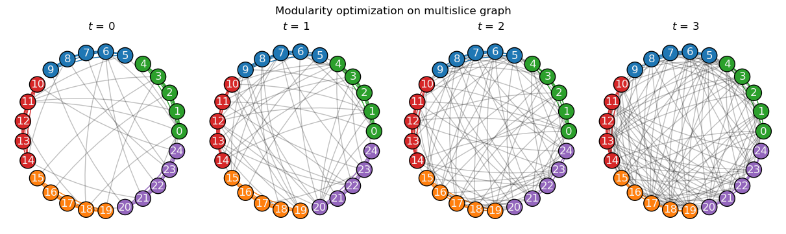

.. include:: ../include-examples.rst

###################
Community detection
###################

Community detection is a fundamental task in network analysis. This simple example demonstrates how
a network's temporal dynamics can overall benefit the detection of its mesoscale structures.

.. note::

   Contributions are welcome! If you would like to see a specific algorithm for temporal graphs
   implemented, please feel free to submit a pull request on the package's `GitHub repository
   <https://github.com/nelsonaloysio/networkx-temporal>`__.

Generate graph
==============

As a toy example, let's first use the simplest `Stochastic Block Model
<https://networkx.org/documentation/stable/reference/generated/networkx.generators.community.stochastic_block_model.html>`__
to generate 4 graph snapshots, in which each of the 5 clusters of 5 nodes each continuously mix
together over time:

.. code-block:: python

   >>> snapshots = 4   # Temporal graphs to generate.
   >>> clusters = 5    # Number of clusters/communities.
   >>> order = 5       # Nodes in each cluster.
   >>> intra = .9      # High initial probability of within-community edges.
   >>> inter = .1      # Low initial probability of inter-community edges.
   >>> change = .125   # Change in within- and inter-community edges over time.
   >>>
   >>> # Get probability matrix for each snapshot.
   >>> probs = [[[
   >>>     (intra if i == j else inter) + (t * change * (-1 if i == j else 1))
   >>>     for j in range(clusters)]
   >>>     for i in range(clusters)]
   >>>     for t in range(snapshots)]
   >>>
   >>> # Create graphs from probabilities.
   >>> graphs = {}
   >>> for t in range(snapshots):
   >>>     graphs[t] = nx.stochastic_block_model(clusters*[order], probs[t], seed=10)
   >>>     graphs[t].name = t
   >>>
   >>> # Create temporal graph from snapshots.
   >>> TG = tx.from_snapshots(graphs)

Let's plot the graphs, with node colors representing communities and within-community edges:

.. code-block:: python

   >>> import matplotlib.pyplot as plt
   >>>
   >>> def get_edge_color(edges: list, node_color: dict):
   >>>     return [node_color[u]
   >>>             if node_color[u] == node_color[v]
   >>>             else "#00000035"
   >>>             for u, v in edges]
   >>>
   >>> c = plt.cm.tab10.colors
   >>>
   >>> # Node positions.
   >>> pos = nx.circular_layout(TG.to_static())
   >>>
   >>> # Community ground truths.
   >>> node_color = [c[i // clusters] for i in range(TG.temporal_order())]
   >>>
   >>> # Colorize within-community edges.
   >>> temporal_opts = {t: {"edge_color": get_edge_color(TG[t].edges(), node_color)}
   >>>                  for t in range(len(TG))}
   >>>
   >>> # Plot snapshots with community ground truths.
   >>> tx.draw(
   >>>     TG,
   >>>     pos=pos,
   >>>     figsize=(12, 3.5),
   >>>     node_color=node_color,
   >>>     temporal_opts=temporal_opts,
   >>>     connectionstyle="arc3,rad=0.1",
   >>>     suptitle="Ground truths")

.. image:: ../../assets/figure/fig-9.png

We see the graphs are generated with the same community structure, but continuously decreasing
assortativity. Let's try and retrieve the ground truths using a simple community detection algorithm.

-----

Modularity optimization
=======================

The `leidenalg <https://leidenalg.readthedocs.io>`__ [1]_ package implements optimization algorithms
for community detection that may be applied on snapshot-based temporal graphs, allowing to better
capture their underlying structure.

.. attention ::

   Optimizations algorithms may help with descriptive or exploratory tasks and post-hoc network
   analysis, but lack statistical rigor for inferential purposes. See `Peixoto (2021)
   <https://skewed.de/tiago/posts/descriptive-inferential/>`__ [2]_ for a discussion.

On the static graph
-------------------

Let's start by considering the network as a single static graph, i.e., ignoring its temporal information.

We can observe that depending on the initial node community assigments (e.g., with ``seed=0`` below),
`modularity <https://leidenalg.readthedocs.io/en/stable/reference.html#modularityvertexpartition>`__ [3]_
fails to retrieve the true communities (ground truths) in the network:

.. code-block:: python

   >>> import leidenalg as la
   >>>
   >>> membership = la.find_partition(
   >>>     TG.to_static("igraph"),
   >>>     la.ModularityVertexPartition,
   >>>     n_iterations=-1,
   >>>     seed=0,
   >>> )
   >>>
   >>> node_color = [c[m] for m in membership.membership]
   >>> edge_color = get_edge_color(TG.to_static().edges(), node_color)
   >>>
   >>> tx.draw(
   >>>     TG.to_static(),
   >>>     pos=pos,
   >>>     figsize=(4, 4),
   >>>     node_size=300,
   >>>     node_color=node_color,
   >>>     edge_color=edge_color,
   >>>     connectionstyle="arc3,rad=0.1",
   >>>     suptitle="Modularity optimization on static graph")

Next, let's try considering the network's temporal information to see if we can improve the results.

On each snapshot
----------------

Running the same algorithm separately on each of the generated snapshots retrieves the correct
clusters only on the first graph (:math:`t=0`). In addition, community indices (represented by their
colors) are not fixed over snapshots, which makes understanding their mesoscale dynamics harder:

.. code-block:: python

   >>> temporal_node_color, temporal_edge_color = {}, {}
   >>>
   >>> for t in range(len(TG)):
   >>>     membership = la.find_partition(
   >>>         TG[t:t+1].to_static("igraph"),
   >>>         la.ModularityVertexPartition,
   >>>         n_iterations=-1,
   >>>         seed=0)
   >>>     temporal_node_color[t] = [c[m] for m in membership.membership]
   >>>     temporal_edge_color[t] = get_edge_color(TG[t].edges(), temporal_node_color[t])
   >>>
   >>> tx.draw(
   >>>     TG,
   >>>     pos=pos,
   >>>     figsize=(12, 3.5),
   >>>     node_size=300,
   >>>     temporal_node_color=temporal_node_color,
   >>>     temporal_edge_color=temporal_edge_color,
   >>>     connectionstyle="arc3,rad=0.1",
   >>>     suptitle="Modularity optimization on each snapshot")

.. image:: ../../assets/figure/fig-11.png

This is partly due to modularity optimization expecting an assortative community structure, while
the network grew more disassortative over time. Not only the results of later snapshots are here
suboptimal, but the changing community indices also increases the complexity of their analysis.

On the temporal graph
---------------------

Considering snapshots as layers (slices) of a multiplex graph, with `interslice edges coupling
temporal node copies <https://leidenalg.readthedocs.io/en/stable/multiplex.html#slices-to-layers)>`__,
is one way of employing modularity optimization on dynamic graphs, which may help to better capture
their mesoscale structures. The example below uses the same algorithm as before:

.. code-block:: python

   >>> temporal_membership, improvement = la.find_partition_temporal(
   >>>     TG.to_snapshots("igraph"),
   >>>     la.ModularityVertexPartition,
   >>>     interslice_weight=1.0,
   >>>     n_iterations=-1,
   >>>     seed=0,
   >>>     vertex_id_attr="_nx_name")
   >>>
   >>> temporal_node_color = {
   >>>     t: [c[m] for m in temporal_membership[t]]
   >>>     for t in range(len(TG))}
   >>>
   >>> temporal_edge_color = {
   >>>     t: get_edge_color(TG[t].edges(), temporal_node_color[t])
   >>>     for t in range(len(TG))}
   >>>
   >>> tx.draw(
   >>>     TG,
   >>>     pos=pos,
   >>>     figsize=(12, 3.5),
   >>>     node_size=300,
   >>>     temporal_node_color=temporal_node_color,
   >>>     temporal_edge_color=temporal_edge_color,
   >>>     connectionstyle="arc3,rad=0.1",
   >>>     suptitle="Modularity optimization on multiplex graph")

As observed, considering the network's temporal information allowed the algorithm to correctly
retrieve the ground truths in this particular example, as well as to maintain the same community
indices across snapshots, which helps in the study of the network's mesoscale temporal dynamics.

Although very simple, this example showcases how considering a network's temporal information can
benefit its analysis, as well as help to better understand and visualize its mesoscale structures,
for which this package provides a flexible framework to work with, especially in a topological level.

-----

.. rubric:: References

.. [1] V. A. Traag, L. Waltman, N. J. van Eck (2019). ''From Louvain to Leiden: guaranteeing
   well-connected communities''. Scientific Reports, 9(1), 5233.

.. [2] Tiago. P. Peixoto (2023). ''Descriptive Vs. Inferential Community Detection in Networks:
   Pitfalls, Myths and Half-Truths''. Elements in the Structure and Dynamics of Complex Networks,
   Cambridge University Press.

.. [3] Mark Newman (2018). ''Networks''. Oxford University Press, 2nd ed., pp. 498--514.