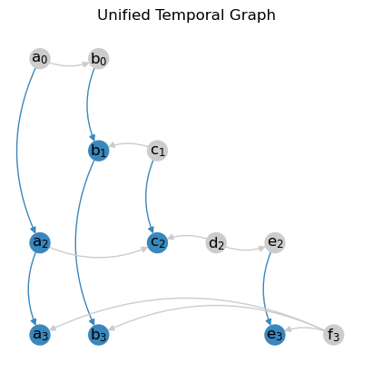
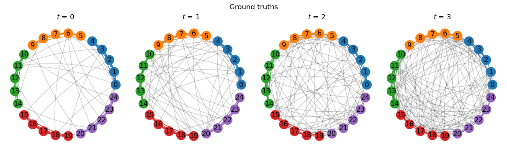
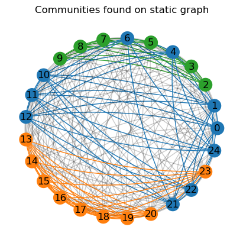

.. hint::

    This guide is also available as an interactive
    `Jupyter notebook
    <https://github.com/nelsonaloysio/networkx-temporal/blob/main/notebook/networkx-temporal.ipynb>`__
    (`open on Colab
    <https://colab.research.google.com/github/nelsonaloysio/networkx-temporal/blob/main/notebook/networkx-temporal.ipynb>`__).

###################
Community detection
###################

Community detection is a fundamental task in network analysis. This simple example demonstrates how
a network's temporal dynamics can benefit the detection of its mesoscale structures.

.. note::

   Contributions are welcome! If you would like to see a specific algorithm for temporal graphs
   implemented, please feel free to submit a pull request on the package's `GitHub repository
   <https://github.com/nelsonaloysio/networkx-temporal>`__.

Generate graph
==============

As a toy example, let's first use the simplest `Stochastic Block Model
<https://networkx.org/documentation/stable/reference/generated/networkx.generators.community.stochastic_block_model.html>`__
to generate 4 graph snapshots, in which each of the 5 clusters of 5 nodes each continuously mix
together over time:

.. code-block:: python

    >>> snapshots = 4   # Temporal graphs to generate.
    >>> clusters = 5    # Number of clusters/communities.
    >>> order = 5       # Nodes in each cluster.
    >>> intra = .9      # High initial probability of intra-community edges.
    >>> inter = .1      # Low initial probability of inter-community edges.
    >>> change = .125   # Change in intra- and inter-community edges over time.
    >>>
    >>> # Get probability matrix for each snapshot.
    >>> probs = [[[
    >>>     (intra if i == j else inter) + (t * change * (-1 if i == j else 1))
    >>>     for j in range(clusters)]
    >>>     for i in range(clusters)]
    >>>     for t in range(snapshots)]
    >>>
    >>> # Create graphs from probabilities.
    >>> graphs = {}
    >>> for t in range(snapshots):
    >>>     graphs[t] = nx.stochastic_block_model(clusters*[order], probs[t], seed=10)
    >>>     graphs[t].name = t
    >>>
    >>> # Create temporal graph from snapshots.
    >>> TG = tx.from_snapshots(graphs)

Let's plot the graphs, with node colors representing communities and intra-community edges:

.. code-block:: python

    >>> import matplotlib.pyplot as plt
    >>>
    >>> def get_edge_color(edges: list, node_color: dict):
    >>>     return [node_color[u]
    >>>             if node_color[u] == node_color[v]
    >>>             else "#00000035"
    >>>             for u, v in edges]
    >>>
    >>> c = plt.cm.tab10.colors
    >>>
    >>> # Node positions.
    >>> pos = nx.circular_layout(TG.to_static())
    >>>
    >>> # Community ground truths.
    >>> node_color = [c[i // clusters] for i in range(TG.temporal_order())]
    >>>
    >>> # Colorize intra-community edges.
    >>> temporal_opts = {t: {"edge_color": get_edge_color(TG[t].edges(), node_color)}
    >>>                  for t in range(len(TG))}
    >>>
    >>> # Plot snapshots with community ground truths.
    >>> tx.draw(
    >>>     TG,
    >>>     pos=pos,
    >>>     figsize=(14, 4),
    >>>     node_color=node_color,
    >>>     temporal_opts=temporal_opts,
    >>>     connectionstyle="arc3,rad=0.1",
    >>>     suptitle="Ground truth")

We see the graphs are generated with the same community structure, but continuously decreasing
assortativity. Let's try and retrieve the ground truths using a simple community detection algorithm.

-----

Modularity optimization
=======================

The `leidenalg <https://leidenalg.readthedocs.io>`__ package implements optimization algorithms
for community detection that may be applied on snapshot-based temporal graphs, allowing to better
capture their underlying structure.

.. attention ::

   Optimizations algorithms may help with descriptive or exploratory tasks and post-hoc network
   analysis, but lack statistical rigor for inferential purposes. See `Peixoto (2021)
   <https://skewed.de/tiago/posts/descriptive-inferential/>`__ [1]_ for a discussion.

On the static graph
-------------------

Let's start by considering the network as a ''flattened'' graph, i.e., ignoring its temporal information.

We can observe that depending on the initial node community assigments (e.g., with ``seed=0`` below),
`modularity <https://leidenalg.readthedocs.io/en/stable/reference.html#modularityvertexpartition>`__
fails to retrieve the true communities (their ground truths) in the network:

.. code-block:: python

    >>> import leidenalg as la
    >>>
    >>> membership = la.find_partition(
    >>>     TG.to_static("igraph"),
    >>>     la.ModularityVertexPartition,
    >>>     n_iterations=-1,
    >>>     seed=0,
    >>> )
    >>>
    >>> node_color = [c[m] for m in membership.membership]
    >>> edge_color = get_edge_color(TG.to_static().edges(), node_color)
    >>>
    >>> tx.draw(
    >>>     TG.to_static(),
    >>>     pos=pos,
    >>>     figsize=(4, 4),
    >>>     node_color=node_color,
    >>>     edge_color=edge_color,
    >>>     connectionstyle="arc3,rad=0.1",
    >>>     suptitle="Communities found by modularity on static graph")

Although two communities are correctly retrieved (in red and green), nodes :math:`0` to :math:`4`,
which form a fifth community in the network, are misclassified as belonging to the blue and orange
communities.
Next, let's try considering the network's temporal information to see if we can improve the results.

On each snapshot
----------------

Running the same algorithm separately on each of the generated snapshots retrieves the correct
clusters only on the first graph (:math:`t=0`). In addition, community indices (represented by their
colors) are not fixed over snapshots, which makes understanding their mesoscale dynamics harder:

.. code-block:: python

    >>> temporal_opts = {}
    >>>
    >>> for t in range(len(TG)):
    >>>     membership = la.find_partition(
    >>>         TG[t:t+1].to_static("igraph"),
    >>>         la.ModularityVertexPartition,
    >>>         n_iterations=-1,
    >>>         seed=0,
    >>>     )
    >>>     node_color = [c[m] for m in membership.membership]
    >>>     edge_color = get_edge_color(TG[t].edges(), node_color)
    >>>     temporal_opts[t] = {"node_color": node_color, "edge_color": edge_color}
    >>>
    >>> tx.draw(
    >>>     TG,
    >>>     pos=pos,
    >>>     figsize=(14, 4),
    >>>     temporal_opts=temporal_opts,
    >>>     connectionstyle="arc3,rad=0.1",
    >>>     suptitle="Communities found by modularity on snapshots")

This is mostly due to modularity optimization expecting an assortative community structure, while
our network grows more disassortative over time. Not only the results of later snapshots are here
suboptimal, it is also particularly hard to understand the network's mesoscale temporal dynamics.

On the temporal graph
---------------------

`Coupling temporal nodes <https://leidenalg.readthedocs.io/en/stable/multiplex.html#slices-to-layers>`__
allows the same algorithm to correctly retrieve the ground truths in this case, while at the same
time maintaining community indices consistent over time, as seen below:

.. code-block:: python

    >>> temporal_opts = {}
    >>>
    >>> temporal_membership, improvement = la.find_partition_temporal(
    >>>     TG.to_snapshots("igraph"),
    >>>     la.ModularityVertexPartition,
    >>>     interslice_weight=1.0,
    >>>     n_iterations=-1,
    >>>     seed=0,
    >>>     vertex_id_attr="_nx_name"
    >>> )
    >>>
    >>> for t in range(len(TG)):
    >>>     node_color = [c[m] for m in temporal_membership[t]]
    >>>     edge_color = get_edge_color(TG[t].edges(), node_color)
    >>>     temporal_opts[t] = {"node_color": node_color, "edge_color": edge_color}
    >>>
    >>> tx.draw(
    >>>     TG,
    >>>     pos=pos,
    >>>     figsize=(14, 4),
    >>>     temporal_opts=temporal_opts,
    >>>     connectionstyle="arc3,rad=0.1",
    >>>     suptitle="Communities found by modularity on temporal graph")

This method seems particularly useful to track communities over time, as it allows to maintain the
same community indices across snapshots, potentially contributing to the study of their dynamics.
Although very simple, this example showcases how considering a network's temporal information can benefit
its analysis, as well as help to better understand and visualize its mesoscale structures.

-----

.. rubric:: References

.. [1] Tiago. P. Peixoto. ''Descriptive Vs. Inferential Community Detection in Networks: Pitfalls,
   Myths and Half-Truths'' (2023). Elements in the Structure and Dynamics of Complex Networks,
   Cambridge U.P.