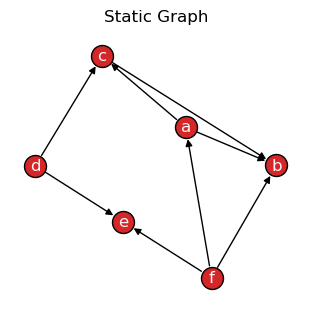
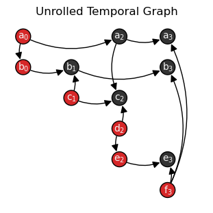
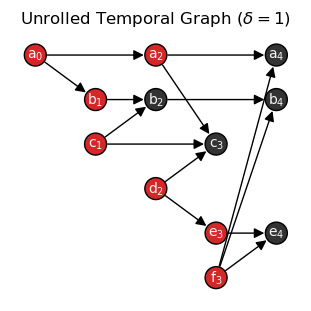
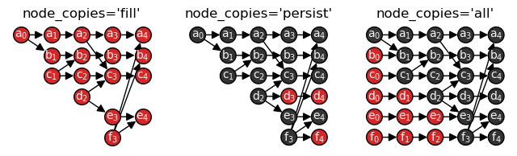

.. seealso::

    All examples in this guide are also available as an interactive
    `Jupyter notebook
    <https://github.com/nelsonaloysio/networkx-temporal/blob/main/notebook/networkx-temporal-02-convert.ipynb>`__
    (`open on Colab
    <https://colab.research.google.com/github/nelsonaloysio/networkx-temporal/blob/main/notebook/networkx-temporal-02-convert.ipynb>`__).

#####################
Convert and transform
#####################

This package provides a set of functions to manipulate graph classes, formats, and representations.
In this context, :mod:`~networkx_temporal.utils.convert` refers to different graph-based libraries,
e.g., `igraph <https://igraph.org/python>`__, and :mod:`~networkx_temporal.transform` refers to the
underlying data structure used to store object relations, e.g.,
`event-based temporal graphs <#event-based-temporal-graph>`__.

Graph types and classes
=======================

The :mod:`~networkx_temporal.transform` module provides functions to convert among different
:class:`~networkx_temporal.classes.TemporalGraph` types, depending on whether the underlying data
structure allows parallel edges (multigraphs) or not.
Static or temporal multigraphs may be converted to graphs without parallel edges and vice-versa.

.. code-block:: python

   >>> import networkx_temporal as tx
   >>>
   >>> TG = tx.temporal_graph(directed=True)  # tx.TemporalMultiDiGraph
   >>>
   >>> TG.add_edge("a", "b", time=0)
   >>> TG.add_edge("c", "b", time=1)
   >>> TG.add_edge("d", "c", time=2)
   >>> TG.add_edge("d", "e", time=2)
   >>> TG.add_edge("a", "c", time=2)
   >>> TG.add_edge("f", "e", time=3)
   >>> TG.add_edge("f", "a", time=3)
   >>> TG.add_edge("f", "b", time=3)
   >>>
   >>> print(TG)

   TemporalMultiDiGraph (t=1) with 6 nodes and 8 edges

.. code-block:: python

   >>> TG.add_edge("c", "b", time=0)   # <-- parallel edge
   >>> print(TG)

   TemporalMultiDiGraph (t=1) with 6 nodes and 9 edges

The :func:`~networkx_temporal.transform.from_multigraph` function combines parallel edges
and sum their ``weight`` (default: :math:`1`) values. Notice that :math:`(c, b)` ``time``
is now set to :math:`0`, as later attribute values take precedence over earlier ones:

.. code-block:: python

   >>> TG = tx.from_multigraph(TG)
   >>> TG.edge("c", "b")

   {0: {'time': 0, 'weight': 2}}

Converting the resulting
:class:`~networkx_temporal.classes.TemporalDiGraph`
back to a
:class:`~networkx_temporal.classes.TemporalMultiDiGraph`
does not restore data:

.. code-block:: python

   >>> TG = tx.to_multigraph(TG)
   >>> print(TG)

   TemporalMultiDiGraph (t=1) with 6 nodes and 8 edges

.. code-block:: python

   >>> TG.add_edge("c", "b", time=1)   # <-- parallel edge
   >>> print(TG)

   TemporalMultiDiGraph (t=1) with 6 nodes and 9 edges

Graph representations
=====================

Once instantiated, :class:`~networkx_temporal.classes.TemporalGraph` objects may be transformed into
different representations, depending on the analysis or visualization requirements. Due to the
nature of temporal graphs, some representations may not preserve all the data, such as dynamic node
or edge attributes.

Observe that the total number of returned nodes :math:`V` and edges :math:`E`
after transformation might differ from the number of temporal nodes :math:`V_T` and
edges :math:`E_T`, depending on the data and method used:

+------------------+----------------------+---------------------+------------------------------------+-------------------------------------+
| Representation   | .. centered:: Order  | .. centered:: Size  | Dynamic node attributes            | Dynamic edge attributes             |
+==================+======================+=====================+====================================+=====================================+
| |to_static|_     | :math:`V = V_T`      | :math:`E = E_T`     | .. centered:: |:x:|                | .. centered:: |:heavy_check_mark:|  |
+------------------+----------------------+---------------------+------------------------------------+-------------------------------------+
| |to_snapshots|_  | :math:`V \ge V_T`    | :math:`E = E_T`     | .. centered:: |:heavy_check_mark:| | .. centered:: |:heavy_check_mark:|  |
+------------------+----------------------+---------------------+------------------------------------+-------------------------------------+
| |to_events|_     | :math:`V = V_T`      | :math:`E = E_T`     | .. centered:: |:x:|                | .. centered:: |:x:|                 |
+------------------+----------------------+---------------------+------------------------------------+-------------------------------------+
| |to_unrolled|_   | :math:`V \ge V_T`    | :math:`E \ge E_T`   | .. centered:: |:heavy_check_mark:| | .. centered:: |:heavy_check_mark:|  |
+------------------+----------------------+---------------------+------------------------------------+-------------------------------------+

.. .. |to_static| replace:: :func:`~networkx_temporal.classes.TemporalGraph.to_static`
.. .. |to_snapshots| replace:: :func:`~networkx_temporal.classes.TemporalGraph.to_snapshots`
.. .. |to_events| replace:: :func:`~networkx_temporal.classes.TemporalGraph.to_events`
.. .. |to_unrolled| replace:: :func:`~networkx_temporal.classes.TemporalGraph.to_unrolled`

.. |to_static| replace:: Static
.. _to_static: #static-graph

.. |to_snapshots| replace:: Snapshots\*
.. _to_snapshots: #snapshot-based-temporal-graph

.. |to_events| replace:: Events
.. _to_events: #event-based-temporal-graph

.. |to_unrolled| replace:: Unrolled
.. _to_unrolled: #unrolled-temporal-graph

(\*) Default underlying data structure for temporal graphs with multiple snapshots on
:func:`~networkx_temporal.classes.TemporalGraph.slice`.

Static graph
------------

A static graph :const:`G` is a single graph object containing all the nodes and edges found in the
temporal graph. It is the simplest representation of a network and is the most common type of graph.

.. attention::

   Dynamic node attributes are not preserved when transforming a temporal to a static graph.

:const:`TG` → :const:`G`
^^^^^^^^^^^^^^^^^^^^^^^^

Transforming a :class:`~networkx_temporal.classes.TemporalGraph` into a static graph
with the :func:`~networkx_temporal.classes.TemporalGraph.to_static` method:

.. code-block:: python

   >>> G = TG.to_static()
   >>> print(G)

    DiGraph with 6 nodes and 9 edges

.. code-block:: python

   >>> tx.draw(G, layout="kamada_kawai", suptitle="Static Graph")

|

:const:`G` → :const:`TG`
^^^^^^^^^^^^^^^^^^^^^^^^

Transforming a static graph into a :class:`~networkx_temporal.classes.TemporalGraph`
with the :func:`~networkx_temporal.transform.from_static` function:

.. code-block:: python

   >>> TG = tx.from_static(G)
   >>> TG = TG.slice(attr="time")
   >>> print(TG)

   TemporalDiGraph (t=4) with 6 nodes and 9 edges

Snapshot-based temporal graph
-----------------------------

A snapshot-based temporal graph :const:`STG` is a sequence of graphs where each element represents a
snapshot of the original temporal graph. It is the most common representation of temporal graphs.

.. note::

   Like the :func:`~networkx_temporal.classes.TemporalGraph.slice` method,
   :func:`~networkx_temporal.classes.TemporalGraph.to_snapshots` internally returns
   views of the original graph data, so no data is copied unless specified otherwise, i.e., by
   passing ``as_view=False`` to the function.

:const:`TG` → :const:`STG`
^^^^^^^^^^^^^^^^^^^^^^^^^^

Transforming a :class:`~networkx_temporal.classes.TemporalGraph` into a snapshot-based
temporal graph with :func:`~networkx_temporal.classes.TemporalGraph.to_snapshots`:

.. code-block:: python

   >>> STG = TG.to_snapshots()
   >>> STG

   [<networkx.classes.graph.Graph at 0x7fd9132420d0>,
    <networkx.classes.graph.Graph at 0x7fd913193710>,
    <networkx.classes.graph.Graph at 0x7fd912906d50>,
    <networkx.classes.graph.Graph at 0x7fd91290d350>]

:const:`STG` → :const:`TG`
^^^^^^^^^^^^^^^^^^^^^^^^^^

Transforming a snapshot-based temporal graph into a :class:`~networkx_temporal.classes.TemporalGraph` with
:func:`~networkx_temporal.transform.from_snapshots`:

.. code-block:: python

   >>> TG = tx.from_snapshots(STG)
   >>> print(TG)

   TemporalDiGraph (t=4) with 6 nodes and 9 edges

Event-based temporal graph
--------------------------

An event-based temporal graph :const:`ETG` is a sequence of 3- or 4-tuple edge-based events.

* **3-tuples** (:math:`u, v, t`), where elements are the source node, target node, and time attribute;

* **4-tuples** (:math:`u, v, t, \delta`), where an additional element :math:`\delta` is either an
  ``int`` for edge addition (``1``) or deletion (``-1``) events, or a ``float`` for the duration
  of the interaction (zero for a single snapshot).

Depending on the temporal graph data, one of these may allow a more compact representation than the
others. The default is to return a 3-tuple sequence, also known as a stream graph.

.. note::

   As events are edge-based, node isolates are only preserved by means of adding self-loops.

:const:`TG` → :const:`ETG`
^^^^^^^^^^^^^^^^^^^^^^^^^^

Transforming a :class:`~networkx_temporal.classes.TemporalGraph` into an event-based temporal
graph with :func:`~networkx_temporal.classes.TemporalGraph.to_events`:

.. code-block:: python

   >>> ETG = TG.to_events()  # delta=None
   >>> ETG

   [('a', 'b', 0),
    ('c', 'b', 1),
    ('a', 'c', 2),
    ('d', 'c', 2),
    ('d', 'e', 2),
    ('f', 'e', 3),
    ('f', 'a', 3),
    ('f', 'b', 3)]

.. code-block:: python

   >>> ETG = TG.to_events(delta=int)
   >>> ETG

   [('a', 'b', 0, 1),
    ('c', 'b', 1, 1),
    ('a', 'b', 1, -1),
    ('a', 'c', 2, 1),
    ('d', 'c', 2, 1),
    ('d', 'e', 2, 1),
    ('c', 'b', 2, -1),
    ('f', 'e', 3, 1),
    ('f', 'a', 3, 1),
    ('f', 'b', 3, 1),
    ('a', 'c', 3, -1),
    ('d', 'c', 3, -1),
    ('d', 'e', 3, -1)]

.. code-block:: python

   >>> ETG = TG.to_events(delta=float)
   >>> ETG

   [('a', 'b', 0, 0.0),
    ('c', 'b', 1, 1.0),
    ('a', 'c', 2, 0.0),
    ('d', 'c', 2, 0.0),
    ('d', 'e', 2, 0.0),
    ('f', 'e', 3, 0.0),
    ('f', 'a', 3, 0.0),
    ('f', 'b', 3, 0.0)]

:const:`ETG` → :const:`TG`
^^^^^^^^^^^^^^^^^^^^^^^^^^

Node and edge attributes are not preserved when transforming a graph to a sequence of events,
but topological information is retained, allowing to reconstruct its snapshots with
:func:`~networkx_temporal.transform.from_events`:

.. code-block:: python

   >>> TG = tx.from_events(ETG, directed=True, multigraph=True)
   >>> print(TG)

   TemporalDiGraph (t=4) with 6 nodes and 9 edges

Unrolled temporal graph
-----------------------

An unrolled temporal graph :const:`UTG` is a single graph object that contains the original temporal data,
plus additional time-adjacent node copies (from each snapshot) and edge couplings connecting them.
It is mainly useful for certain analysis and visualization tasks, e.g., based on
temporal flows.

.. seealso::

   For an example with temporal node centrality metrics, see
   `Hyoungshick & Anderson, 2012 <https://doi.org/10.1103/PhysRevE.85.026107>`_ [1]_.

:const:`TG` → :const:`UTG`
^^^^^^^^^^^^^^^^^^^^^^^^^^

Transforming a :class:`~networkx_temporal.classes.TemporalGraph` into an unrolled temporal
graph with :func:`~networkx_temporal.classes.TemporalGraph.to_unrolled`:

.. code-block:: python

   >>> UTG = TG.to_unrolled(edge_couplings=True)
   >>> print(UTG)

   DiGraph named 'UnrolledTemporalGraph' with 12 nodes and 14 edges

Let's draw the resulting graph to visualize the node copies (in black) and edge couplings (dotted):

.. code-block:: python

   >>> def draw_unrolled(UTG, **kwargs):
   >>>     return tx.draw(
   >>>         UTG,
   >>>         layout=tx.unrolled_layout,
   >>>         labels={n: f"{n.split('_')[0]}$_{n.split('_')[1]}$" for n in UTG.nodes()},
   >>>         font_size=10,
   >>>         arrowsize=15,
   >>>         **kwargs,
   >>>     )
   >>>
   >>> node_color = [
   >>>     "tab:red" if int(n.split("_")[1]) == TG.index_node(n.split("_")[0])[0] else "#333"
   >>>     for n in UTG.nodes()]
   >>>
   >>> draw_unrolled(UTG,
   >>>               node_color=node_color,
   >>>               connectionstyle="arc3,rad=0.25",
   >>>               title="Unrolled Temporal Graph")

|

By default, edges connect nodes in the same snapshot, e.g., from :math:`u_t` to :math:`v_t`.
To create edges that connect nodes across time, e.g., from :math:`u_t` to
:math:`v_{t+\delta}`, pass the ``delta`` parameter to the function
with the desired edge-level attribute, e.g., ``delta='duration'``,
or time difference, e.g., ``delta=1``.

In the following plot with ``delta=1``, nodes that were not present in ``UTG`` graph are
colored in black:

.. code-block:: python

   >>> UTG_delta = TG.to_unrolled(delta=1)
   >>>
   >>> node_color = [
   >>>     "tab:red" if UTG.has_node(n) else "#333"
   >>>     for n in UTG_delta.nodes()]
   >>>
   >>> tx.draw_unrolled(UTG_delta,
   >>>                  node_color=node_color,
   >>>                  title="Unrolled Temporal Graph ($\\delta=1$)")

|

.. note::

   New nodes and edges are created depending on the ``delta`` value passed to the
   function, leading to graphs of different order and size. For instance, passing
   ``delta=1`` in the example above created additional edges among node :math:`f_3`
   and the temporal node copies :math:`a_4`, :math:`b_4`, and :math:`e_4`.

Lastly, the additional parameters ``edge_couplings`` and ``node_copies`` allow further control over
the creation of temporal node copies and edge couplings. A comparison with newly added nodes in red:

.. code-block:: python

   >>> import matplotlib.pyplot as plt
   >>>
   >>> fig, ax = plt.subplots(nrows=1, ncols=3, figsize=(8, 2))
   >>>
   >>> UTG_fill = TG.to_unrolled(delta=1, node_copies="fill")
   >>> UTG_persist = TG.to_unrolled(delta=1, node_copies="persist")
   >>> UTG_all = TG.to_unrolled(delta=1, node_copies="all")
   >>>
   >>> draw_unrolled(
   >>>     UTG_fill,
   >>>     node_size=200, fig=fig, ax=0, title="node_copies='fill'")
   >>>
   >>> draw_unrolled(
   >>>     UTG_persist,
   >>>     node_color=["#333" if UTG_fill.has_node(n) else "tab:red" for n in UTG_persist.nodes()],
   >>>     node_size=200, fig=fig, ax=1, title="node_copies='persist'")
   >>>
   >>> draw_unrolled(
   >>>     UTG_all,
   >>>     node_color=["#333" if UTG_persist.has_node(n) else "tab:red" for n in UTG_all.nodes()],
   >>>     node_size=200, fig=fig, ax=2, title="node_copies='all'")

|

:const:`UTG` → :const:`TG`
^^^^^^^^^^^^^^^^^^^^^^^^^^

As with events, node and edge attributes are not preserved when unrolling and rerolling graphs,
but their structural information is retained.
Obtanining a :class:`~networkx_temporal.classes.TemporalGraph`
with :func:`~networkx_temporal.transform.from_unrolled`:

.. code-block:: python

   >>> TG = tx.from_unrolled(UTG)
   >>> print(TG)

   TemporalDiGraph (t=4) with 6 nodes and 9 edges

External library formats
========================

Support for the following external libraries is currently implemented:

+-------------------------------------------------------------------+--------------------------------------+---------------------------------------------------------------------------+
| Format                                                            | Parameter (Package)                  | .. centered:: Calls (Function)                                            |
+===================================================================+======================================+===========================================================================+
| `Deep Graph Library <https://www.dgl.ai>`__                       | .. centered:: ``'dgl'``              | .. centered:: :func:`~networkx_temporal.utils.convert.to_dgl`             |
+-------------------------------------------------------------------+--------------------------------------+---------------------------------------------------------------------------+
| `DyNetX <https://dynetx.readthedocs.io>`__                        | .. centered:: ``'dynetx'``           | .. centered:: :func:`~networkx_temporal.utils.convert.to_dynetx`          |
+-------------------------------------------------------------------+--------------------------------------+---------------------------------------------------------------------------+
| `graph-tool <https://graph-tool.skewed.de>`__                     | .. centered:: ``'graph_tool'``       | .. centered:: :func:`~networkx_temporal.utils.convert.to_graph_tool`      |
+-------------------------------------------------------------------+--------------------------------------+---------------------------------------------------------------------------+
| `igraph <https://igraph.org/python>`__                            | .. centered:: ``'igraph'``           | .. centered:: :func:`~networkx_temporal.utils.convert.to_igraph`          |
+-------------------------------------------------------------------+--------------------------------------+---------------------------------------------------------------------------+
| `NetworKit <https://networkit.github.io>`__                       | .. centered:: ``'networkit'``        | .. centered:: :func:`~networkx_temporal.utils.convert.to_networkit`       |
+-------------------------------------------------------------------+--------------------------------------+---------------------------------------------------------------------------+
| `NumPy <https://numpy.org>`__                                     | .. centered:: ``'numpy'``            | .. centered:: :func:`~networkx_temporal.utils.convert.to_numpy`           |
+-------------------------------------------------------------------+--------------------------------------+---------------------------------------------------------------------------+
| `PyTorch Geometric <https://pytorch-geometric.readthedocs.io>`__  | .. centered:: ``'torch_geometric'``  | .. centered:: :func:`~networkx_temporal.utils.convert.to_torch_geometric` |
+-------------------------------------------------------------------+--------------------------------------+---------------------------------------------------------------------------+
| `SciPy <https://scipy.org>`__                                     | .. centered:: ``'scipy'``            | .. centered:: :func:`~networkx_temporal.utils.convert.to_scipy`           |
+-------------------------------------------------------------------+--------------------------------------+---------------------------------------------------------------------------+
| `SNAP <https://https://snap.stanford.edu>`__                      | .. centered:: ``'snap'``             | .. centered:: :func:`~networkx_temporal.utils.convert.to_snap`            |
+-------------------------------------------------------------------+--------------------------------------+---------------------------------------------------------------------------+
| `StellarGraph <https://stellargraph.readthedocs.io>`__            | .. centered:: ``'stellargraph'``     | .. centered:: :func:`~networkx_temporal.utils.convert.to_stellargraph`    |
+-------------------------------------------------------------------+--------------------------------------+---------------------------------------------------------------------------+
| `Teneto <https://teneto.readthedocs.io>`__                        | .. centered:: ``'teneto'``           | .. centered:: :func:`~networkx_temporal.utils.convert.to_teneto`          |
+-------------------------------------------------------------------+--------------------------------------+---------------------------------------------------------------------------+

Graphs may be converted to a different library format with the high-level
:func:`~networkx_temporal.utils.convert.convert` function:

.. code-block:: python

   >>> tx.convert(TG, "igraph")

   [<igraph.Graph at 0x7ff6f1803e40>,
    <igraph.Graph at 0x7ff6f181c040>,
    <igraph.Graph at 0x7ff6f181c140>,
    <igraph.Graph at 0x7ff6f181c240>]

By default, the amount of objects returned match the number of slices (snapshots). To return a
single object containing all the nodes and edges found in the temporal graph:

.. code-block:: python

   >>> tx.convert(TG.to_static(), "igraph")

   <igraph.Graph at 0x7ff6f1803d40>

File readers and writers
========================

Reading and writing temporal graph data to and from external file formats is supported
through the :mod:`~networkx_temporal.readwrite` module.
for which :func:`~networkx_temporal.readwrite.read_graph`
and :func:`~networkx_temporal.readwrite.write_graph`
offer a high-level interface:

.. code-block:: python

   >>> tx.write_graph(TG, "temporal-graph.graphml.zip")
   >>> TG = tx.read_graph("temporal-graph.graphml.zip")
   >>> print(TG)

   TemporalDiGraph (t=4) with 6 nodes and 9 edges

File formats supported by the installed version of NetworkX may be used to read and write temporal graph data,
including GML, GEXF, GraphML, Pajek, LEDA, and adjacency list formats.

.. code-block:: python

   >>> byte_data = tx.write_graph(TG, format="graphml")
   >>> TG = tx.read_graph(byte_data)
   >>> print(TG)

   TemporalDiGraph (t=4) with 6 nodes and 9 edges

.. seealso::

   The `read and write documentation <https://networkx.org/documentation/stable/reference/readwrite/index.html>`__
   from NetworkX for a list of supported formats and details.

-----

.. rubric:: References

.. [1] Hyoungshick, K., Anderson, R. (2012). ''Temporal node centrality in complex networks''.
   Physical Review E, 85(2).