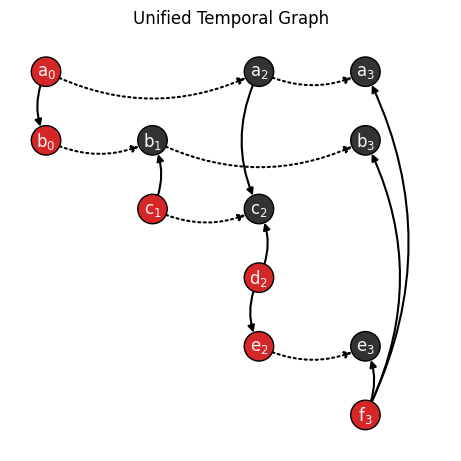

.. include:: notebook.rst

#####################
Convert and transform
#####################

The package provides a set of functions to convert to different graph formats and representations.
In this context, ''converting'' refers to changing the underlying graph object type, e.g.
`igraph <https://igraph.org>`__, while ''transforming'' refers to changing the graph
representation, e.g., `event-based temporal graphs <#event-based-temporal-graph>`__.

.. note::

   Contributions are welcome! If you would like to see a specific graph format or representation
   implemented, please feel free to submit a pull request on the package's `GitHub repository
   <https://github.com/nelsonaloysio/networkx-temporal>`__.

Graph formats
=============

Graphs may be converted to a different object type by calling :func:`~networkx_temporal.convert`
with the desired format:

.. code-block:: python

   >>> import networkx_temporal as tx
   >>>
   >>> TG = tx.TemporalDiGraph()  # TG = tx.temporal_graph(directed=True, multigraph=False)
   >>>
   >>> TG.add_edge("a", "b", time=0)
   >>> TG.add_edge("c", "b", time=1)
   >>> TG.add_edge("d", "c", time=2)
   >>> TG.add_edge("d", "e", time=2)
   >>> TG.add_edge("a", "c", time=2)
   >>> TG.add_edge("f", "e", time=3)
   >>> TG.add_edge("f", "a", time=3)
   >>> TG.add_edge("f", "b", time=3)
   >>>
   >>> TG = TG.slice(attr="time")
   >>>
   >>> tx.convert(TG.to_static(), "igraph")

   <igraph.Graph at 0x7ff6f1803d40>

In the example above, the temporal graph :const:`TG` was first transformed into a `static graph
<#static-graph>`__, which is not required. Otherwise, the function returns a list of graph
objects, one per snapshot, as shown below:

.. code-block:: python

   >>> tx.convert(TG, "igraph")

   [<igraph.Graph at 0x7ff6f1803e40>,
    <igraph.Graph at 0x7ff6f181c040>,
    <igraph.Graph at 0x7ff6f181c140>,
    <igraph.Graph at 0x7ff6f181c240>]

Support for the following output formats are implemented, here listed with their respective aliases:

+------------------------------------------------------------------+------------------------------------+------------------------+
| Format                                                           | Parameter (Package)                | Parameter (Alias)      |
+==================================================================+====================================+========================+
|`Deep Graph Library <https://www.dgl.ai>`__                       | .. centered :: ``dgl``             | .. centered :: -       |
+------------------------------------------------------------------+------------------------------------+------------------------+
|`DyNetX <https://dynetx.readthedocs.io>`__                        | .. centered :: ``dynetx``          | .. centered :: ``dn``  |
+------------------------------------------------------------------+------------------------------------+------------------------+
|`graph-tool <https://graph-tool.skewed.de>`__                     | .. centered :: ``graph_tool``      | .. centered :: ``gt``  |
+------------------------------------------------------------------+------------------------------------+------------------------+
|`igraph <https://igraph.org/python>`__                            | .. centered :: ``igraph``          | .. centered :: ``ig``  |
+------------------------------------------------------------------+------------------------------------+------------------------+
|`NetworKit <https://networkit.github.io>`__                       | .. centered :: ``networkit``       | .. centered :: ``nk``  |
+------------------------------------------------------------------+------------------------------------+------------------------+
|`PyTorch Geometric <https://pytorch-geometric.readthedocs.io>`__  | .. centered :: ``torch_geometric`` | .. centered :: ``pyg`` |
+------------------------------------------------------------------+------------------------------------+------------------------+
|`Teneto <https://teneto.readthedocs.io>`__                        | .. centered :: ``teneto``          | .. centered :: -       |
+------------------------------------------------------------------+------------------------------------+------------------------+

-----

Graph representations
=====================

Once a temporal graph is instantiated, the following methods allow returning static graphs,
snapshots events or unified representations.  Due to the way the underlying data is represented,
some of these objects (i.e., those with unique nodes) do not allow dynamic node attributes.

Observe that the total number of nodes :math:`V` and edges :math:`E` of the returned object might
differ from the number of temporal nodes :math:`V_T` and edges :math:`E_T`, depending on the data
and method used:

+------------------+----------------------+---------------------+------------------------------------+-------------------------------------+
| Representation   | .. centered:: Order  | .. centered:: Size  | Dynamic node attributes            | Dynamic edge attributes             |
+==================+======================+=====================+====================================+=====================================+
| |to_static|_     | :math:`V = V_T`      | :math:`E = E_T`     | .. centered:: |:x:|                | .. centered:: |:heavy_check_mark:|  |
+------------------+----------------------+---------------------+------------------------------------+-------------------------------------+
| |to_snapshots|_  | :math:`V \ge V_T`    | :math:`E = E_T`     | .. centered:: |:heavy_check_mark:| | .. centered:: |:heavy_check_mark:|  |
+------------------+----------------------+---------------------+------------------------------------+-------------------------------------+
| |to_events|_     | :math:`V = V_T`      | :math:`E = E_T`     | .. centered:: |:x:|                | .. centered:: |:x:|                 |
+------------------+----------------------+---------------------+------------------------------------+-------------------------------------+
| |to_unified|_    | :math:`V \ge V_T`    | :math:`E \ge E_T`   | .. centered:: |:heavy_check_mark:| | .. centered:: |:heavy_check_mark:|  |
+------------------+----------------------+---------------------+------------------------------------+-------------------------------------+

.. .. |to_static| replace:: :func:`~networkx_temporal.TemporalGraph.to_static`
.. .. |to_snapshots| replace:: :func:`~networkx_temporal.TemporalGraph.to_snapshots`
.. .. |to_events| replace:: :func:`~networkx_temporal.TemporalGraph.to_events`
.. .. |to_unified| replace:: :func:`~networkx_temporal.TemporalGraph.to_unified`

.. |to_static| replace:: Static
.. _to_static: #static-graph

.. |to_snapshots| replace:: Snapshots
.. _to_snapshots: #snapshot-based-temporal-graph

.. |to_events| replace:: Events
.. _to_events: #event-based-temporal-graph

.. |to_unified| replace:: Unified
.. _to_unified: #unified-temporal-graph

Static graph
------------

A static graph :const:`G` is a single graph object containing all the nodes and edges found in the
temporal graph. It is the simplest representation of a network and is the most common type of graph.

.. attention::

   Dynamic node attributes are not preserved when transforming a temporal to a static graph.

.. seealso::

   The `Basic operations → Import static graphs <basics.html#import-static-graphs>`__ page for
   more static graph conversion examples.

:const:`TG` → :const:`G`
^^^^^^^^^^^^^^^^^^^^^^^^

Transforming a temporal graph into a static graph with the :func:`~networkx_temporal.TemporalGraph.to_static` method:

.. code-block:: python

    >>> G = TG.to_static()
    >>> print(G)

    DiGraph with 6 nodes and 8 edges

.. code-block:: python

   >>> tx.draw(G, layout="kamada_kawai", suptitle="Static Graph")

:const:`G` → :const:`TG`
^^^^^^^^^^^^^^^^^^^^^^^^

Transforming a static graph into a temporal graph with the :func:`~networkx_temporal.from_static` function:

.. code-block:: python

    >>> TG = tx.from_static(G)
    >>> TG = TG.slice(attr="time")
    >>> print(TG)

    TemporalDiGraph (t=1) with 6 nodes and 8 edges

Snapshot-based temporal graph
-----------------------------

A snapshot-based temporal graph :const:`STG` is a sequence of graphs where each element represents a
snapshot of the original temporal graph. It is the most common representation of temporal graphs.

.. note::

   Like the :func:`~networkx_temporal.TemporalGraph.slice` method,
   :func:`~networkx_temporal.TemporalGraph.to_snapshots` internally returns
   views of the original graph data, so no data is copied unless specified otherwise, i.e., by
   passing ``as_view=False`` to the function.

:const:`TG` → :const:`STG`
^^^^^^^^^^^^^^^^^^^^^^^^^^

Transforming a temporal graph into a snapshot-based temporal graph with :func:`~networkx_temporal.TemporalGraph.to_snapshots`:

.. code-block:: python

   >>> STG = TG.to_snapshots()
   >>> STG

   [<networkx.classes.graph.Graph at 0x7fd9132420d0>,
    <networkx.classes.graph.Graph at 0x7fd913193710>,
    <networkx.classes.graph.Graph at 0x7fd912906d50>,
    <networkx.classes.graph.Graph at 0x7fd91290d350>]

:const:`STG` → :const:`TG`
^^^^^^^^^^^^^^^^^^^^^^^^^^

Transforming a snapshot-based temporal graph into a temporal graph with :func:`~networkx_temporal.from_snapshots`:

.. code-block:: python

   >>> TG = tx.from_snapshots(STG)
   >>> print(TG)

   TemporalDiGraph (t=4) with 12 nodes and 8 edges

Event-based temporal graph
--------------------------

An event-based temporal graph :const:`ETG` is a sequence of 3- or 4-tuple edge-based events.

* **3-tuples** (:math:`u, v, t`), where elements are the source node, target node, and time attribute;

* **4-tuples** (:math:`u, v, t, \varepsilon`), where an additional element :math:`\varepsilon` is either a
  positive (``1``) or negative (``-1``) unity representing edge addition and deletion events, respectively.

Depending on the temporal graph data, one of these may allow a more compact representation than the
other. The default is to return a 3-tuple sequence (also known as a **stream graph**).

.. important::

   Event-based temporal graphs do not currently store node- or edge-level attribute data.
   Moreover, as sequences of events are edge-based, node isolates are not preserved.

:const:`TG` → :const:`ETG`
^^^^^^^^^^^^^^^^^^^^^^^^^^

Transforming a temporal graph into event-based temporal graphs with :func:`~networkx_temporal.TemporalGraph.to_events`:

.. code-block:: python

   >>> ETG = TG.to_events()
   >>> ETG

    [('a', 'b', 0),
     ('c', 'b', 1),
     ('a', 'c', 2),
     ('d', 'c', 2),
     ('d', 'e', 2),
     ('f', 'e', 3),
     ('f', 'a', 3),
     ('f', 'b', 3)]

.. code-block:: python

   >>> ETG = TG.to_events(stream=False)
   >>> ETG

   [('a', 'b', 0, 1),
    ('c', 'b', 1, 1),
    ('a', 'b', 1, -1),
    ('a', 'c', 2, 1),
    ('d', 'c', 2, 1),
    ('d', 'e', 2, 1),
    ('c', 'b', 2, -1),
    ('f', 'e', 3, 1),
    ('f', 'a', 3, 1),
    ('f', 'b', 3, 1),
    ('a', 'c', 3, -1),
    ('d', 'c', 3, -1),
    ('d', 'e', 3, -1)]

:const:`ETG` → :const:`TG`
^^^^^^^^^^^^^^^^^^^^^^^^^^

Transforming an event-based temporal graph into a temporal graph with :func:`~networkx_temporal.from_events`:

.. code-block:: python

   >>> TG = tx.from_events(ETG, directed=True, multigraph=True)
   >>> print(TG)

   TemporalDiGraph (t=4) with 12 nodes and 8 edges

Unified temporal graph
----------------------

A unified temporal graph :const:`UTG` is a single graph object that contains the original temporal data,
plus ''proxy'' nodes (from each snapshot) and edge ''couplings'' (linking sequential temporal
nodes). Its usefulness is restricted to certain types of analysis and visualization, e.g., based on
temporal flows.

:const:`TG` → :const:`UTG`
^^^^^^^^^^^^^^^^^^^^^^^^^^

Transforming a temporal graph into a unified temporal graph with :func:`~networkx_temporal.TemporalGraph.to_unified`:

.. code-block:: python

   >>> UTG = TG.to_unified(add_couplings=True)
   >>> print(UTG)

   MultiDiGraph named 'UTG (t=4, proxy_nodes=6, edge_couplings=6)' with 12 nodes and 14 edges

Let's draw the unified temporal graph to visualize the proxy nodes and edge couplings (in blue):

.. code-block:: python

   >>> c0, c1 = "#cccccc", "#3987bd"
   >>>
   >>> nodes = sorted(TG.temporal_nodes())
   >>>
   >>> pos = {n: (nodes.index(n.rsplit("_")[0]), -int(n.rsplit("_")[1]))
   >>>        for n in UTG.nodes()}
   >>>
   >>> labels = {n: f"{n.split('_')[0]}$_{n.split('_')[1]}$"
   >>>           for n in UTG.nodes()}
   >>>
   >>> node_color = [c1 if int(n.split("_")[1]) != TG.index_node(n.split("_")[0])[0] else c0
   >>>               for n in UTG.nodes()]
   >>>
   >>> edge_color = [c1 if u.split("_")[0] == v.split("_")[0] else c0
   >>>               for u, v in UTG.edges()]
   >>>
   >>> tx.draw(UTG,
   >>>       pos=pos,
   >>>       figsize=(4, 4),
   >>>       labels=labels,
   >>>       node_color=node_color,
   >>>       edge_color=edge_color,
   >>>       connectionstyle="arc3,rad=0.25",
   >>>       suptitle="Unified Temporal Graph")

:const:`UTG` → :const:`TG`
^^^^^^^^^^^^^^^^^^^^^^^^^^

Transforming a unified temporal graph into a temporal graph with :func:`~networkx_temporal.from_unified`:

.. code-block:: python

   >>> TG = tx.from_unified(UTG)
   >>> print(TG)

   TemporalMultiDiGraph (t=4) with 12 nodes and 8 edges
