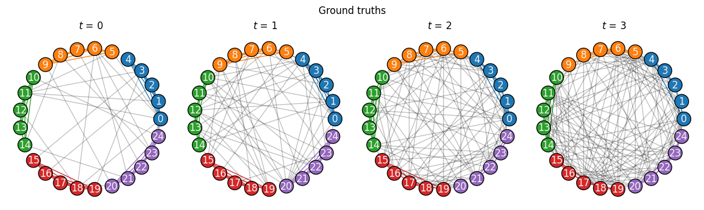

.. include:: ../include-examples.rst

#####################
Convert and transform
#####################

This package provides a set of functions to manipulate graph classes, formats, and representations.
In this context, :mod:`~networkx_temporal.utils.convert` refers to different graph-based libraries,
e.g., `igraph <https://igraph.org/python>`__, and :mod:`~networkx_temporal.transform` refers to the
underlying data structure used to store object relations, e.g.,
`event-based temporal graphs <#event-based-temporal-graph>`__.

.. note::

   Contributions are welcome! If you would like to see a specific graph format or representation
   implemented, please feel free to submit a pull request on the package's `GitHub repository
   <https://github.com/nelsonaloysio/networkx-temporal>`__.

Graph classes
=============

Static or temporal multigraphs may be converted to graphs without parallel edges and vice-versa:

.. code-block:: python

   >>> import networkx_temporal as tx
   >>>
   >>> TG = tx.TemporalMultiDiGraph()
   >>> # TG = tx.temporal_graph(directed=True, multigraph=True)
   >>>
   >>> TG.add_edge("a", "b", time=0)
   >>> TG.add_edge("c", "b", time=0)
   >>> TG.add_edge("c", "b", time=1)   # <-- parallel edge
   >>> TG.add_edge("d", "c", time=2)
   >>> TG.add_edge("d", "e", time=2)
   >>> TG.add_edge("a", "c", time=2)
   >>> TG.add_edge("f", "e", time=3)
   >>> TG.add_edge("f", "a", time=3)
   >>> TG.add_edge("f", "b", time=3)
   >>>
   >>> TG = TG.slice(attr="time")
   >>> print(TG)

   TemporalMultiDiGraph (t=4) with 6 nodes and 9 edges

In the example above, the temporal multigraph ``TG`` was first sliced into :math:`t=4` snapshots.
Let's now convert it to a simple graph, in which parallel edges among the same node pair are
not allowed:

.. code-block:: python

   >>> TG = tx.from_multigraph(TG)
   >>> print(TG)

   TemporalDiGraph (t=4) with 6 nodes and 9 edges

The resulting graph has the same size of :math:`|\mathcal{E}| = 9` edges, as the parallel edges
among nodes :math:`c` and :math:`b` were in different snapshots, :math:`t=\{0,1\}`.
Let's now :func:`~networkx_temporal.classes.TemporalGraph.flatten` it and call
:func:`~networkx_temporal.utils.from_multigraph` again:

.. code-block:: python

   >>> TG = tx.to_multigraph(TG)    # Restore temporal graph back to a multigraph.
   >>> TG = TG.flatten()            # Obtain temporal graph with a single snapshot.
   >>> TG = tx.from_multigraph(TG)  # Combine parallel edges into single ones.
   >>>
   >>> print(TG)

   TemporalDiGraph (t=4) with 6 nodes and 8 edges

In this case, the resulting graph has :math:`|\mathcal{E}| = 8` edges, as the parallel edges
among nodes :math:`c` and :math:`b` were combined into a single one with the attributes
``time=1`` and ``weight=2``, referring to the last snapshot time and their total number of
interactions, respectively, resulting in an irreversible operation:

.. code-block:: python

   >>> TG.edges(("c", "b"), data=True)

   [OutEdgeDataView([('c', 'b', {'time': 1, 'weight': 2})])]

.. attention::

   The conversion from a temporal multigraph to a simple graph is not always reversible, as
   dynamic edge attributes, e.g., ``time``, are overwritten when converting multigraphs to graphs.

Graph formats
=============

The :func:`~networkx_temporal.readwrite.read_graph`
and :func:`~networkx_temporal.readwrite.write_graph`
functions offer a high-level interface to load and store graph data, supporting any format
implemented in the current installed version of NetworkX.

.. code-block:: python

   >>> tx.write_graph(TG, "temporal-graph.graphml.zip")
   >>> TG = tx.read_graph("temporal-graph.graphml.zip")

.. seealso::

   The `NetworkX documentation <https://networkx.org/documentation/stable/reference/readwrite/index.html>`__
   for an and updated list of supported reading and writing formats.

Graph readers
-------------

Additional support is currently implemented for reading
`Hypergraph Interchange Format (HIF) <https://github.com/pszufe/HIF-standard>`__ files.
This format enables the seamless integration and exchange of hypergraph and bipartite data across
different platforms and tools, such as the
`Hypergraph Analysis Toolbox (HAT) <https://hypergraph-analysis-toolbox.readthedocs.io>`__.

+----------------------------------------------------------------------------+----------------------------+-------------------------------------------------------------+
| Format                                                                     | Format (Extension)         | Calls (Function)                                            |
+============================================================================+============================+=============================================================+
| `Hypergraph Interchange Format <https://github.com/pszufe/HIF-standard>`__ | .. centered:: ``hif.json`` | .. centered:: :func:`~networkx_temporal.readwrite.read_hif` |
+----------------------------------------------------------------------------+----------------------------+-------------------------------------------------------------+

.. code-block:: python

   >>> TG = tx.read_hif("/path/to/file.hif.json")
   >>> # TG = tx.read_graph("/path/to/file.hif.json")

Graph libraries
===============

Support for the following external libraries are currently implemented in the package:

+-------------------------------------------------------------------+--------------------------------------+---------------------------------------------------------------------------+
| Format                                                            | Parameter (Package)                  | .. centered:: Calls (Function)                                            |
+===================================================================+======================================+===========================================================================+
| `Deep Graph Library <https://www.dgl.ai>`__                       | .. centered:: ``'dgl'``              | .. centered:: :func:`~networkx_temporal.utils.convert.to_dgl`             |
+-------------------------------------------------------------------+--------------------------------------+---------------------------------------------------------------------------+
| `DyNetX <https://dynetx.readthedocs.io>`__                        | .. centered:: ``'dynetx'``           | .. centered:: :func:`~networkx_temporal.utils.convert.to_dynetx`          |
+-------------------------------------------------------------------+--------------------------------------+---------------------------------------------------------------------------+
| `graph-tool <https://graph-tool.skewed.de>`__                     | .. centered:: ``'graph_tool'``       | .. centered:: :func:`~networkx_temporal.utils.convert.to_graph_tool`      |
+-------------------------------------------------------------------+--------------------------------------+---------------------------------------------------------------------------+
| `igraph <https://igraph.org/python>`__                            | .. centered:: ``'igraph'``           | .. centered:: :func:`~networkx_temporal.utils.convert.to_igraph`          |
+-------------------------------------------------------------------+--------------------------------------+---------------------------------------------------------------------------+
| `NetworKit <https://networkit.github.io>`__                       | .. centered:: ``'networkit'``        | .. centered:: :func:`~networkx_temporal.utils.convert.to_networkit`       |
+-------------------------------------------------------------------+--------------------------------------+---------------------------------------------------------------------------+
| `PyTorch Geometric <https://pytorch-geometric.readthedocs.io>`__  | .. centered:: ``'torch_geometric'``  | .. centered:: :func:`~networkx_temporal.utils.convert.to_torch_geometric` |
+-------------------------------------------------------------------+--------------------------------------+---------------------------------------------------------------------------+
| `SNAP <https://https://snap.stanford.edu>`__                      | .. centered:: ``'snap'``             | .. centered:: :func:`~networkx_temporal.utils.convert.to_snap`            |
+-------------------------------------------------------------------+--------------------------------------+---------------------------------------------------------------------------+
| `StellarGraph <https://stellargraph.readthedocs.io>`__            | .. centered:: ``'stellargraph'``     | .. centered:: :func:`~networkx_temporal.utils.convert.to_stellargraph`    |
+-------------------------------------------------------------------+--------------------------------------+---------------------------------------------------------------------------+
| `Teneto <https://teneto.readthedocs.io>`__                        | .. centered:: ``'teneto'``           | .. centered:: :func:`~networkx_temporal.utils.convert.to_teneto`          |
+-------------------------------------------------------------------+--------------------------------------+---------------------------------------------------------------------------+

Graphs may be converted to a different library format with the high-level
:func:`~networkx_temporal.utils.convert.convert` function:

.. code-block:: python

   >>> TG = TG.slice(attr="time")
   >>> tx.convert(TG, "igraph")

   [<igraph.Graph at 0x7ff6f1803e40>,
    <igraph.Graph at 0x7ff6f181c040>,
    <igraph.Graph at 0x7ff6f181c140>,
    <igraph.Graph at 0x7ff6f181c240>]

By default, the amount of objects returned match the number of slices (snapshots). To return a
single object containing all the nodes and edges found in the temporal graph:

.. code-block:: python

   >>> tx.convert(TG.to_static(), "igraph")

   <igraph.Graph at 0x7ff6f1803d40>

Graph representations
=====================

Once instantiated, :class:`~networkx_temporal.classes.TemporalGraph` objects may be transformed into
different representations, depending on the analysis or visualization requirements. Due to the
nature of temporal graphs, some representations may not preserve all the data, such as dynamic node
or edge attributes.

Observe that the total number of returned nodes :math:`V` and edges :math:`E`
after transformation might differ from the number of temporal nodes :math:`V_T` and
edges :math:`E_T`, depending on the data and method used:

+------------------+----------------------+---------------------+------------------------------------+-------------------------------------+
| Representation   | .. centered:: Order  | .. centered:: Size  | Dynamic node attributes            | Dynamic edge attributes             |
+==================+======================+=====================+====================================+=====================================+
| |to_static|_     | :math:`V = V_T`      | :math:`E = E_T`     | .. centered:: |:x:|                | .. centered:: |:heavy_check_mark:|  |
+------------------+----------------------+---------------------+------------------------------------+-------------------------------------+
| |to_snapshots|_  | :math:`V \ge V_T`    | :math:`E = E_T`     | .. centered:: |:heavy_check_mark:| | .. centered:: |:heavy_check_mark:|  |
+------------------+----------------------+---------------------+------------------------------------+-------------------------------------+
| |to_events|_     | :math:`V = V_T`      | :math:`E = E_T`     | .. centered:: |:x:|                | .. centered:: |:x:|                 |
+------------------+----------------------+---------------------+------------------------------------+-------------------------------------+
| |to_unrolled|_   | :math:`V \ge V_T`    | :math:`E \ge E_T`   | .. centered:: |:heavy_check_mark:| | .. centered:: |:heavy_check_mark:|  |
+------------------+----------------------+---------------------+------------------------------------+-------------------------------------+

.. .. |to_static| replace:: :func:`~networkx_temporal.classes.TemporalGraph.to_static`
.. .. |to_snapshots| replace:: :func:`~networkx_temporal.classes.TemporalGraph.to_snapshots`
.. .. |to_events| replace:: :func:`~networkx_temporal.classes.TemporalGraph.to_events`
.. .. |to_unrolled| replace:: :func:`~networkx_temporal.classes.TemporalGraph.to_unrolled`

.. |to_static| replace:: Static
.. _to_static: #static-graph

.. |to_snapshots| replace:: Snapshots\*
.. _to_snapshots: #snapshot-based-temporal-graph

.. |to_events| replace:: Events
.. _to_events: #event-based-temporal-graph

.. |to_unrolled| replace:: Unrolled
.. _to_unrolled: #unrolled-temporal-graph

(\*) Default underlying data structure for temporal graphs with multiple snapshots on
:func:`~networkx_temporal.classes.TemporalGraph.slice`.

Static graph
------------

A static graph :const:`G` is a single graph object containing all the nodes and edges found in the
temporal graph. It is the simplest representation of a network and is the most common type of graph.

.. attention::

   Dynamic node attributes are not preserved when transforming a temporal to a static graph.

.. seealso::

   The `Basic operations → Import static graphs <basics.html#import-static-graphs>`__ page for
   more static graph conversion examples.

:const:`TG` → :const:`G`
^^^^^^^^^^^^^^^^^^^^^^^^

Transforming a :class:`~networkx_temporal.classes.TemporalGraph` into a static graph
with the :func:`~networkx_temporal.classes.TemporalGraph.to_static` method:

.. code-block:: python

   >>> G = TG.to_static()
   >>> print(G)

    DiGraph with 6 nodes and 8 edges

.. code-block:: python

   >>> tx.draw(G, layout="kamada_kawai", suptitle="Static Graph")

.. image:: ../../assets/figure/fig-7.png
   :align: center

:const:`G` → :const:`TG`
^^^^^^^^^^^^^^^^^^^^^^^^

Transforming a static graph into a :class:`~networkx_temporal.classes.TemporalGraph`
with the :func:`~networkx_temporal.transform.from_static` function:

.. code-block:: python

   >>> TG = tx.from_static(G)
   >>> TG = TG.slice(attr="time")
   >>> print(TG)

   TemporalDiGraph (t=1) with 6 nodes and 8 edges

Snapshot-based temporal graph
-----------------------------

A snapshot-based temporal graph :const:`STG` is a sequence of graphs where each element represents a
snapshot of the original temporal graph. It is the most common representation of temporal graphs.

.. note::

   Like the :func:`~networkx_temporal.classes.TemporalGraph.slice` method,
   :func:`~networkx_temporal.classes.TemporalGraph.to_snapshots` internally returns
   views of the original graph data, so no data is copied unless specified otherwise, i.e., by
   passing ``as_view=False`` to the function.

:const:`TG` → :const:`STG`
^^^^^^^^^^^^^^^^^^^^^^^^^^

Transforming a :class:`~networkx_temporal.classes.TemporalGraph` into a snapshot-based
temporal graph with :func:`~networkx_temporal.classes.TemporalGraph.to_snapshots`:

.. code-block:: python

   >>> STG = TG.to_snapshots()
   >>> STG

   [<networkx.classes.graph.Graph at 0x7fd9132420d0>,
    <networkx.classes.graph.Graph at 0x7fd913193710>,
    <networkx.classes.graph.Graph at 0x7fd912906d50>,
    <networkx.classes.graph.Graph at 0x7fd91290d350>]

:const:`STG` → :const:`TG`
^^^^^^^^^^^^^^^^^^^^^^^^^^

Transforming a snapshot-based temporal graph into a :class:`~networkx_temporal.classes.TemporalGraph` with
:func:`~networkx_temporal.transform.from_snapshots`:

.. code-block:: python

   >>> TG = tx.from_snapshots(STG)
   >>> print(TG)

   TemporalDiGraph (t=4) with 6 nodes and 8 edges

Event-based temporal graph
--------------------------

An event-based temporal graph :const:`ETG` is a sequence of 3- or 4-tuple edge-based events.

* **3-tuples** (:math:`u, v, t`), where elements are the source node, target node, and time attribute;

* **4-tuples** (:math:`u, v, t, \delta`), where an additional element :math:`\delta` is either an
  ``int`` for edge addition (``1``) or deletion (``-1``) events, or a ``float`` for the duration
  of the interaction (zero for a single snapshot).

Depending on the temporal graph data, one of these may allow a more compact representation than the
others. The default is to return a 3-tuple sequence (also known as a *stream graph*).

.. attention::

   As events are edge-based, node isolates without self-loops are not preserved.

:const:`TG` → :const:`ETG`
^^^^^^^^^^^^^^^^^^^^^^^^^^

Transforming a :class:`~networkx_temporal.classes.TemporalGraph` into an event-based temporal
graph with :func:`~networkx_temporal.classes.TemporalGraph.to_events`:

.. code-block:: python

   >>> ETG = TG.to_events()  # delta=None
   >>> ETG

   [('a', 'b', 0),
    ('c', 'b', 1),
    ('a', 'c', 2),
    ('d', 'c', 2),
    ('d', 'e', 2),
    ('f', 'e', 3),
    ('f', 'a', 3),
    ('f', 'b', 3)]

.. code-block:: python

   >>> ETG = TG.to_events(delta=int)
   >>> ETG

   [('a', 'b', 0, 1),
    ('c', 'b', 1, 1),
    ('a', 'b', 1, -1),
    ('a', 'c', 2, 1),
    ('d', 'c', 2, 1),
    ('d', 'e', 2, 1),
    ('c', 'b', 2, -1),
    ('f', 'e', 3, 1),
    ('f', 'a', 3, 1),
    ('f', 'b', 3, 1),
    ('a', 'c', 3, -1),
    ('d', 'c', 3, -1),
    ('d', 'e', 3, -1)]

.. code-block:: python

   >>> ETG = TG.to_events(delta=float)
   >>> ETG

   [('a', 'b', 0, 0.0),
    ('c', 'b', 1, 0.0),
    ('a', 'c', 2, 0.0),
    ('d', 'c', 2, 0.0),
    ('d', 'e', 2, 0.0),
    ('f', 'e', 3, 0.0),
    ('f', 'a', 3, 0.0),
    ('f', 'b', 3, 0.0)]

:const:`ETG` → :const:`TG`
^^^^^^^^^^^^^^^^^^^^^^^^^^

Transforming an event-based temporal graph into a :class:`~networkx_temporal.classes.TemporalGraph` with
:func:`~networkx_temporal.transform.from_events`:

.. code-block:: python

   >>> TG = tx.from_events(ETG, directed=True, multigraph=True)
   >>> print(TG)

   TemporalDiGraph (t=4) with 6 nodes and 8 edges

Unrolled temporal graph
-----------------------

An unrolled temporal graph :const:`UTG` is a single graph object that contains the original temporal data,
plus additional time-adjacent node copies (from each snapshot) and edge couplings connecting them.
It is mainly useful for certain analysis and visualization tasks, e.g., based on
temporal flows.

.. seealso::

   For an example with temporal node centrality metrics, see
   `Hyoungshick & Anderson, 2012 <https://doi.org/10.1103/PhysRevE.85.026107>`_ [1]_.

:const:`TG` → :const:`UTG`
^^^^^^^^^^^^^^^^^^^^^^^^^^

Transforming a :class:`~networkx_temporal.classes.TemporalGraph` into an unrolled temporal
graph with :func:`~networkx_temporal.classes.TemporalGraph.to_unrolled`:

.. code-block:: python

   >>> UTG = TG.to_unrolled(edge_couplings=True)
   >>> print(UTG)

   DiGraph named 'UnrolledTemporalGraph' with 12 nodes and 14 edges

Let's draw the resulting graph to visualize the node copies (in black) and edge couplings (dotted):

.. code-block:: python

   >>> node_color = [
   >>>    "tab:red" if int(n.split("_")[1]) == TG.index_node(n.split("_")[0])[0] else "#333"
   >>>    for n in UTG.nodes()]
   >>>
   >>> tx.draw_unrolled(UTG, node_color=node_color, connectionstyle="arc3,rad=0.25")

.. image:: ../../assets/figure/fig-8.png
   :align: center

.. hint::

   By default, edges connect nodes in the same snapshot, e.g., from :math:`u_t` to :math:`v_t`.
   To create edges that connect nodes across time, e.g., from :math:`u_t` to
   :math:`v_{t+\delta}`, pass the ``delta`` parameter to the function
   with the desired edge-level attribute, e.g., ``delta='duration'``,
   or time difference, e.g., ``delta=1``.

Passing ``delta=1`` to the function creates edges connecting nodes in adjacent snapshots.
In the following plot, nodes in blue are those newly created and not present in the previous example:

.. code-block:: python

   >>> UTG_delta = TG.to_unrolled(delta=1)
   >>>
   >>> node_color = [
   >>>     "tab:red" if UTG.has_node(n) else "tab:blue"
   >>>     for n in UTG_delta.nodes()]
   >>>
   >>> tx.draw_unrolled(UTG_delta, node_color=node_color,
   >>>                  title="Unrolled Temporal Graph ($\\delta=1$)")

.. attention::

   New nodes and edges are created depending on the ``delta`` value passed to the
   function, leading to graphs of different order and size. For instance, passing
   ``delta=1`` in the example above created additional edges among node :math:`f_3`
   and the temporal node copies :math:`a_4`, :math:`b_4`, and :math:`e_4`.

Lastly, the additional parameters ``edge_couplings`` and ``node_copies`` allow further control over
the creation of new temporal node copies and edge couplings connecting them, as shown below:

.. code-block:: python

   >>> import matplotlib.pyplot as plt
   >>>
   >>> fig, ax = plt.subplots(nrows=1, ncols=3, figsize=(8, 2))
   >>>
   >>> tx.draw_unrolled(TG.to_unrolled(delta=1, node_copies="fill"),
   >>>                  node_size=200, fig=fig, ax=0, title="node_copies='fill'")
   >>>
   >>> tx.draw_unrolled(TG.to_unrolled(delta=1, node_copies="persist"),
   >>>                  node_size=200, fig=fig, ax=1, title="node_copies='persist'")
   >>>
   >>> tx.draw_unrolled(TG.to_unrolled(delta=1, node_copies="all"),
   >>>                  node_size=200, fig=fig, ax=2, title="node_copies='all'")

.. image:: ../../assets/figure/fig-10.png
   :align: center

:const:`UTG` → :const:`TG`
^^^^^^^^^^^^^^^^^^^^^^^^^^

Transforming an unrolled temporal graph into a :class:`~networkx_temporal.classes.TemporalGraph`
with :func:`~networkx_temporal.transform.from_unrolled`:

.. code-block:: python

   >>> TG = tx.from_unrolled(UTG)
   >>> # TG = tx.from_unrolled(UTG_delta)
   >>> print(TG)

   TemporalDiGraph (t=4) with 6 nodes and 8 edges

-----

.. rubric:: References

.. [1] Hyoungshick, K., Anderson, R. (2012). ''Temporal node centrality in complex networks''.
   Physical Review E, 85(2).