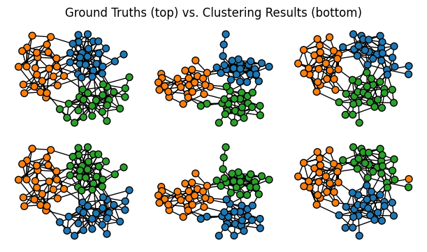
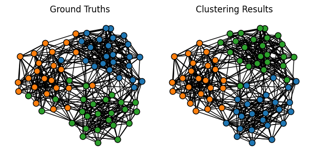
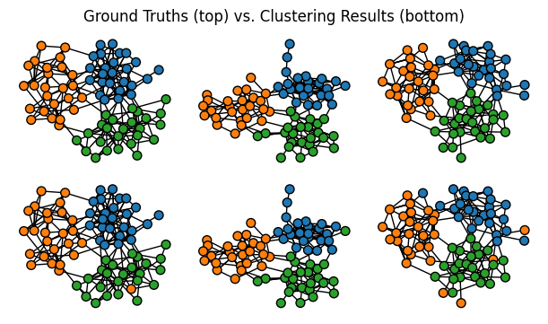
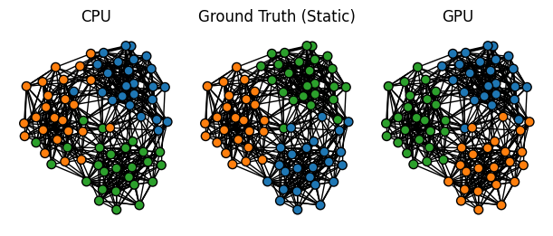
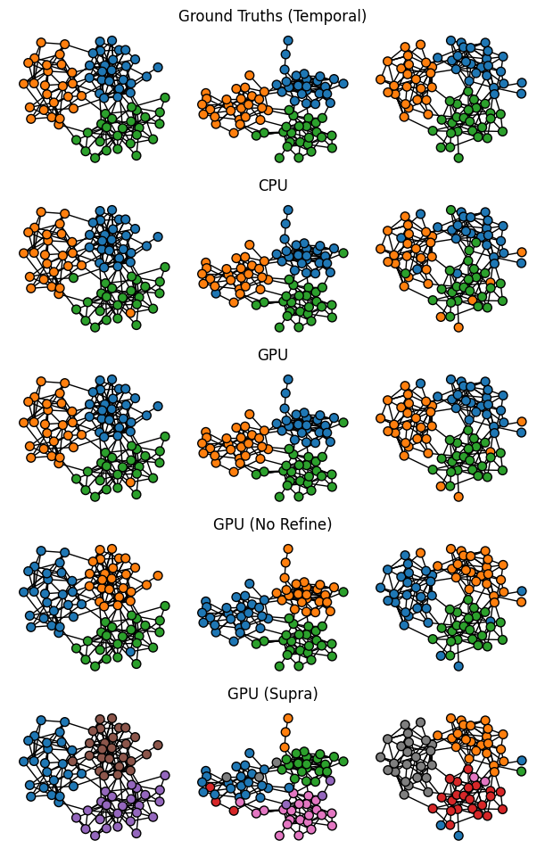
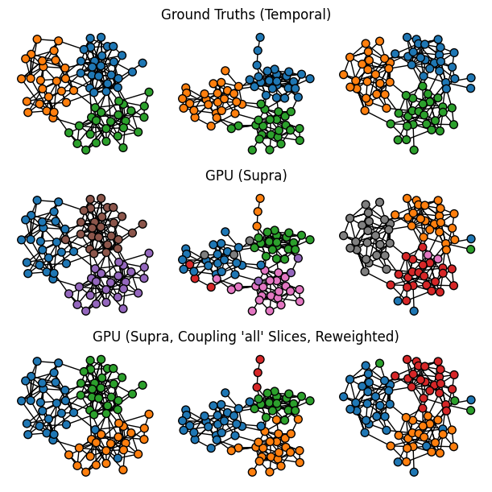

.. include:: ../include-template.rst

################
GPU acceleration
################

   .. image:: https://colab.research.google.com/assets/colab-badge.svg
      :target: https://colab.research.google.com/github/nelsonaloysio/networkx-temporal/blob/main/notebook/networkx-temporal-05-gpu.ipynb
      :alt: Open on Colab
      :align: right

   Examples in this guide are also available as an interactive
   `Jupyter notebook
   <https://github.com/nelsonaloysio/networkx-temporal/blob/main/notebook/networkx-temporal-05-gpu.ipynb>`__.

GPU acceleration allows to significantly speed up computations of algorithms for temporal graphs
on specialized hardware. This guide demonstrates how to enable GPU acceleration in NetworkX-Temporal
and provides some examples of its usage for community detection algorithms.

Accelerating temporal graph algorithms
======================================

Some algorithms for temporal networks can be computationally intensive,
especially for large-scale networks. To address this, NetworkX-Temporal
integrates some GPU-accelerated algorithm implementations using the
open-source libraries CuPy, cuGraph, and cuML, substantially reducing
their computation time. This guide illustrates some commomn usage examples.

GPU-accelerated algorithms may require the installation of the following libraries:

- `CuPy <https://docs.cupy.dev/en/stable/install.html>`__:
  Array computations on GPUs, similar to NumPy and SciPy (AMD/NVIDIA);
- `cuGraph <https://docs.rapids.ai/api/cugraph/stable/install.html>`__:
  Graph computations part of the RAPIDS suite (NVIDIA only);
- `cuML <https://docs.rapids.ai/api/cuml/stable/install.html>`__:
  Machine learning algorithms part of the same suite (NVIDIA only).

.. code-block:: bash

   # Parallelized multislice Leiden via CuPy on NVIDIA GPUs (CUDA)...
   conda install -c conda-forge cupy

   # ...or on AMD GPUs (ROCm, experimental; separate build)
   pip install amd-cupy --extra-index-url=https://pypi.amd.com/simple

   # Spectral clustering + static Leiden algorithm (NVIDIA only)
   conda install -c conda-forge -c rapidsai -c nvidia cupy cuml cugraph nx-cugraph pylibcugraph

Once installed, GPU acceleration in NetworkX-Temporal may be enabled by passing the parameter
``device='gpu'`` in the relevant functions; or by setting ``NX_GPU_AUTOCONFIG=1`` in the
environment, allowing zero-code configuration and automatic switch to GPU device when supported.
To verify it:

.. code-block:: python

   >>> import networkx_temporal as tx
   >>> tx.is_gpu_enabled

   True

Currently, only algorithms relevant for temporal community detection are implemented with
support for GPU acceleration: `spectral <#spectral-clustering>`_ [1]_ clustering and the
`Leiden <#leiden-communities>`_ [2]_ algorithm. Details on both are provided next, using the
:func:`~networkx_temporal.algorithms.spectral_clustering` and
:func:`~networkx_temporal.algorithms.leiden_communities` high-level functions.

Community detection
===================

For a first example, we will use a synthetic temporal graph generated by
the :func:`~networkx_temporal.generators.example_sbm_graph`
function, based on a stochastic block model (SBM) with dynamic community assignments.

.. code-block:: python

   >>> TG = tx.example_sbm_graph()
   >>> print(TG)

   TemporalDiGraph (t=3) with 75 nodes and 225 edges

Spectral clustering
-------------------

The :func:`~networkx_temporal.algorithms.spectral_clustering` high-level function supports both CPU
and GPU (NVIDIA) acceleration for three graph operators: ``'laplacian'`` (default),
``'bethe_hessian'``, and ``'modularity'``, which internally call their corresponding
:mod:`~networkx_temporal.algorithms` depending on the parameter passed as ``operator``:

.. code-block:: python

   >>> y_pred = tx.spectral_clustering(TG, k=3, operator="laplacian")

Let's plot the ground truths and the detected clusters for each time step, so to compare the results:

.. code-block:: python

   >>> import matplotlib.pyplot as plt
   >>> colors = plt.cm.tab10.colors
   >>>
   >>> def plot_temporal_graph(TG, y_pred):
   >>>     y_true = tx.get_node_attributes(TG, "community", index=False)
   >>>     pos = tx.layout(TG, layout="kamada_kawai")
   >>>     temporal_node_color = [
   >>>         [colors[m % len(colors)] for m in s]
   >>>         for y in [y_true, y_pred]
   >>>         for s in y
   >>>     ]
   >>>     # Draw ground truths (top) and spectral clustering results (bottom).
   >>>     return tx.draw(
   >>>         [*TG, *TG], figsize=(6, 3.5), nrows=2, ncols=3,
   >>>         pos=[*pos, *pos], node_size=50, title=False,
   >>>         suptitle=f"Ground Truths (top) vs. Clustering Results (bottom)",
   >>>         temporal_node_color=temporal_node_color)
   >>>
   >>> plot_temporal_graph(TG, y_pred)

The function can also be used to cluster the aggregated (static) graph obtained by the
:func:`~networkx_temporal.classes.TemporalGraph.to_static` method, which returns a NetworkX
`MultiGraph <https://networkx.org/documentation/stable/reference/classes/multigraph.html>`__
instance with all edges from all graph snapshots:

.. code-block:: python

   >>> G = TG.to_static()
   >>> y_pred = tx.spectral_clustering(G, k=3, operator="laplacian")

.. code-block:: python

   >>> def plot_static_graph(G, y_pred):
   >>>     y_true = tx.get_node_attributes(G, "community", index=False)
   >>>     pos = tx.layout(G, layout="kamada_kawai")
   >>>     node_color = [
   >>>         [colors[m % len(colors)] for m in y]
   >>>         for y in [y_true, y_pred]
   >>>     ]
   >>>     # Draw ground truths (left) and spectral clustering results (right).
   >>>     return tx.draw(
   >>>         [G, G], figsize=(6, 3), pos=pos, node_size=70,
   >>>         title=["Ground Truths", "Clustering Results"],
   >>>         temporal_node_color=node_color)
   >>>
   >>> plot_static_graph(G, y_pred)

Leiden communities
------------------

The :func:`~networkx_temporal.algorithms.leiden_communities` function also supports CPU/GPU
devices for greedy optimization with 'quality' functions such as modularity. If a temporal graph
is provided, a supra-graph encoding with inter-slice couplings is constructed, and the multislice
modularity [3]_ objective is optimized instead:

.. code-block:: python

   >>> y_pred = tx.leiden_communities(TG)
   >>>
   >>> plot_temporal_graph(TG, y_pred)

.. hint::

   Unless needed, spectral clustering is often preferred over greedy optimization, especially when
   the number of communities is known in advance, yielding a fast and accurate detection method.

Compare running times
=====================

The CPU and GPU implementations of the Leiden [2_] algorithm run through different backends
depending on both the selected ``device`` and graph type (a
:class:`~networkx_temporal.typing.StaticGraph` or a
:class:`~networkx_temporal.classes.TemporalGraph`):

- ``'cpu'``: uses `leidenalg <https://github.com/vtraag/leidenalg>`__
  and `igraph <https://igraph.org/python/>`__
  as backends, implemented in Python and C++.
- ``'gpu'``: uses `cuGraph <https://docs.rapids.ai/api/cugraph/stable/>`__
  for static and a parallelized `CuPy <https://cupy.dev/>`__
  implementation for temporal graphs.

Temporal multislice optimization
--------------------------------

Overall, the GPU implementations are significantly faster for large-scale graphs.
especially in for large-scale temporal graphs. Runtimes for the PubMed temporal graph are shown
below, with a fixed budget of ``max_iter=2`` optimization passes for both CPU and GPU implementations.

.. code-block:: python

   >>> TG = tx.pubmed_graph()
   >>> print(TG)

   TemporalDiGraph named 'PubMed' (t=42) with 19717 nodes and 44335 edges

.. code-block:: python

   >>> y = tx.leiden_communities(TG, max_iter=2, device="cpu")

   # 52.2 s ± 1.42 s per loop (mean ± std. dev. of 7 runs, 1 loop each)

.. code-block:: python

   >>> y = tx.leiden_communities(TG, max_iter=2, device="gpu")

   # 1.36 s ± 40.7 ms per loop (mean ± std. dev. of 20 runs, 1 loop each)

When efficiency is a topmost concern, it is possible to disable the refinement phase of Leiden
algorithm by setting ``refine=False``, yielding a parallelized Louvain-like multislice modularity
optimization that is ~20% faster, but does not optimize for internally connected communities.

.. code-block:: python

   >>> y = tx.leiden_communities(TG, max_iter=2, device="gpu", refine=False)

   # 1.23 s ± 5.89 ms per loop (mean ± std. dev. of 20 runs, 1 loop each)

Static modularity optimization
------------------------------

On static graphs, the GPU advantage emerges only at scale, with the CPU implementation being faster
for smaller graphs due to kernel launch overheads and host-device transfers:

.. code-block:: python

   >>> G = TG.to_static()
   >>> print(G)

   DiGraph named 'PubMed' with 19717 nodes and 44335 edges

.. code-block:: python

   >>> y = tx.leiden_communities(G, max_iter=2, device="cpu")

   # 1.11 s ± 25.9 ms per loop (mean ± std. dev. of 20 runs, 1 loop each)

.. code-block:: python

   >>> y = tx.leiden_communities(G, max_iter=2, device="gpu")

   # 74.9 ms ± 15.5 ms per loop (mean ± std. dev. of 20 runs, 1 loop each)

.. note::

   The default number of iterations differ among CPU (``2``) and GPU
   (``500``) implementations. Note that parallelization, random seed state, and different backends
   may also affect the results.

Static supra-graph optimization
-------------------------------

Alternatively, it is possible to optimize (static) modularity on a supra-graph representation. This
approach is substantially faster [4]_ than the temporal (multislice) implementation, and allows for
multi-GPU execution by loading the supra-graph into a distributed GPU cluster with
`Dask-cuGraph <https://docs.rapids.ai/api/cugraph/legacy/api_docs/cugraph/dask-cugraph/>`__.

.. code-block:: python

   >>> adj = tx.to_supra_adjacency_matrix(TG)
   >>> G_supra = tx.from_scipy(adj)
   >>> print(G_supra)

   MultiGraph with 37003 nodes and 30896 edges

.. code-block:: python

   >>> y = tx.leiden_communities(G_supra, max_iter=2, device="gpu")

   # 303 ms ± 60.8 ms per loop (mean ± std. dev. of 7 runs, 10 loops each)

.. attention::

   This approach optimizes a global null model on the entire supra-graph, instead of per-slice null
   models, i.e., :func:`~networkx_temporal.algorithms.modularity` and not
   :func:`~networkx_temporal.algorithms.modularity_multislice`; see the
   `next section <#temporal-graph-optimization>`_ for details.

Compare detection accuracy
==========================

Let's now compare the clustering results of the different techniques shown above on
the same network graph, using the ground truth communities as reference. We'll
employ a fixed budget of ``max_iter=100`` for all implementations, both
for static and multislice modularity optimization.

.. code-block:: python

   >>> max_iter = 100
   >>>
   >>> TG = tx.example_sbm_graph()
   >>> G = TG.to_static()
   >>>
   >>> # Multislice modularity optimization.
   >>> y_cpu_TG = tx.leiden_communities(TG, device="cpu", max_iter=max_iter)
   >>> y_gpu_TG = tx.leiden_communities(TG, device="gpu", max_iter=max_iter)
   >>> y_gpu_TG_norefine = tx.leiden_communities(TG, device="gpu", max_iter=max_iter,
   >>>                                           refine=False)
   >>>
   >>> # Static modularity optimization.
   >>> y_cpu_G = tx.leiden_communities(G, device="cpu", max_iter=max_iter)
   >>> y_gpu_G = tx.leiden_communities(G, device="gpu", max_iter=max_iter)
   >>>
   >>> # Build supra-graph connecting nodes across time slices (default interslice_weight=1.0).
   >>> adj, offsets = tx.to_supra_adjacency_matrix(TG, return_offsets=True)
   >>> G_supra = tx.from_scipy(adj)
   >>>
   >>> # Supra-graph (static) modularity optimization.
   >>> y_gpu_G_supra = tx.leiden_communities(G_supra, device="gpu", max_iter=max_iter)
   >>> y_gpu_G_supra = [y_gpu_G_supra[offsets[t]:offsets[t] + len(TG[t])]
   >>>                  for t in range(len(TG))]

Static graph optimization
-------------------------

Let's visualize the results of Leiden optimizing static
:func:`~networkx_temporal.algorithms.modularity` on the aggregated (static) graph:

.. code-block:: python

   >>> y_true_G = tx.get_node_attributes(G, "community", index=False)
   >>> pos = tx.layout(G, layout="kamada_kawai")
   >>>
   >>> node_color = [
   >>>     [colors[m % len(colors)] for m in y]
   >>>     for y in [y_true_G, y_cpu_G, y_gpu_G]
   >>> ]
   >>>
   >>> tx.draw(
   >>>     [G, G, G], figsize=(6, 2.5), pos=pos, node_size=50,
   >>>     title=["CPU", "Ground Truth (Static)", "GPU"],
   >>>     temporal_node_color=node_color)

On this synthetic SBM instance, the predicted communities differ among implementations under a fixed
budget of ``max_iter=100`` optimization passes, with the GPU implementation yielding a more accurate
partitioning. Note that the :func:`~networkx_temporal.generators.example_sbm_graph` is generated
with a dynamic SBM model, in which the community assignments of nodes may change over time, and the
ground truths here consider the node assignments at the last time step. For dynamic community
detection, it would be required run the algorithm on each snapshot and track their evolution
with a post-processing step.

To avoid this, it is preferred to optimize multislice modularity on the temporal graph directly,
which yields a more consistent partitioning across time slices, as shown in the next examples.

Temporal graph optimization
---------------------------

Let's now plot the results of Leiden optimizing
:func:`~networkx_temporal.algorithms.modularity_multislice`
on the temporal graph:

.. code-block:: python

   >>> y_true_TG = tx.get_node_attributes(TG, "community", index=False)
   >>> pos = tx.layout(TG, layout="kamada_kawai")
   >>>
   >>> temporal_node_color = [
   >>>     [colors[m % len(colors)] for m in s]
   >>>     for y in [y_true_TG, y_cpu_TG, y_gpu_TG, y_gpu_TG_norefine, y_gpu_G_supra]
   >>>     for s in y
   >>> ]
   >>>
   >>> title = [
   >>>     "", "Ground Truths (Temporal)", "",
   >>>     "", "CPU", "",
   >>>     "", "GPU", "",
   >>>     "", "GPU (No Refine)", "",
   >>>     "", "GPU (Supra)", "",
   >>> ]
   >>>
   >>> tx.draw(
   >>>     [*TG, *TG, *TG, *TG, *TG], figsize=(6, 9.5), nrows=5, ncols=3,
   >>>     pos=[*pos, *pos, *pos, *pos, *pos], node_size=50, names=False,
   >>>     title=title,
   >>>     temporal_node_color=temporal_node_color)

On the synthetic SBM instance, the predicted communities are visually similar to the ground truth
in all cases, with the exception of the static supra-graph optimization, which yields a suboptimal
partitioning. This is expected, as the approach optimizes the static objective function instead.
Meanwhile, the CPU and GPU implementations of multislice modularity optimization yield similar
results, with the parallel GPU implementation being significantly faster and slightly more accurate.

Note also that the GPU implementation with ``refine=False``, in which the refinement phase of
Leiden that guarantees internally connected communities is skipped (corresponding therefore to
the Louvain [5]_ algorithm), yielded slightly more accurate results than with refinement enabled.

Supra-graph optimization
------------------------

On the supra-graph case, inter-slice couplings inflate node degrees under the global null model,
shifting the optimal partitioning away from the one obtained by the multislice modularity model.

To mitigate this, it is possible to add inter-slice couplings linking nodes across ``'all'``
slices, with weights inversely proportional to the distance between slices. This approach makes
the inflation node-uniform, assuming both constant time interval and constant node presences
across slices:

.. code-block:: python

   >>> T, omega = len(TG), 1.0
   >>>
   >>> # Normalize and symmetrize inter-slice couplings based on inverse distance weighting.
   >>> raw = {(i, j): 1 / abs(i - j) for i in range(T) for j in range(T) if i != j}
   >>> row = {i: sum(raw[(i, k)] for k in range(T) if k != i) for i in range(T)}
   >>> w = {(i, j): omega * v * 0.5 * (1 / row[i] + 1 / row[j]) for (i, j), v in raw.items()}
   >>>
   >>> # Build supra-graph connecting nodes across 'all' time slices.
   >>> adj, offsets = tx.to_supra_adjacency_matrix(
   >>>     TG, interslice_couple="all", interslice_weights=w, return_offsets=True)
   >>>
   >>> # Supra-graph (static) modularity optimization.
   >>> G_supra_ = tx.from_scipy(adj)
   >>> y_gpu_G_supra_ = tx.leiden_communities(G_supra_, max_iter=max_iter, device="gpu")
   >>> y_gpu_G_supra_ = [y_gpu_G_supra_[offsets[t]:offsets[t] + len(TG[t])]
   >>>                   for t in range(len(TG))]
   >>>
   >>> print(f"Graph:\n{G}\n",
   >>>       f"Supra-Graph:\n{G_supra}\n",
   >>>       f"Supra-Graph (Coupling All Slices):\n{G_supra_}", sep="\n")

   Graph:
   MultiGraph with 75 nodes and 589 edges

   Supra-Graph:
   MultiGraph with 225 nodes and 690 edges

   Supra-Graph (Coupling All Slices):
   MultiGraph with 225 nodes and 765 edges

.. important::

   Note that coupling all slice pairs adds
   :math:`\mathcal{O}(N \times T^2)` edges to the supra-graph, which is
   practical for few snapshots but quickly grows prohibitive with :math:`T`,
   especially for sparse temporal graphs.

As expected, the supra-graph with all-to-all couplings has more edges than the chain-coupled
supra-graph (connecting nodes from :math:`t` to :math:`t+1` slices only). Let's now visualize and
compare the results optimzing the global null model on both supra-graphs, with and without
all-to-all couplings:

.. code-block:: python

   >>> temporal_node_color = [
   >>>     [colors[m % len(colors)] for m in s]
   >>>     for y in [y_true_TG, y_gpu_G_supra, y_gpu_G_supra_]
   >>>     for s in y
   >>> ]
   >>>
   >>> title = [
   >>>     "", "Ground Truths (Temporal)", "",
   >>>     "", "GPU (Supra)", "",
   >>>     "", "GPU (Supra, Coupling 'all' Slices, Reweighted)", "",
   >>> ]
   >>>
   >>> tx.draw(
   >>>     [*TG, *TG, *TG], figsize=(6, 6), nrows=3, ncols=3,
   >>>     pos=[*pos, *pos, *pos], node_size=50, names=False,
   >>>     title=title,
   >>>     temporal_node_color=temporal_node_color)

Although results are still suboptimal, with 4 communities detected instead of 3 (bottom row),
the supra-graph with all-to-all couplings yields a more approximate partitioning to the ground
truths, while the one obtained by the chain-coupled supra-graph (middle row) fragments the
detected communities well beyond expectation due to modularity being sensitive to the graph size.

Supra-graph optimization therefore serves only as a proxy for dynamic community detection. Meanwhile,
under the per-slice multislice null model, inter-slice couplings carry no null term and therefore
do not inflate node degrees, yielding a more consistent node partitioning across time.

This example highlights the advantages of temporal graph optimization over static supra-graph
surrogates, which offer a faster but less accurate alternative over methods such as spectral
or multislice modularity optimization for dynamic community detection in larger networks.

.. seealso::

   The :mod:`~networkx_temporal.algorithms` module for more details on the available algorithms
   and their parameters.

-----

.. rubric:: References

.. [1] A. Ng, M. Jordan, and Y. Weiss. (2001). ''On spectral clustering: Analysis and an algorithm''.
   In: Dietterich, T., Becker, S., Ghahramani, Z. (eds.) Advances in Neural Information
   Processing Systems. Vol. 14. MIT Press.

.. [2] V. A. Traag, L. Waltman, N. J. van Eck (2019). ''From Louvain to Leiden: guaranteeing
   well-connected communities''. Scientific Reports, 9(1), 5233.

.. [3] P. J. Mucha et al (2010). ''Community Structure in Time-Dependent,
   Multiscale, and Multiplex Networks''. Science, 328, 876--878.

.. [4] Passos, N.A.R.A.; Carlini, E.; Trani, S. (2026). ''Accelerating
   Dynamic Graph Clustering on GPU Architectures with cuGraph''. The 6th
   workshop on Flexible Resource and Application Management on the Edge
   (FRAME); co-located with Euro-Par'26. Pisa, Italy, Aug. 24--28, 2026.

.. [5] Blondel, V.D.; Guillaume, J.L.; Lambiotte, R.; Lefebvre, E. (2008). ''Fast unfolding of
   communities in large networks''. Journal of Statistical Mechanics: Theory and Experiment,
   2008(10), P10008.