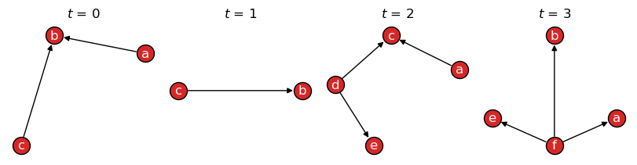

.. include:: ../include-examples.rst

######################
Algorithms and metrics
######################

Algorithms implemented by NetworkX can be called on graph snapshots, while
`NetworkX graph <https://networkx.org/documentation/stable/reference/classes/graph.html#networkx.Graph>`__
methods are inherited by
:class:`~networkx_temporal.classes.TemporalGraph` objects.
This section highlights a few common examples.

.. note::

   Contributions are welcome! If you would like to see a specific algorithm for temporal graphs
   implemented, please feel free to submit a pull request on the package's `GitHub repository
   <https://github.com/nelsonaloysio/networkx-temporal>`__.

Graph-level functions
=====================

Order and size
--------------

The methods
:func:`~networkx_temporal.classes.TemporalGraph.order`
and :func:`~networkx_temporal.classes.TemporalGraph.size`
return the number of nodes and edges in each graph snapshot, respectively,
while an additional argument ``copies`` allows specifying whether to count
duplicates:

.. code-block:: python

   >>> import networkx_temporal as tx
   >>>
   >>> TG = tx.TemporalMultiDiGraph()  # TG = tx.temporal_graph(directed=True, multigraph=False)
   >>>
   >>> TG.add_edge("a", "b", time=0)
   >>> TG.add_edge("c", "b", time=1)
   >>> TG.add_edge("c", "b", time=1)   # parallel edge
   >>> TG.add_edge("d", "c", time=2)
   >>> TG.add_edge("d", "e", time=2)
   >>> TG.add_edge("a", "c", time=2)
   >>> TG.add_edge("f", "e", time=3)
   >>> TG.add_edge("f", "a", time=3)
   >>> TG.add_edge("f", "b", time=3)
   >>>
   >>> TG = TG.slice(attr="time")
   >>> print(TG)

   TemporalDiGraph (t=4) with 6 nodes and 9 edges

.. code-block:: python

   >>> print("Order:", TG.order())
   >>> print("Order (unique nodes):", TG.order(copies=False))
   >>> print("Order (including copies):", TG.order(copies=True))

   Order: [3, 2, 4, 4]
   Order (unique nodes): 6
   Order (including copies): 13

.. code-block:: python

   >>> print("Size:", TG.size())
   >>> print("Size (unique edges):", TG.size(copies=False))
   >>> print("Size (including copies):", TG.size(copies=True))

   Size: [2, 1, 3, 3]
   Size (unique edges): 8
   Size (including copies): 9

Note that when printing a :class:`~networkx_temporal.classes.TemporalGraph` instance, the order of
the graph :math:`|\mathcal{V}|` corresponds to the number of unique nodes and its size to the
number of edge interactions :math:`|\mathcal{E}|` (including copies).

.. seealso::

   The alias methods:
   :func:`~networkx_temporal.classes.TemporalGraph.temporal_order`,
   :func:`~networkx_temporal.classes.TemporalGraph.temporal_size`,
   :func:`~networkx_temporal.classes.TemporalGraph.total_order`,
   and :func:`~networkx_temporal.classes.TemporalGraph.total_size`.

Centralization
--------------

Centralization [1]_ is a graph-level metric that compares the observed node centralities against the
maximum possible score for a graph with the same properties, e.g., order, size, and directedness.

The :func:`~networkx_temporal.algorithms.centralization` function receives the node centrality
values for a static or temporal graph, plus an optional ``scalar`` value corresponding to the
maximum possible sum of node centrality differences in a theoretical likewise graph, and returns
the centralization score for the graph:

.. code-block:: python

   >>> G = TG[-1]
   >>>
   >>> centrality = G.degree()  # Node degree values.
   >>> maximum = G.order() - 1  # Highest possible degree.
   >>> minimum = 1              # Minimum possible degree.
   >>>
   >>> # Highest theoretical sum of values in a simple star-like graph.
   >>> scalar = sum(maximum - minimum for n in range(G.order()-1))
   >>>
   >>> tx.centralization(centrality=centrality, scalar=scalar)

   1.0

.. note::

   The example above considers the node degrees as the centrality measure and is equivalent to
   :func:`~networkx_temporal.algorithms.degree_centralization` for a simple graph without parallel
   edges, self-loops, or node isolates.

Much like the example above using :func:`~networkx_temporal.algorithms.degree`, the
function can be used to calculate the
graph score for any node centrality measure, e.g.,
`closeness
<https://networkx.org/documentation/stable/reference/algorithms/generated/networkx.algorithms.centrality.closeness_centrality.html>`__,
`betweenness
<https://networkx.org/documentation/stable/reference/algorithms/generated/networkx.algorithms.centrality.betweenness_centrality.html>`__
and `eigenvector
<https://networkx.org/documentation/stable/reference/algorithms/generated/networkx.algorithms.centrality.eigenvector_centrality.html>`__
centrality.

Degree centralization
---------------------

The :func:`~networkx_temporal.algorithms.degree_centralization` function returns the score
considering node degrees per snapshot:

.. code-block:: python

   >>> tx.degree_centralization(TG)
   >>> # tx.in_degree_centralization(TG)
   >>> # tx.out_degree_centralization(TG)

   [0, 0, 0.3333333333333333, 1.0]

In the example above, we see that the first and last snapshots corresponds to intervals with
the highest centralization in the network. By plotting them, we see both display a
`star-like structure <https://networkx.org/documentation/stable/reference/generated/networkx.generators.classic.star_graph.html>`__:

.. code-block:: python

   >>> tx.draw(TG, layout="kamada_kawai")

.. note::

   In directed graphs, the in-degree and out-degree centralitization values may differ:

   .. code-block:: python

      >>> tx.in_degree_centralization(TG) == tx.out_degree_centralization(TG)

      False

   .. code-block:: python

      >>> for t, G in enumerate(TG):
      >>>     indc = tx.in_degree_centralization(G)
      >>>     outdc = tx.out_degree_centralization(G)
      >>>     print(f"t={t}: in={indc:.2f}, out={outdc:.2f}")

      t=0: in=1.00, out=0.25
      t=1: in=1.00, out=1.00
      t=2: in=0.56, out=0.56
      t=3: in=0.11, out=1.00

Node-level functions
====================

The functions and algorithms implemented by NetworkX can be applied directly on the temporal graph
by iterating over snapshots. For instance, to calculate the `Katz centrality
<https://networkx.org/documentation/stable/reference/algorithms/generated/networkx.algorithms.centrality.katz_centrality.html>`__
for each snapshot:

.. code-block:: python

   >>> TG = tx.from_multigraph(TG)
   >>>
   >>> for t, G in enumerate(TG):
   >>>     katz = nx.katz_centrality(G)
   >>>     katz = {node: round(value, 2) for node, value in katz.items()}
   >>>     print(f"t={t}: {katz}")

   t=0: {'a': 0.54, 'b': 0.65, 'c': 0.54}
   t=1: {'c': 0.67, 'b': 0.74}
   t=2: {'a': 0.46, 'c': 0.56, 'd': 0.46, 'e': 0.51}
   t=3: {'f': 0.46, 'e': 0.51, 'a': 0.51, 'b': 0.51}

Note that we first converted the multigraph to a simple graph (without parallel edges) using the
:func:`~networkx_temporal.utils.from_multigraph` function, as the algorithm implementation
does not support multigraphs.

.. seealso::

   The `Algorithms section <https://networkx.org/documentation/stable/reference/algorithms/index.html>`__
   of the NetworkX documentation for a list of available functions.

Degree
------

In addition, any NetworkX `Graph methods
<https://networkx.org/documentation/stable/reference/classes/graph.html#methods>`__
can be called directly from the temporal graph as well.
For example, the methods
:func:`~networkx_temporal.algorithms.degree`
:func:`~networkx_temporal.algorithms.in_degree`
and
:func:`~networkx_temporal.algorithms.out_degree`
return results per snapshot:

.. code-block:: python

   >>> TG.degree()
   >>> # TG.in_degree()
   >>> # TG.out_degree()

   [{'a': 1, 'b': 2, 'c': 1},
    {'c': 1, 'b': 1},
    {'a': 1, 'c': 2, 'd': 2, 'e': 1},
    {'f': 3, 'e': 1, 'a': 1, 'b': 1}]

.. code-block:: python

   >>> TG.degree("a")
   >>> # TG.in_degree("a")
   >>> # TG.out_degree("a")

   [1, None, 1, 1]

Note that, like for :math:`a` in :math:`t=1` above, a ``None`` is returned when a node is not
present in a snapshot.

Total degree
^^^^^^^^^^^^

The :func:`~networkx_temporal.algorithms.degree` function returns
instead a dictionary with the sum of node degrees over time:

.. code-block:: python

   >>> tx.degree(TG)
   >>> # tx.in_degree(TG)
   >>> # tx.out_degree(TG)

   {'a': 3, 'b': 4, 'c': 4, 'd': 2, 'e': 2, 'f': 3}

.. code-block:: python

   >>> tx.degree(TG, "a")
   >>> # tx.in_degree(TG, "a")
   >>> # tx.out_degree(TG, "a")

   3

.. seealso::

   The alias methods
   :func:`~networkx_temporal.classes.TemporalGraph.total_degree`,
   :func:`~networkx_temporal.classes.TemporalGraph.total_in_degree`,
   and :func:`~networkx_temporal.classes.TemporalGraph.total_out_degree`,
   which return a dictionary with the sum of node degrees over time,
   while maintaining its original ordering.

Degree centrality
-----------------

Alternatively, :func:`~networkx_temporal.algorithms.degree_centrality`
returns the fraction of nodes connected to each of all nodes:

.. code-block:: python

   >>> tx.degree_centrality(TG)
   >>> # tx.in_degree_centrality(TG)
   >>> # tx.out_degree_centrality(TG)

   {'a': 0.6, 'b': 0.8, 'c': 0.8, 'd': 0.4, 'e': 0.4, 'f': 0.6}

.. code-block:: python

   >>> tx.degree_centrality(TG, "a")
   >>> # tx.in_degree_centrality(TG, "a")
   >>> # tx.out_degree_centrality(TG, "a")

   0.6

Neighbors
---------

The :func:`~networkx_temporal.classes.TemporalGraph.neighbors`
method returns a generator over graph snapshots, respecting edge direction:

.. code-block:: python

   >>> TG = TG.slice(attr="time")
   >>> list(TG.neighbors("c"))

   [[], ['b'], [], []]

Converting the graph to undirected, we also obtain nodes that have node
:math:`c` as their neighbor:

.. code-block:: python

   >>> list(TG.to_undirected().neighbors("c"))

   [[], ['b'], ['a', 'd'], []]

Note that the above is effectively the same as calling the
:func:`~networkx_temporal.classes.TemporalGraph.all_neighbors`
method instead.

From all snapshots
^^^^^^^^^^^^^^^^^^

The :func:`~networkx_temporal.classes.neighbors` function
returns a node neighborhood considering all snapshots:

.. code-block:: python

   >>> list(tx.neighbors(TG, "c"))

   ['b']

Converting the graph to undirected, we also obtain temporal nodes that have it
as their neighbor:

.. code-block:: python

   >>> list(tx.neighbors(TG.to_undirected(), "c"))

   ['a', 'd', 'b']

Indexes allow to restrict the search to specific snapshots in time, e.g.,
from :math:`t=0` to :math:`t=1`:

.. code-block:: python

   >>> list(tx.neighbors(TG[0:2], "c"))

   ['b']

.. note::

   Indexing follows Python conventions and is inclusive on the left and exclusive on the right,
   i.e., the above example returns the neighbors of node :math:`c` at time steps :math:`t=0` and
   :math:`t=1`.

-----

.. [1] Freeman, L.C. (1979).
       Centrality in Social Networks I: Conceptual Clarification.
       Social Networks 1, 215--239.
       doi: `10.1016/0378-8733(78)90021-7 <https://doi.org/10.1016/0378-8733(78)90021-7>`__