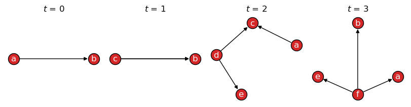
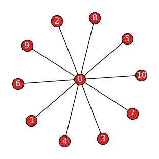
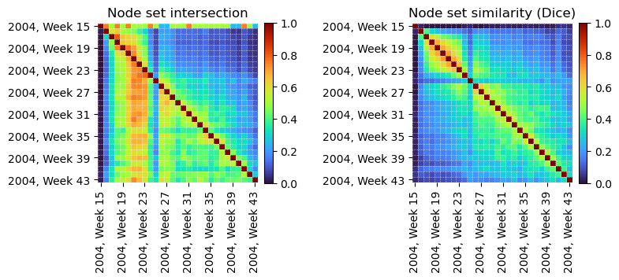
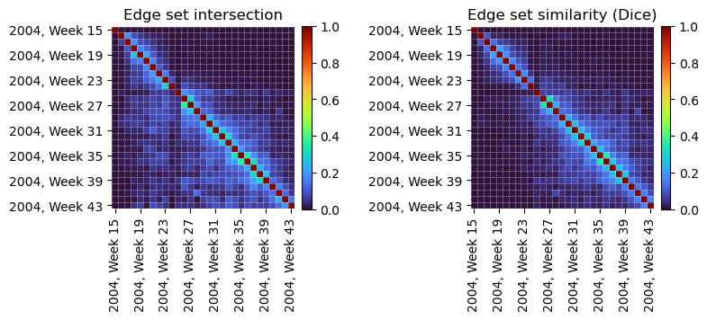

.. seealso::

    All examples in this guide are also available as an interactive
    `Jupyter notebook
    <https://github.com/nelsonaloysio/networkx-temporal/blob/main/notebook/networkx-temporal-03-metrics.ipynb>`__
    (`open on Colab
    <https://colab.research.google.com/github/nelsonaloysio/networkx-temporal/blob/main/notebook/networkx-temporal-03-metrics.ipynb>`__).


######################
Algorithms and metrics
######################

This section showcases how to compute common graph metrics and run algorithms on
:class:`~networkx_temporal.classes.TemporalGraph` objects. Algorithms implemented by NetworkX can
be called on graph snapshots, while
`NetworkX graph <https://networkx.org/documentation/stable/reference/classes/graph.html#networkx.Graph>`__
methods are inherited by :class:`~networkx_temporal.classes.TemporalGraph` objects.
The last section includes examples on applying these techniques to analyze the evolution of a
temporal graph over time.


Graph properties
================

The methods
:func:`~networkx_temporal.classes.TemporalGraph.order`
and :func:`~networkx_temporal.classes.TemporalGraph.size`
return the number of nodes and edges in each graph snapshot, respectively,
while an additional argument ``copies`` allows specifying whether to count
duplicates:

.. code-block:: python

   >>> import networkx_temporal as tx
   >>>
   >>> TG = tx.temporal_graph(directed=True)  # TG = tx.TemporalMultiDiGraph()
   >>>
   >>>
   >>> TG.add_edge("a", "b", time=0)
   >>> TG.add_edge("c", "b", time=1)
   >>> TG.add_edge("c", "b", time=1)   # <- parallel edge
   >>> TG.add_edge("d", "c", time=2)
   >>> TG.add_edge("d", "e", time=2)
   >>> TG.add_edge("a", "c", time=2)
   >>> TG.add_edge("f", "e", time=3)
   >>> TG.add_edge("f", "a", time=3)
   >>> TG.add_edge("f", "b", time=3)
   >>>
   >>> TG = TG.slice(attr="time")
   >>> print(TG)

   TemporalMultiDiGraph (t=4) with 6 nodes and 9 edges

Note that when printing a :class:`~networkx_temporal.classes.TemporalGraph` instance, the order of
the graph :math:`|\mathcal{V}|` corresponds to the number of unique nodes and its size to the
number of edge interactions :math:`|\mathcal{E}|` (with parallel edges):

.. code-block:: python

   >>> print("Order:", TG.order())
   >>> print("Order (unique nodes):", TG.order(copies=False))
   >>> print("Order (including copies):", TG.order(copies=True))

   Order: [3, 2, 4, 4]
   Order (unique nodes): 6
   Order (including copies): 13

.. code-block:: python

   >>> print("Size:", TG.size())
   >>> print("Size (unique edges):", TG.size(copies=False))
   >>> print("Size (including copies):", TG.size(copies=True))

   Size: [2, 1, 3, 3]
   Size (unique edges): 8
   Size (including copies): 9

Visualizing the graph with :func:`~networkx_temporal.draw`, however, shows all nodes
and edges, including their copies:

.. code-block:: python

   >>> tx.draw(TG, layout="kamada_kawai", figsize=(8,2))



|

.. seealso::

   The alias methods:
   :func:`~networkx_temporal.classes.TemporalGraph.temporal_order`,
   :func:`~networkx_temporal.classes.TemporalGraph.temporal_size`,
   :func:`~networkx_temporal.classes.TemporalGraph.total_order`,
   and :func:`~networkx_temporal.classes.TemporalGraph.total_size`.


Node neighborhoods
------------------

Edge directedness is considered when obtaining the neighbors of a node,
either per snapshot or considering all snapshots, via
the :func:`~networkx_temporal.classes.TemporalGraph.neighbors` method
and the :func:`~networkx_temporal.classes.neighbors` function, respectively.


Per snapshot
^^^^^^^^^^^^

The :func:`~networkx_temporal.classes.TemporalGraph.neighbors`
method returns a generator over graph snapshots, respecting edge direction:

.. code-block:: python

   >>> TG = TG.slice(attr="time")
   >>> list(TG.neighbors("c"))

   [[], ['b'], [], []]

Converting the graph to undirected, we also obtain nodes that have node
:math:`c` as their neighbor:

.. code-block:: python

   >>> list(TG.to_undirected().neighbors("c"))

   [[], ['b'], ['a', 'd'], []]

.. hint::

   The above is effectively the same as calling the
   :func:`~networkx_temporal.classes.TemporalGraph.all_neighbors`
   method instead.


From all snapshots
^^^^^^^^^^^^^^^^^^

The :func:`~networkx_temporal.classes.neighbors` function
returns node neighborhoods considering all snapshots:

.. code-block:: python

   >>> list(tx.neighbors(TG, "c"))

   ['b']

Converting the graph to undirected, we also obtain temporal nodes that have it
as their neighbor:

.. code-block:: python

   >>> list(tx.neighbors(TG.to_undirected(), "c"))

   ['a', 'd', 'b']

Indexes allow to restrict the search to specific snapshots in time, e.g.,
from :math:`t=0` to :math:`t=1`:

.. code-block:: python

   >>> list(tx.neighbors(TG[0:2], "c"))

   ['b']

.. note::

   Indexing follows Python conventions and is inclusive on the left and exclusive on the right,
   i.e., the above example returns the neighbors of node :math:`c` at time steps :math:`t=0` and
   :math:`t=1`.


Node centrality
===============

The functions and algorithms implemented by NetworkX can be applied directly on the temporal graph
by iterating over snapshots. For instance, to calculate the `Katz centrality
<https://networkx.org/documentation/stable/reference/algorithms/generated/networkx.algorithms.centrality.katz_centrality.html>`__
for each snapshot:

.. code-block:: python

   >>> import networkx as nx
   >>>
   >>> for t, G in enumerate(TG):
   >>>     # We convert the multigraph to a simple graph first,
   >>>     # as Katz centrality is not implemented for multigraphs.
   >>>     G = tx.from_multigraph(G)
   >>>     katz = nx.katz_centrality(G)
   >>>     katz = {node: round(value, 2) for node, value in katz.items()}
   >>>     print(f"t={t}: {katz}")

   t=0: {'a': 0.54, 'b': 0.65, 'c': 0.54}
   t=1: {'b': 0.74, 'c': 0.67}
   t=2: {'a': 0.46, 'c': 0.56, 'd': 0.46, 'e': 0.51}
   t=3: {'a': 0.51, 'b': 0.51, 'e': 0.51, 'f': 0.46}

Note that we first converted the multigraph to a simple graph (without parallel edges) using the
:func:`~networkx_temporal.utils.from_multigraph` function, as the algorithm implementation
does not support multigraphs.

.. seealso::

   The `Algorithms section <https://networkx.org/documentation/stable/reference/algorithms/index.html>`__
   of the NetworkX documentation for a list of available functions.


Node degrees
------------

In addition, any `NetworkX graph methods
<https://networkx.org/documentation/stable/reference/classes/graph.html#methods>`__
can be called directly from the temporal graph.
For example, the methods
:func:`~networkx_temporal.algorithms.degree`
:func:`~networkx_temporal.algorithms.in_degree`
and
:func:`~networkx_temporal.algorithms.out_degree`
return the results per snapshot:

.. code-block:: python

   >>> TG.degree()
   >>> # TG.in_degree()
   >>> # TG.out_degree()

   [DiDegreeView({'a': 1, 'b': 2, 'c': 1}),
    DiDegreeView({'b': 1, 'c': 1}),
    DiDegreeView({'a': 1, 'c': 2, 'd': 2, 'e': 1}),
    DiDegreeView({'a': 1, 'b': 1, 'e': 1, 'f': 3})]

.. code-block:: python

   >>> TG.degree("a")
   >>> # TG.in_degree("a")
   >>> # TG.out_degree("a")

   [1, None, 1, 1]


Note that, for :math:`a` in :math:`t=1` above, a ``None`` is returned as the node is not
present in that snapshot.


Degree centrality
-----------------

The :func:`~networkx_temporal.algorithms.degree` function
returns a dictionary with the sum of node degrees over time:

.. code-block:: python

   >>> tx.degree(TG)
   >>> # tx.in_degree(TG)
   >>> # tx.out_degree(TG)

   {'a': 3, 'b': 4, 'c': 4, 'd': 2, 'e': 2, 'f': 3}

.. code-block:: python

   >>> tx.degree(TG, "a")
   >>> # tx.in_degree(TG, "a")
   >>> # tx.out_degree(TG, "a")

   3

Alternatively, :func:`~networkx_temporal.algorithms.degree_centrality`
returns the fraction of nodes connected to each of all nodes:

.. code-block:: python

   >>> tx.degree_centrality(TG)
   >>> # tx.in_degree_centrality(TG)
   >>> # tx.out_degree_centrality(TG)

   {'a': 0.6, 'b': 0.8, 'c': 0.8, 'd': 0.4, 'e': 0.4, 'f': 0.6}

.. code-block:: python

   >>> tx.degree_centrality(TG, "a")
   >>> # tx.in_degree_centrality(TG, "a")
   >>> # tx.out_degree_centrality(TG, "a")

   0.6

.. seealso::

   The alias methods
   :func:`~networkx_temporal.classes.TemporalGraph.temporal_degree`,
   :func:`~networkx_temporal.classes.TemporalGraph.temporal_in_degree`
   and :func:`~networkx_temporal.classes.TemporalGraph.temporal_out_degree`
   all return a dictionary with the sum of node degrees over time,
   maintaining its original ordering.


Graph centralization
====================

Centralization [1]_ is a graph-level metric that compares the sum of all node centralities against the
maximum possible score for a graph with the same properties, e.g., order, size, and directedness.

For example, the theoretical graph corresponding to the maximum degree centralization is a
`star-like structure <https://networkx.org/documentation/stable/reference/generated/networkx.generators.classic.star_graph.html>`__,
where one central node is connected to all other nodes in the graph, which are not connected among
themselves. This graph is characterized by a degree centralization score of :math:`1.0`:

.. code-block:: python

   >>> G = nx.star_graph(10)
   >>> tx.draw(G, layout="fruchterman_reingold")



|


Degree centralization
---------------------

The :func:`~networkx_temporal.algorithms.degree_centralization` function returns the score
considering node degrees per snapshot:

.. code-block:: python

   >>> tx.degree_centralization(TG)
   >>> # tx.in_degree_centralization(TG)
   >>> # tx.out_degree_centralization(TG)

   [0, 0, 0.3333333333333333, 1.0]

In directed graphs, the in-degree and out-degree centralization scores may differ:

.. code-block:: python

   >>> tx.in_degree_centralization(TG) == tx.out_degree_centralization(TG)

   False

.. code-block:: python

   >>> for t, G in enumerate(TG):
   >>>     indc = tx.in_degree_centralization(G)
   >>>     outdc = tx.out_degree_centralization(G)
   >>>     print(f"t={t}: in={indc:.2f}, out={outdc:.2f}")

   t=0: in=1.00, out=0.25
   t=1: in=1.00, out=1.00
   t=2: in=0.56, out=0.56
   t=3: in=0.11, out=1.00

Note that while edge directedness is considered, self-loops and isolates are ignored by default.
This behavior may be changed by passing ``isolates=True`` or ``self_loops=True`` arguments,
respectively:

.. code-block:: python

   >>> G.add_node(-1)    # Disconnected node.
   >>> G.add_edge(0, 0)  # Edge self-loop.
   >>>
   >>> print(f"Default: {tx.degree_centralization(G)}\n"
   >>>       f"With isolates: {tx.degree_centralization(G, isolates=True):.3f}\n"
   >>>       f"With self-loops: {tx.degree_centralization(G, self_loops=True):.3f}\n"
   >>>       f"With both: {tx.degree_centralization(G, isolates=True, self_loops=True):.3f}")

   Default: 1.0
   With isolates: 0.909
   With self-loops: 1.222
   With both: 1.109


Centralization metrics
----------------------

The :func:`~networkx_temporal.algorithms.centralization` function receives the node centrality
values for a static or temporal graph, plus an optional ``scalar`` value corresponding to the
maximum possible sum of node centrality differences in a theoretical likewise graph, and returns
the centralization score for the graph.

.. code-block:: python

   >>> centrality = G.degree()
   >>> scalar = sum(G.order() - 2 for n in range(G.order()-1))  # |V|-1 for DiGraph
   >>>
   >>> centralization = tx.centralization(centrality=centrality, scalar=scalar)
   >>> print(f"Degree centralization: {centralization:.2f}")

   Degree centralization: 1.00

The function may be used to calculate the score for other centrality measures,
e.g., closeness and betweenness, where the most centralized structure is a star-like graph,
or eigenvector centrality, where the most centralized structure is a graph with a single edge
(and potentially many isolates).


Temporal dynamics
=================

Let's take the :func:`collegemsg_graph <~networkx_temporal.generators.collegemsg_graph>` [2]_
dataset as an example. It represents message exchanges among students at the University of
California, Irvine, over a period of several months in the year of 2004:

.. code-block:: python

   >>> TG = tx.collegemsg_graph()
   >>> print(TG)

   TemporalMultiDiGraph (t=193) with 1899 nodes and 59835 edges

The dataset is sliced into :math:`t=193` daily snapshots, spanning a period from April to October:

.. code-block:: python

   >>> TG.names[0], TG.names[-1]

   ('2004-04-15', '2004-10-26')

Let's define a custom function to convert date timestamps to week-based intervals
```YYYY, Week W``` (0-indexed), and use it to slice the temporal graph into weekly snapshots:

.. code-block:: python

   >>> from datetime import datetime
   >>>
   >>> def strftime(x, fmt="%Y, Week %W"):
   >>>    # Convert date to weekly intervals with ascending sorting.
   >>>    return datetime.strptime(x, "%Y-%m-%d %H:%M").strftime(fmt)
   >>>
   >>> TG = tx.collegemsg_graph()
   >>> TG = TG.slice(attr="time", apply_func=strftime)
   >>> print(TG)

   TemporalMultiDiGraph (t=29) with 1899 nodes and 59835 edges

The result is a graph with :math:`t=29` snapshots, spanning the weeks of 15 to 43 of 2004:

.. code-block:: python

   >>> TG.names[0], TG.names[-1]

   ('2004, Week 15', '2004, Week 43')


Let's identify the weeks with the maximum number of nodes and edges:

.. code-block:: python

   >>> t_max_order = TG.order().index(max(TG.order()))
   >>> t_max_size = TG.size().index(max(TG.size()))
   >>>
   >>> print(f"Max nodes at t={t_max_order} "
             f"({TG.names[t_max_order]}): V={TG[t_max_order].order()} nodes")
   >>> print(f"Max edges at t={t_max_size} "
             f"({TG.names[t_max_size]}): E={TG[t_max_size].size()} edges")

   Max nodes at t=6 (2004, Week 21): V=904 nodes
   Max edges at t=3 (2004, Week 18): E=10194 edges


Degree distribution
-------------------

Let's visualize the node degree distributions on the static graph, considering the whole dataset:

.. code-block:: python

   >>> import matplotlib.pyplot as plt
   >>> import pandas as pd
   >>>
   >>> G = TG.to_static()
   >>>
   >>> fig, ax = plt.subplot_mosaic([["Left", "TopRight"],["Left", "BottomRight"]],
   >>>                               constrained_layout=True, figsize=(8, 4), sharex=True,
   >>>                               gridspec_kw={"width_ratios": [3, 1]})
   >>>
   >>> def deg_plot(df, ax, color="#555", title=None, xlabel=None, ylabel=None):
   >>>    # Plot degree distribution as a line plot with log-scaled x-axis.
   >>>    df.value_counts().sort_index().plot.line(
   >>>       ax=ax, color=color, logx=True, marker="x", markersize=3, linewidth=.9)
   >>>    ax.grid(color="#ccc", linestyle=":", linewidth=1, alpha=1.0, which="major")
   >>>    ax.grid(color="#ccc", linestyle=":", linewidth=1, alpha=0.5, which="minor")
   >>>    ax.set_title(title, fontsize=10)
   >>>    ax.set_xlabel(xlabel)
   >>>    ax.set_ylabel(ylabel)
   >>>
   >>> def ins_plot(df, ax, bins, axes, title="", xlabel="", ylabel="", color="#555"):
   >>>    # Plot histogram of degree distribution with log-scaled y-axis.
   >>>    ins = ax.inset_axes(axes)
   >>>    hist = pd.cut(df, bins=bins)
   >>>    hist.value_counts().sort_index().plot.bar(ax=ins, logy=True, color=color, width=0.7)
   >>>    ins.grid(color="#ccc", linestyle=":", linewidth=1, alpha=1.0, which="major", axis="y")
   >>>    ins.tick_params(axis='both', which="major", labelsize=9)
   >>>    ins.set_title(title, fontsize=9)
   >>>    ins.set_xlabel(xlabel, fontsize=9)
   >>>    ins.set_xticklabels([f"<{b}" for b in bins[1:]])
   >>>    ins.set_ylabel(ylabel, fontsize=9)
   >>>    ins.set_yticks([], minor=True)
   >>>    ins.set_yticks([1, 10, 100, 1000])
   >>>
   >>> df = pd.Series(dict(G.degree()))
   >>> df_in = pd.Series(dict(G.in_degree()))
   >>> df_out = pd.Series(dict(G.out_degree()))
   >>>
   >>> deg_plot(df, ax["Left"], xlabel="Degree (log-scaled)", ylabel="Frequency")
   >>> deg_plot(df_in, ax["TopRight"], title="In-Degree (log)", color="#333")
   >>> deg_plot(df_out, ax["BottomRight"], xlabel="Out-Degree (log)", color="#777")
   >>>
   >>> bins = [0, 10, 50, 100, 500, 1000, 2000]
   >>>
   >>> ins_plot(df, ax['Left'], bins, axes=[0.67, 0.59, 0.3, 0.32],
   >>>          title="Degree Histogram", xlabel="Degree", ylabel="Frequency (log)")
   >>> ins_plot(df_in, ax['TopRight'], bins, axes=[0.5, 0.48, 0.45, 0.45], color="#333")
   >>> ins_plot(df_out, ax['BottomRight'], bins, axes=[0.5, 0.48, 0.45, 0.45], color="#777")
   >>>
   >>> plt.suptitle("Node Degree Distributions on Static Graph", fontsize=11, y=1, fontweight="bold")
   >>> plt.show()

.. image:: ../../assets/figure/notebook/networkx-temporal-03-metrics_52_1.png
   :align: center

|

We see the characteristic long-tailed node degree distributions from communication networks,
very often observed in online contexts: in general, students form a limited number of connections
with their peers, as their frequency seemingly decreases relative to their total degrees.


General statistics
------------------

Let's take a glance at the weekly activity among students using Pandas to
`describe <https://pandas.pydata.org/docs/reference/api/pandas.DataFrame.describe.html>`__ it:

.. code-block:: python

   >>> import pandas as pd
   >>>
   >>> df = pd.DataFrame({
   >>>    "nodes": TG.order(),
   >>>    "edges": TG.size(),
   >>>    "deg_mean": [sum(d[1] for d in deg)/len(deg) for deg in TG.degree()],
   >>>    # "deg_in_min": [min(d[1] for d in deg) for deg in TG.in_degree()],
   >>>    # "deg_out_min": [min(d[1] for d in deg) for deg in TG.out_degree()],
   >>>    "deg_in_max": [max(d[1] for d in deg) for deg in TG.in_degree()],
   >>>    "deg_out_max": [max(d[1] for d in deg) for deg in TG.out_degree()],
   >>>    "cent_in": tx.in_degree_centralization(TG),
   >>>    "cent_out": tx.out_degree_centralization(TG)},
   >>>    index=TG.names)
   >>>
   >>>  print(df.describe().iloc[1:].round(2))

           nodes     edges  deg_mean  deg_in_max  deg_out_max  cent_in  cent_out
    mean  311.45   2063.28      8.66       67.62       105.38     0.06      0.15
    std   258.45   3071.82      6.68       55.98       100.95     0.04      0.08
    min     4.00      2.00      1.00        1.00         1.00     0.02      0.05
    25%   145.00    385.00      5.08       28.00        37.00     0.04      0.09
    50%   197.00    648.00      6.13       45.00        87.00     0.06      0.14
    75%   342.00   1431.00      8.40       94.00       137.00     0.08      0.18
    max   904.00  10194.00     25.74      192.00       493.00     0.22      0.43

Although the order and size of the snapshots vary significantly, the degree centralization
remains relatively stable (:math:`\sigma = 0.04` and :math:`0.08` for in- and out-degree
centralization, respectively).


Temporal activity
-----------------

Let's plot this information over time to better understand the students' activity patterns:

.. code-block:: python

   >>> # Include date in x-axis labels for better readability.
   >>> def to_date(x):
   >>>     if not x.get_text():
   >>>         return ""
   >>>     return datetime.strptime(f"{x.get_text()} 0", "%Y, Week %W %w")\
   >>>                    .strftime("Week %W\n(%b %d, %Y)")
   >>>
   >>> fig, axs = plt.subplots(figsize=(6, 6), nrows=3, ncols=1,
   >>>                         constrained_layout=True, sharex=True)
   >>>
   >>> plt.suptitle("CollegMsg graph (%s weeks, %s nodes, %s edges)" %
   >>>              (len(TG), TG.order(copies=False), TG.size(copies=True)))
   >>>
   >>> df[["nodes", "edges"]].plot(ax=axs[0], color=["#1f77b4cc", "#ff7f0ecc"])
   >>> df[["deg_in_max", "deg_out_max"]].plot(ax=axs[1], color=["#2ca02ccc", "#d62728cc"])
   >>> df[["cent_in", "cent_out"]].plot(ax=axs[2], color=["#8e508ecc", "#c8c107cc"])
   >>>
   >>> axs[0].legend(labels=["Total nodes", "Total edges"])
   >>> axs[1].legend(labels=["Max. node in-degree", "Max. node out-degree"])
   >>> axs[2].legend(labels=["In-degree centralization", "Out-degree centralization"])
   >>>
   >>> for i, ax in enumerate(axs):
   >>>     ax.set_xlim((0, df.shape[0]-1))
   >>>     ax.set_ylim((0, ax.get_ylim()[1]))
   >>>     ax.xaxis.set_minor_locator(MultipleLocator(1))
   >>>     ax.yaxis.set_minor_locator(AutoMinorLocator(2))
   >>>     ax.grid(color="#ccc", linestyle=":", linewidth=1, alpha=1.0, which='major')
   >>>     ax.grid(color="#ccc", linestyle=":", linewidth=1, alpha=0.5, which='minor')
   >>>
   >>> ax.set_xticklabels([to_date(x) for x in ax.get_xticklabels()], rotation=10)
   >>>
   >>> plt.show()

.. image:: ../../assets/figure/notebook/networkx-temporal-03-metrics_56_0.png
   :align: center

|

The chart show the evolution of the network over time in terms of nodes, edges, degrees, and
centralization. The first observed weeks show an increased number of nodes and edges and nodes with
higher in- and out-degrees. However, the degree centralization in the same intervals remains
relatively stable, hinting that the overall communication structure may remain relatively similar.


Temporal evolution
------------------

The previous plots, however, tell little about the number of new students and newly formed
connections at each time step. Let's instead visualize those metrics by plotting the
intersection and similarity of node sets between snapshots. Since sets are umbalanced in size,
let's compare their intersection against Dice coefficient (double their intersection over the sum
of their elements):

.. code-block:: python

   >>> def plot_heatmap(data, ax, title, cmap="turbo", vmin=0, vmax=1):
   >>>     im = ax.imshow(data, cmap=cmap, vmin=vmin, vmax=vmax)
   >>>     ax.spines[:].set_visible(False)
   >>>     ax.set_title(title)
   >>>     ax.set_xticks(range(0, len(TG), 4))
   >>>     ax.set_yticks(range(0, len(TG), 4))
   >>>     ax.set_xticks([i-0.5 for i in range(len(TG))], minor=True)
   >>>     ax.set_yticks([i-0.5 for i in range(len(TG))], minor=True)
   >>>     ax.set_xticklabels([TG.names[i] for i in ax.get_xticks()], rotation=90)
   >>>     ax.set_yticklabels([TG.names[i] for i in ax.get_yticks()])
   >>>     ax.tick_params(which="minor", bottom=False, left=False)
   >>>     ax.grid(which="minor", color="w", linestyle='dotted', linewidth=0.5)
   >>>     x0, y0, x1, y1 = ax.get_position().bounds
   >>>     cbar = ax.figure.colorbar(im, ax=ax, fraction=0.046, pad=0.04)
   >>>     cbar.ax.set_position([x1 + 0.01, y0, 0.02, y1 - y0])
   >>>     return cbar
   >>>
   >>> fig, axs = plt.subplots(figsize=(8, 4), ncols=2)
   >>>
   >>> intersect = tx.temporal_node_matrix(TG, method="intersect")
   >>> jaccard = tx.temporal_node_matrix(TG, method="dice")
   >>>
   >>> plot_heatmap(intersect, axs[0], "Node set intersection")
   >>> plot_heatmap(jaccard, axs[1], "Node set similarity (Dice)")
   >>>
   >>> plt.subplots_adjust(wspace=0.8)



|

From the temporal node intersections (left), we see most students observed between weeks
17 and 23 remained active throughout the entire period in which data was collected. However,
when considering longer time spans, the similarity among node sets decreases significantly (right).
There is also an anomalous period where very few nodes intersect with any other intervals (Week 25).

.. code-block:: python

   >>> fig, axs = plt.subplots(figsize=(8, 4), ncols=2)
   >>>
   >>> intersect = tx.temporal_edge_matrix(TG.to_undirected(), method="intersect")
   >>> dice = tx.temporal_edge_matrix(TG.to_undirected(), method="dice")
   >>>
   >>> plot_heatmap(intersect, axs[0], "Edge set intersection")
   >>> plot_heatmap(dice, axs[1], "Edge set similarity (Dice)")
   >>>
   >>> plt.subplots_adjust(wspace=0.8)



|

Edge set intersections (left) show instead that most message exchanges were short-lived,
with few edges persisting for more than a couple of weeks. The edge set similarity (right)
also reflects this trend, with most intervals sharing few edges in common, except for
those closer in time.

This initial exploration offers initial insight into the temporal dimension of the data.
Among others, next steps may seek to explore specific intervals of interest, different
aggregation strategies, and node-and community-level metrics.


-----

.. [1] Freeman, L.C. (1979).
       Centrality in Social Networks I: Conceptual Clarification.
       Social Networks 1, 215--239.
       doi: `10.1016/0378-8733(78)90021-7 <https://doi.org/10.1016/0378-8733(78)90021-7>`__

.. [2] P. Panzarasa, T. Opsahl, and K.M. Carley (2009).
       Patterns and dynamics of users' behavior and interaction: Network analysis of an
       online community. Journal of the American Society for Information Science and
       Technology 60.5: 911-932.
