###########
Get started
###########

.. hint::

    The examples below are also available as an interactive
    Jupyter `notebook <https://github.com/nelsonaloysio/networkx-temporal/blob/main/notebook/networkx-temporal.ipynb>`_
    (open on `Colab <https://colab.research.google.com/github/nelsonaloysio/networkx-temporal/blob/main/notebook/networkx-temporal.ipynb>`_).

Build temporal graph
====================

The main class of the package is the
`TemporalGraph <#networkx_temporal.TemporalGraph>`_
object, which extends NetworkX's
`Graph <https://networkx.org/documentation/stable/reference/classes/graph.html#networkx.Graph>`_
to handle temporal data.
Let's start by creating a simple directed graph using ``time`` as attribute key:

.. code-block:: python

   >>> import networkx_temporal as tx
   >>> from networkx_temporal.example.draw import draw_temporal_graph
   >>>
   >>> TG = tx.TemporalGraph(directed=True)
   >>>
   >>> TG.add_edge("a", "b", time=0)
   >>> TG.add_edge("c", "b", time=1)
   >>> TG.add_edge("d", "c", time=2)
   >>> TG.add_edge("d", "e", time=2)
   >>> TG.add_edge("a", "c", time=2)
   >>> TG.add_edge("f", "e", time=3)
   >>> TG.add_edge("f", "a", time=3)
   >>> TG.add_edge("f", "b", time=3)
   >>>
   >>> print(TG)

   TemporalMultiDiGraph (t=1) with 6 nodes and 8 edges

Note that the resulting graph object reports a **single** time step ``t=1``, as it has not yet been
sliced.

.. note::

   By default, graphs created with the package allow multiple edges between the same pair of nodes
   (`MultiGraph <https://networkx.org/documentation/stable/reference/classes/multigraph.html>`_).
   This is particularly useful for temporal graphs, as it allows to store multiple interactions
   between the same nodes at different time steps within a single graph object. This behavior can
   be changed by setting ``multigraph=False`` when creating the ``TemporalGraph`` object.

Slice temporal graph
--------------------

We may now call `slice <#networkx_temporal.TemporalGraph.slice>`_ to split the
graph we created into a number of snapshots:

.. code-block:: python

   >>> TG = TG.slice(attr="time")
   >>> TG

   TemporalMultiDiGraph (t=4) with 12 nodes and 8 edges

We may further inspect the resulting temporal graph's properties using the following methods:

.. code-block:: python

   >>> print(f"t = {len(TG)} time steps\n"
   >>>       f"V = {TG.order()} nodes ({TG.temporal_order()} unique, {TG.total_nodes()} total)\n"
   >>>       f"E = {TG.size()} edges ({TG.temporal_size()} unique, {TG.total_edges()} total)")

   t = 4 time steps
   V = [2, 2, 4, 4] nodes (6 unique, 12 total)
   E = [1, 1, 3, 3] edges (8 unique, 8 total)

Let's now visualize the resulting temporal graph using the
`draw_temporal_graph <#networkx_temporal.example.draw.draw_temporal_graph>`_
function:

.. code-block:: python

   >>> draw_temporal_graph(TG, figsize=(8, 2))

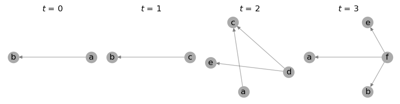

.. note::

   The ``draw_temporal_graph`` function currently simply calls ``networkx``
   `draw <https://networkx.org/documentation/stable/reference/generated/networkx.drawing.nx_pylab.draw.html>`_
   in the backend and is meant only as an example to showcase the package's capabilities. It does
   not scale well to large graphs, which usually require more sophisticated approaches or specialized
   visualization tools.

Specify number of snapshots
---------------------------

A specific number of bins can be returned in a new object of the same type using ``slice``:

.. code-block:: python

   >>> TG = TG.slice(attr="time", bins=2)
   >>> draw_temporal_graph(TG, figsize=(4, 2))

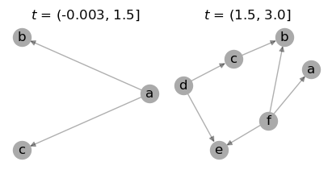

Note that this usually leads to snapshots with differing numbers of nodes and edges, as expected.

Considering quantiles
^^^^^^^^^^^^^^^^^^^^^

By default, created bins are composed of non-overlapping edges and might have uneven order and/or
size. To try and balance them using quantiles, pass ``qcut=True`` (see `pandas.qcut
<https://pandas.pydata.org/pandas-docs/stable/reference/api/pandas.qcut.html>`_ for details):

.. code-block:: python

   >>> TG = TG.slice(attr="time", bins=2, qcut=True)
   >>> draw_temporal_graph(TG, figsize=(4, 2))

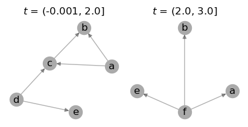

Though not perfectly balanced due to node :math:`a` appearing multiple times (in :math:`t={1,2,3}`),
the resulting snapshots have a more even number of edges. Results are expected to vary in a
case-by-case basis.

Ranking nodes or edges
^^^^^^^^^^^^^^^^^^^^^^

Forcing a number of bins can be achieved by setting ``rank_first=True``, ranking nodes or edges by
their order of appearance in the original graph:

.. code-block:: python

   >>> TG = TG.slice(attr="time", bins=2, rank_first=True)
   >>> draw_temporal_graph(TG, figsize=(4, 2))

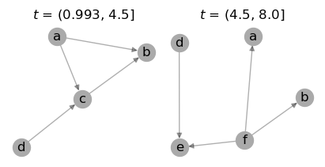

As the `time` attribute is here located in the edge level, each resulting snapshot has 4 edges each.
In case of node-level times, the number of nodes in each snapshot would be more evenly distributed.

.. note::
   In some cases, ``slice`` may still not be able to split the graph into the number of bins
   requested (e.g., insufficient data), returning the maximum possible number of temporal snapshots
   instead.

Convert from static graph
-------------------------

Static graphs may carry temporal information in both node- and edge-level attributes.

Slicing a graph into bins usually result in the same number of edges, but a higher number of nodes,
as they may appear in more than one snapshot. In the example below, we create a static multigraph in
which both nodes and edges are attributed with the time step in which they are observed:

.. code-block:: python

   >>> G = nx.MultiDiGraph()
   >>>
   >>> G.add_nodes_from([
   >>>     ("a", {"time": 0}),
   >>>     ("b", {"time": 0}),
   >>>     ("c", {"time": 1}),
   >>>     ("d", {"time": 2}),
   >>>     ("e", {"time": 3}),
   >>>     ("f", {"time": 3}),
   >>> ])
   >>>
   >>> G.add_edges_from([
   >>>     ("a", "b", {"time": 0}),
   >>>     ("c", "b", {"time": 1}),
   >>>     ("d", "c", {"time": 2}),
   >>>     ("d", "e", {"time": 2}),
   >>>     ("a", "c", {"time": 2}),
   >>>     ("f", "e", {"time": 3}),
   >>>     ("f", "a", {"time": 3}),
   >>>     ("f", "b", {"time": 3}),
   >>> ])
   >>>
   >>> print(G)

   MultiDiGraph with 6 nodes and 8 edges

Edge-level time attribute
^^^^^^^^^^^^^^^^^^^^^^^^^

Converting a static graph with edge-level temporal data to a temporal graph object:

.. code-block:: python

   >>> TG = tx.from_static(G).slice(attr="time")
   >>> draw_temporal_graph(TG, figsize=(8, 2))

.. image:: ../figure/fig_39.png

The resulting temporal graph has the same number of edges as the original graph, but a higher number
of nodes, as they appear in more than one snapshot.

.. note::

   By default, ``slice`` considers ``attr`` as an edge-level attribute, which is usually the case for
   temporal data. This behavior can be changed by setting ``attr_level='node'`` (see example below).

Node-level time attribute
^^^^^^^^^^^^^^^^^^^^^^^^^

Converting a static graph with node-level temporal data to a temporal graph object:

.. code-block:: python

   >>> TG = tx.from_static(G).slice(attr="time", attr_level="node")
   >>> draw_temporal_graph(TG, figsize=(8, 2))

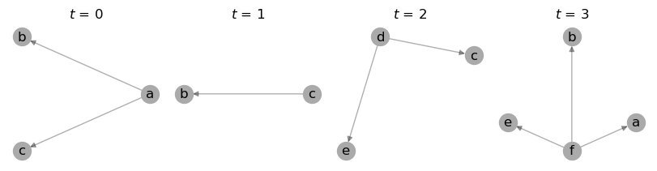

Note that even though the edge :math:`(a, c)` contains the attribute ``time=2``, considering node-level
attributes resulted in it being placed at :math:`t=0` instead, as the source node :math:`a` is set to ``time=0``:

.. code-block:: python

   >>> G.nodes(data="time")["a"]

   0

.. note::

    By default, the source node's temporal attribute is used to determine the time step of an edge
    with ``attr_level='node'``. This behavior can be changed by setting ``node_level='target'`` instead.

Convert to directed or undirected
---------------------------------

We can easily convert the edge directions by calling the same methods available from ``networkx``:

.. code-block:: python

   >>> TG.to_undirected()

   TemporalGraph (t=4) with 12 nodes and 8 edges

.. code-block:: python

   >>> TG.to_directed()

   TemporalDiGraph (t=4) with 12 nodes and 16 edges

-----

Common metrics
==============

Methods available in a ``networkx`` graph may also be executed sequentially on a temporal graph object.
A few additional methods that consider all time slices are also implemented for convenience.

Degree centrality
-----------------

Functions such as ``degree``, ``in_degree``, ``out_degree`` return a list of degree views for each snapshot:

.. code-block:: python

   >>> TG.degree()
   >>> # TG.in_degree()
   >>> # TG.out_degree()

   [DiDegreeView({'a': 2, 'b': 2}),
    DiDegreeView({'c': 2, 'b': 2}),
    DiDegreeView({'d': 4, 'c': 4, 'e': 2, 'a': 2}),
    DiDegreeView({'f': 6, 'e': 2, 'a': 2, 'b': 2})]

Alternatively, to obtain the degree of a specific node:

.. code-block:: python

   >>> TG[0].degree("a")
   >>> # TG[0].in_degree("a")
   >>> # TG[0].out_degree("a")

   2

Temporal degree centrality
^^^^^^^^^^^^^^^^^^^^^^^^^^

Meanwhile, ``temporal_degree`` returns a dictionary containing node degrees across all time steps:

.. code-block:: python

   >>> TG.temporal_degree()
   >>> # TG.temporal_in_degree()
   >>> # TG.temporal_out_degree()

   {'e': 4, 'b': 6, 'f': 6, 'a': 6, 'd': 4, 'c': 6}

Likewise, to obtain the degree of a specific node:

.. code-block:: python

   >>> TG.temporal_degree("a")
   >>> # TG.temporal_in_degree("a")
   >>> # TG.temporal_out_degree("a")

   6

Order and size
--------------

Obtaining the number of nodes and edges in each snapshot:

.. code-block:: python

   >>> print("Order:", TG.order())
   >>> print("Size:", TG.size())

   Order: [2, 2, 4, 4]
   Size: [2, 2, 6, 6]

Temporal order and size
^^^^^^^^^^^^^^^^^^^^^^^

Differently to the above, the ``temporal_order`` and ``temporal_size`` functions return the total
number of nodes and edges across all time steps, **without** considering duplicated nodes across
snapshots:

.. code-block:: python

   >>> print("Temporal nodes:", TG.temporal_order())
   >>> print("Temporal edges:", TG.temporal_size())

   Temporal nodes: 6
   Temporal edges: 16

.. note::

   The temporal order and size are respectively defined as the length of ``TG.temporal_nodes()``,
   i.e., set of all nodes over time, and the length of ``TG.temporal_size()``, i.e., sum of all
   their edges.

Total number of nodes and edges
^^^^^^^^^^^^^^^^^^^^^^^^^^^^^^^

Obtaining the actual number of nodes and edges across all snapshots, **with** duplicates:

.. code-block:: python

   >>> print("Total nodes:", TG.total_nodes())  # TG.total_nodes() != TG.temporal_order()
   >>> print("Total edges:", TG.total_edges())  # TG.total_edges() == TG.temporal_size()

   Total nodes: 12
   Total edges: 16

.. note::

   The total nodes and edges are respectively defined as the sum of ``TG.nodes()`` lengths, i.e.,
   nodes in each snapshot, and the sum of ``TG.edges()`` lengths, i.e., edges in each snapshot.

Node neighborhoods
------------------

The ``neighbors`` method returns a list of neighbors for each node in each snapshot:

.. code-block:: python

   >>> TG.neighbors("c")

   [[], ['b'], ['d', 'a'], []]

Temporal node neighborhoods
^^^^^^^^^^^^^^^^^^^^^^^^^^^

The ``temporal_neighbors`` method returns a dictionary containing node neighbors in all snapshots:

.. code-block:: python

   >>> TG.temporal_neighbors("c")

   {'a', 'b', 'd'}

-----

Convert graph object
====================

Graphs may be converted to a different object type by calling ``convert`` with the desired format:

.. code-block:: python

    >>> tx.convert(G, "igraph")

    <igraph.Graph at 0x7fc242f76050>

Support for the following packages are implemented, with their respective aliases:

+-----------------------------------------------------------------+------------------------------------+------------------------+
| Format                                                          | Parameter (Package)                | Parameter (Alias)      |
+=================================================================+====================================+========================+
|`Deep Graph Library <https://www.dgl.ai/>`_                      | .. centered :: ``dgl``             | .. centered :: -       |
+-----------------------------------------------------------------+------------------------------------+------------------------+
|`graph-tool <https://graph-tool.skewed.de/>`_                    | .. centered :: ``graph_tool``      | .. centered :: ``gt``  |
+-----------------------------------------------------------------+------------------------------------+------------------------+
|`igraph <https://igraph.org/python/>`_                           | .. centered :: ``igraph``          | .. centered :: ``ig``  |
+-----------------------------------------------------------------+------------------------------------+------------------------+
|`NetworKit <https://networkit.github.io/>`_                      | .. centered :: ``networkit``       | .. centered :: ``nk``  |
+-----------------------------------------------------------------+------------------------------------+------------------------+
|`PyTorch Geometric <https://pytorch-geometric.readthedocs.io>`_  | .. centered :: ``torch_geometric`` | .. centered :: ``pyg`` |
+-----------------------------------------------------------------+------------------------------------+------------------------+
|`Teneto <https://teneto.readthedocs.io>`_                        | .. centered :: ``teneto``          | .. centered :: -       |
+-----------------------------------------------------------------+------------------------------------+------------------------+

.. note::

   Only static ``networkx`` graphs are currently accepted as input for this function.

-----

Transform graph representation
==============================

Once a temporal graph is instantiated, the following methods allow returning static graphs,
snapshots events or unified representations.  Due to the way the underlying data is represented,
some of these objects (i.e., those with unique nodes) do not allow dynamic node attributes.

Observe that the total number of nodes :math:`V` and edges :math:`E` of the returned object might
differ from the number of temporal nodes :math:`V_T` and edges :math:`E_T`, depending on the data
and method used:

+------------------+----------------------+---------------------+------------------------------------+-------------------------------------+
| Method           | .. centered :: Order | .. centered :: Size | Dynamic node attributes            | Dynamic edge attributes             |
+==================+======================+=====================+====================================+=====================================+
| ``to_static``    | :math:`V = V_T`      | :math:`E = E_T`     | .. centered:: |:x:|                | .. centered:: |:heavy_check_mark:|  |
+------------------+----------------------+---------------------+------------------------------------+-------------------------------------+
| ``to_snapshots`` | :math:`V \ge V_T`    | :math:`E = E_T`     | .. centered:: |:heavy_check_mark:| | .. centered:: |:heavy_check_mark:|  |
+------------------+----------------------+---------------------+------------------------------------+-------------------------------------+
| ``to_events``    | :math:`V = V_T`      | :math:`E = E_T`     | .. centered:: |:x:|                | .. centered:: |:x:|                 |
+------------------+----------------------+---------------------+------------------------------------+-------------------------------------+
| ``to_unified``   | :math:`V \ge V_T`    | :math:`E \ge E_T`   | .. centered:: |:heavy_check_mark:| | .. centered:: |:heavy_check_mark:|  |
+------------------+----------------------+---------------------+------------------------------------+-------------------------------------+

Static graph
------------

Builds a static or flattened graph ``G`` containing all the edges found at each time step.

.. important::

   Dynamic node attributes from a ``TemporalGraph`` are not preserved in a static graph.

TemporalGraph → G
^^^^^^^^^^^^^^^^^

.. code-block:: python

    >>> G = TG.to_static()
    >>> G

    MultiDiGraph with 6 nodes and 8 edges

.. code-block:: python

   >>> draw_temporal_graph(G, suptitle="Static Graph")

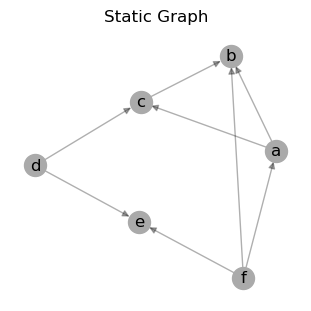

G → TemporalGraph
^^^^^^^^^^^^^^^^^

.. code-block:: python

    >>> TG = tx.from_static(G).slice(attr="time")
    >>> print(TG)

    TemporalMultiDiGraph (t=4) with 12 nodes and 8 edges

Snapshot-based temporal graph
-----------------------------

A snapshot-based temporal graph ``STG`` is a sequence of graphs where each element represents a
snapshot of the original temporal graph. It is the most common representation of temporal graphs.

.. note::

   Like the ``slice`` method, this function internally returns views of the original graph data,
   so no data is copied unless specified otherwise (i.e., by passing ``as_view=False`` to the
   function).

TemporalGraph → STG
^^^^^^^^^^^^^^^^^^^

.. code-block:: python

    >>> STG = TG.to_snapshots()
    >>> STG

   [<networkx.classes.graph.Graph at 0x7fd9132420d0>,
    <networkx.classes.graph.Graph at 0x7fd913193710>,
    <networkx.classes.graph.Graph at 0x7fd912906d50>,
    <networkx.classes.graph.Graph at 0x7fd91290d350>]

STG → TemporalGraph
^^^^^^^^^^^^^^^^^^^

.. code-block:: python

   >>> TG = tx.from_snapshots(STG)
   >>> TG

    TemporalMultiDiGraph (t=4) with 12 nodes and 8 edges

Event-based temporal graph
--------------------------

An event-based temporal graph ``ETG`` is a sequence of 3- or 4-tuple edge-based events.

* **3-tuples** (:math:`u, v, t`), where elements are the source node, target node, and time attribute;

* **4-tuples** (:math:`u, v, t, \epsilon`), where an additional element :math:`\epsilon` is either a
  positive (``1``) or negative (``-1``) unity representing edge addition and deletion events, respectively.

Depending on the temporal graph data, one of these may allow a more compact representation than the
other. The default is to return a 3-tuple sequence (also known as a *stream graph*).

.. important::

   Event-based temporal graphs do not currently store node- or edge-level attribute data.
   Moreover, as sequences of events are edge-based, node isolates are not preserved.

TemporalGraph → ETG
^^^^^^^^^^^^^^^^^^^

.. code-block:: python

    >>> ETG = TG.to_events()  # stream=True (default)
    >>> ETG

.. code-block:: python

    [('a', 'b', 0),
     ('c', 'b', 1),
     ('a', 'c', 2),
     ('d', 'c', 2),
     ('d', 'e', 2),
     ('f', 'e', 3),
     ('f', 'a', 3),
     ('f', 'b', 3)]

.. code-block:: python

    >>> ETG = TG.to_events(stream=False)
    >>> ETG

.. code-block:: python

   [('a', 'b', 0, 1),
    ('c', 'b', 1, 1),
    ('a', 'b', 1, -1),
    ('a', 'c', 2, 1),
    ('d', 'c', 2, 1),
    ('d', 'e', 2, 1),
    ('c', 'b', 2, -1),
    ('f', 'e', 3, 1),
    ('f', 'a', 3, 1),
    ('f', 'b', 3, 1),
    ('a', 'c', 3, -1),
    ('d', 'c', 3, -1),
    ('d', 'e', 3, -1)]

ETG → TemporalGraph
^^^^^^^^^^^^^^^^^^^

.. code-block:: python

   >>> tx.from_events(ETG, directed=True, multigraph=True)

   TemporalDiGraph (t=4) with 12 nodes and 8 edges

Unified temporal graph
----------------------

A unified temporal graph ``UTG`` is a single graph object that contains the original temporal data,
plus ''proxy'' nodes (*from each snapshot*) and edge ''couplings'' (*linking sequential temporal
nodes*). Its usefulness is restricted to certain types of analysis and visualization, e.g., based on
temporal flows.

TemporalGraph → UTG
^^^^^^^^^^^^^^^^^^^

.. code-block:: python

   >>> UTG = TG.to_unified(add_couplings=True)
   >>> print(UTG)

   MultiDiGraph named 'UTG (t=4, proxy_nodes=6, edge_couplings=2)' with 12 nodes and 14 edges

.. code-block:: python

   >>> nodes = sorted(TG.temporal_nodes())
   >>>
   >>> pos = {node: (nodes.index(node.rsplit("_")[0]), -int(node.rsplit("_")[1]))
              for node in UTG.nodes()}
   >>>
   >>> draw_temporal_graph(UTG,
                           pos=pos,
                           figsize=(4, 4),
                           connectionstyle="arc3,rad=0.25",
                           suptitle="Unified Temporal Graph")

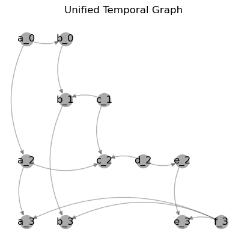

UTG → TemporalGraph
^^^^^^^^^^^^^^^^^^^

.. code-block:: python

   >>> tx.from_unified(UTG)

   TemporalMultiDiGraph (t=4) with 12 nodes and 8 edges

-----

Community detection
====================

As a toy example, let's first use the simplest `Stochastic Block Model
<https://networkx.org/documentation/stable/reference/generated/networkx.generators.community.stochastic_block_model.html>`_
to generate 4 graph snapshots, in which each of the 5 clusters of 5 nodes each continuously mix
together over time:

.. code-block:: python

    >>> snapshots = 4   # Temporal graphs to generate.
    >>> clusters = 5    # Number of clusters/communities.
    >>> order = 5       # Nodes in each cluster.
    >>> intra = .9      # High initial probability of intra-community edges.
    >>> inter = .1      # Low initial probability of inter-community edges.
    >>> change = .125   # Change in intra- and inter-community edges over time.
    >>>
    >>> # Get probability matrix for each snapshot.
    >>> probs = [[[
    >>>     (intra if i == j else inter) + (t * change * (-1 if i == j else 1))
    >>>     for j in range(clusters)]
    >>>     for i in range(clusters)]
    >>>     for t in range(snapshots)]
    >>>
    >>> # Create graphs from probabilities.
    >>> graphs = {}
    >>> for t in range(snapshots):
    >>>     graphs[t] = nx.stochastic_block_model(clusters*[order], probs[t], seed=10)
    >>>     graphs[t].name = t
    >>>
    >>> # Create temporal graph from snapshots.
    >>> TG = tx.from_snapshots(graphs)

Let's plot the graphs, with node colors representing communities and intra-community edges:

.. code-block:: python

    >>> import matplotlib.pyplot as plt
    >>>
    >>> def get_edge_color(edges: list, node_color: dict):
    >>>     return [node_color[u]
    >>>             if node_color[u] == node_color[v]
    >>>             else "#00000035"
    >>>             for u, v in edges]
    >>>
    >>> c = plt.cm.tab10.colors
    >>>
    >>> # Node positions.
    >>> pos = nx.circular_layout(TG.to_static())
    >>>
    >>> # Community ground truths.
    >>> node_color = [c[i // clusters] for i in range(TG.temporal_order())]
    >>>
    >>> # Colorize intra-community edges.
    >>> temporal_opts = {t: {"edge_color": get_edge_color(TG[t].edges(), node_color)}
    >>>                  for t in range(len(TG))}
    >>>
    >>> # Plot snapshots with community ground truths.
    >>> draw_temporal_graph(
    >>>     TG,
    >>>     pos=pos,
    >>>     figsize=(14, 4),
    >>>     node_color=node_color,
    >>>     temporal_opts=temporal_opts,
    >>>     connectionstyle="arc3,rad=0.1",
    >>>     suptitle="Ground truth")

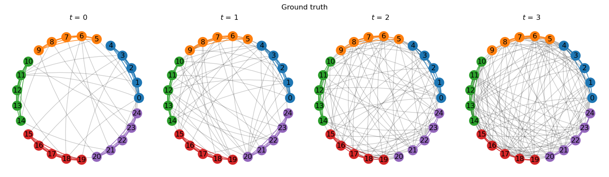

We see the graphs are generated with the same community structure, but continuously decreasing
assortativity. Let's try and retrieve these communities using a modularity optimization algorithm.

.. attention ::

   Optimizations algorithms may help with descriptive or exploratory tasks and post-hoc network
   analysis, but lack statistical rigor for inferential purposes. See `Peixoto (2021)
   <https://skewed.de/tiago/posts/descriptive-inferential/>`_ [1]_ for a discussion.

Modularity: on static graph
---------------------------

The `leidenalg <https://leidenalg.readthedocs.io>`_ package implements optimization algorithms
for community detection that may be applied on snapshot-based temporal graphs, allowing to better
capture their underlying structure.

For example, depending on the initial node community assigments (e.g., with ``seed=0`` below),
`modularity <https://leidenalg.readthedocs.io/en/stable/reference.html#modularityvertexpartition>`_
fails to retrieve the true communities (their ground truths) in the network:

.. code-block:: python

    >>> import leidenalg as la
    >>>
    >>> membership = la.find_partition(
    >>>     TG.to_static("igraph"),
    >>>     la.ModularityVertexPartition,
    >>>     n_iterations=-1,
    >>>     seed=0,
    >>> )
    >>>
    >>> node_color = [c[m] for m in membership.membership]
    >>> edge_color = get_edge_color(TG.to_static().edges(), node_color)
    >>>
    >>> draw_temporal_graph(
    >>>     TG.to_static(),
    >>>     pos=pos,
    >>>     figsize=(4, 4),
    >>>     node_color=node_color,
    >>>     edge_color=edge_color,
    >>>     connectionstyle="arc3,rad=0.1",
    >>>     suptitle="Communities found by modularity on static graph")

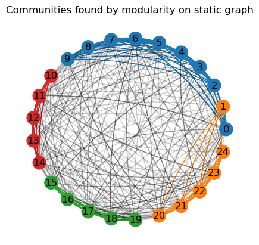

Although two communities are correctly retrieved (in red and green), nodes :math:`0` to :math:`4`,
which form a fifth community in the network, are misclassified as belonging to the blue and orange
communities.

Next, let's try and exploit the network's temporal information to improve on these results.

Modularity: on each snapshot
----------------------------

Running the same algorithm separately on each of the generated snapshots retrieves the correct
clusters only on the first graph (:math:`t=0`). This is mostly due to modularity optimization
expecting an assortative community structure, which is not present in the later snapshots, as they
mix together.

In addition, community indices (represented by their colors) are not fixed over snapshots, which
makes understanding their mesoscale dynamics harder. This is illustrated in the plot below:

.. code-block:: python

    >>> temporal_opts = {}
    >>>
    >>> for t in range(len(TG)):
    >>>     membership = la.find_partition(
    >>>         TG[t:t+1].to_static("igraph"),
    >>>         la.ModularityVertexPartition,
    >>>         n_iterations=-1,
    >>>         seed=0,
    >>>     )
    >>>     node_color = [c[m] for m in membership.membership]
    >>>     edge_color = get_edge_color(TG[t].edges(), node_color)
    >>>     temporal_opts[t] = {"node_color": node_color, "edge_color": edge_color}
    >>>
    >>> draw_temporal_graph(
    >>>     TG,
    >>>     pos=pos,
    >>>     figsize=(14, 4),
    >>>     temporal_opts=temporal_opts,
    >>>     connectionstyle="arc3,rad=0.1",
    >>>     suptitle="Communities found by modularity on snapshots")

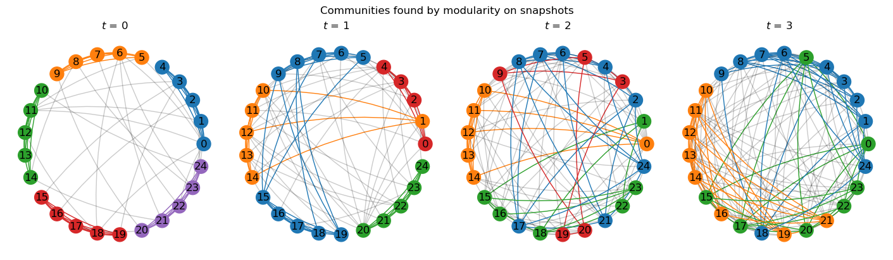

Not only the results of subsequent snapshots are suboptimal, it is also particularly hard to track
the evolution of communities over time to analyze a network's temporal mesoscale dynamics.

Modularity: on temporal graph
-----------------------------

`Coupling temporal nodes <https://leidenalg.readthedocs.io/en/stable/multiplex.html#slices-to-layers>`_
allows the same algorithm to correctly retrieve the ground truths in this case, while at the same
time maintaining community indices consistent over time, as seen below:

.. code-block:: python

    >>> temporal_opts = {}
    >>>
    >>> temporal_membership, improvement = la.find_partition_temporal(
    >>>     TG.to_snapshots("igraph"),
    >>>     la.ModularityVertexPartition,
    >>>     interslice_weight=1.0,
    >>>     n_iterations=-1,
    >>>     seed=0,
    >>>     vertex_id_attr="_nx_name"
    >>> )
    >>>
    >>> for t in range(len(TG)):
    >>>     node_color = [c[m] for m in temporal_membership[t]]
    >>>     edge_color = get_edge_color(TG[t].edges(), node_color)
    >>>     temporal_opts[t] = {"node_color": node_color, "edge_color": edge_color}
    >>>
    >>> draw_temporal_graph(
    >>>     TG,
    >>>     figsize=(14, 4),
    >>>     pos=pos,
    >>>     temporal_opts=temporal_opts,
    >>>     connectionstyle="arc3,rad=0.1",
    >>>     suptitle="Communities found by modularity on temporal graph")

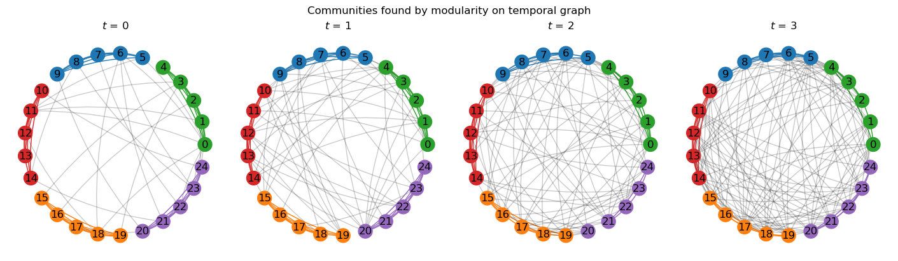

This method is particularly useful to track communities over time, as it allows to maintain the
same community indices across snapshots, potentially contributing to the study of their dynamics.

Although very simple, this example showcased how considering a network's temporal information can benefit
its analysis, as well as help to better understand and visualize its mesoscale structures.

-----

.. rubric:: References

.. [1] Tiago. P. Peixoto. ''Descriptive Vs. Inferential Community Detection in Networks: Pitfalls,
   Myths and Half-Truths'' (2023). Elements in the Structure and Dynamics of Complex Networks,
   Cambridge U.P.