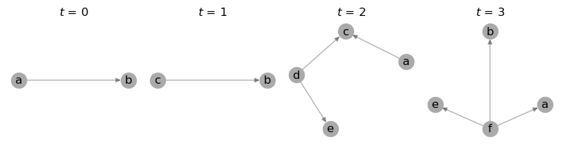

.. toctree::
   :hidden:
   :caption: Introduction

   Overview <self>

.. toctree::
   :hidden:
   :caption: API reference
   :glob:

   api/*

.. toctree::
   :hidden:
   :caption: Examples

   examples/basics
   examples/metrics
   examples/convert
   examples/community

.. toctree::
   :hidden:
   :caption: Appendix

   cite
   references
   genindex

.. note::

   This documentation was generated on |today| for package release |release|.

#################
networkx-temporal
#################

.. image:: https://badge.fury.io/py/networkx-temporal.svg
   :target: https://pypi.org/project/networkx-temporal/
   :alt: PyPI version

.. image:: https://readthedocs.org/projects/networkx-temporal/badge/?version=latest
   :target: https://networkx-temporal.readthedocs.io/en/latest/?badge=latest
   :alt: Documentation Status

.. image:: https://static.pepy.tech/badge/networkx-temporal
   :target: https://pepy.tech/project/networkx-temporal
   :alt: Downloads

.. image:: https://static.pepy.tech/badge/networkx-temporal/month
   :target: https://pepy.tech/project/networkx-temporal
   :alt: Downloads

.. image:: https://img.shields.io/pypi/l/networkx-temporal
   :target: https://github.com/nelsonaloysio/networkx-temporal/blob/main/LICENSE.md
   :alt: License

**NetworkX-Temporal** extends the `NetworkX <https://networkx.org>`__ library to dynamic networks,
i.e., temporal graph data.

This package provides a new class, :class:`~networkx_temporal.TemporalGraph`, which extends NetworkX's `graph classes
<https://networkx.org/documentation/stable/reference/classes/index.html>`_
and implements additional functions to manipulate temporal data within. Most importantly, it
provides methods to :func:`~networkx_temporal.TemporalGraph.slice` a graph into snapshots and convert between formats and representations.

Install
=======

The package is readily available from `PyPI <https://pypi.org/project/networkx-temporal/>`__:

.. code-block:: bash

   $ pip install networkx-temporal

It supports **Python 3.7+** and has been tested on Linux, Windows, and macOS.

Quick start
===========

The following is a quick example of the package in action, covering its basic functionality.

Build and slice temporal graph
------------------------------

Create a :class:`~networkx_temporal.TemporalGraph` object and :func:`~networkx_temporal.TemporalGraph.slice` it into a number of snapshots:

.. code-block:: python

   >>> import networkx_temporal as tx
   >>>
   >>> TG = tx.TemporalGraph(directed=True, multigraph=False)
   >>>
   >>> TG.add_edge("a", "b", time=0)
   >>> TG.add_edge("c", "b", time=1)
   >>> TG.add_edge("d", "c", time=2)
   >>> TG.add_edge("d", "e", time=2)
   >>> TG.add_edge("a", "c", time=2)
   >>> TG.add_edge("f", "e", time=3)
   >>> TG.add_edge("f", "a", time=3)
   >>> TG.add_edge("f", "b", time=3)
   >>>
   >>> TG = TG.slice(attr="time")
   >>>
   >>> print(TG)

   TemporalDiGraph (t=4) with 12 nodes and 8 edges

The number of snapshots to create may be specified with the ``bins`` parameter:

.. code-block:: python

   >>> TG.slice(attr="time", bins=2)

   TemporalDiGraph (t=2) with 9 nodes and 8 edges

Note that the total number of nodes may vary, while the total number of edges is preserved.

.. hint::

   The :func:`~networkx_temporal.TemporalGraph.slice` method by default creates a snapshot for each unique time value in the temporal
   graph. It internally stores `views
   <https://networkx.org/documentation/stable/reference/classes/generated/networkx.classes.graphviews.subgraph_view.html>`__
   of the original graph, so no data is copied unless specified.

Plot snapshots
--------------

We may visualize the resulting temporal graph using the :func:`~networkx_temporal.draw` function:

.. code-block:: python

   >>> tx.draw(TG, layout="kamada_kawai", figsize=(8, 2))

Save and load data
------------------

The :func:`~networkx_temporal.write_graph` and :func:`~networkx_temporal.read_graph`
functions accept compressed temporal graphs:

.. code-block:: python

   >>> TG = tx.read_graph("temporal_graph.graphml.zip")
   >>> tx.write_graph(TG, "temporal_graph.graphml.zip")

Both methods support the same `extension formats
<https://networkx.org/documentation/stable/reference/readwrite/index.html>`__
as in the installed NetworkX library version.

Convert and transform object
----------------------------

This package allows to transform a :class:`~networkx_temporal.TemporalGraph` between different
`graph representations <examples/convert.html#graph-representations>`__:

* `Static graphs <examples/convert.html#static-graph>`__:
  flattened or aggregated versions of the temporal graph.
* `Snapshot-based temporal graphs <examples/convert.html#snapshot-based-temporal-graph>`__:
  a list of node- or edge-level snapshots.
* `Event-based temporal graphs <examples/convert.html#event-based-temporal-graph>`__:
  a sequence of edge-level events.
* `Unified temporal graphs <examples/convert.html#unified-temporal-graph>`__:
  a single graph with time-stamped nodes and edges.

.. code-block:: python

   >>> G = tx.to_static(TG)
   >>> STG = tx.to_snapshot(TG)
   >>> ETG = tx.to_event(TG)
   >>> UTG = tx.to_unified(TG)

In addition, both static and temporal graphs may be converted to the following
`graph formats <examples/convert.html#graph-formats>`__:

- `Deep Graph Library <https://www.dgl.ai>`__
- `graph-tool <https://graph-tool.skewed.de>`__
- `igraph <https://igraph.org/python/>`__
- `NetworKit <https://networkit.github.io>`__
- `PyTorch Geometric <https://pytorch-geometric.readthedocs.io>`__
- `Teneto <https://teneto.readthedocs.io>`__

.. code-block:: python

   >>> tx.convert(TG.to_static(), "igraph")

   <igraph.Graph at 0x7f048ef52c50>

Links
=====

For more information on using this package, please refer to the following sections:

- `API reference <api/classes.html>`__ for details on the classes and functions it implements.

- `Examples <examples/basic.html>`__ covering some of its main functionalities and common use cases.

.. seealso::

   The package's `GitHub repository <https://github.com/nelsonaloysio/networkx-temporal>`__ for
   the latest updates and issues. Contributions are welcome!

If you have any questions or feedback to share, please also feel free to
`contact us via e-mail <mailto:nelson.reis@phd.unipi.it>`__. |:mailbox_with_mail:|
